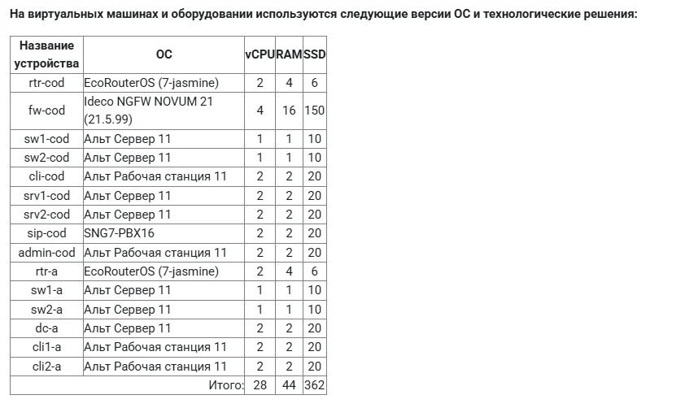
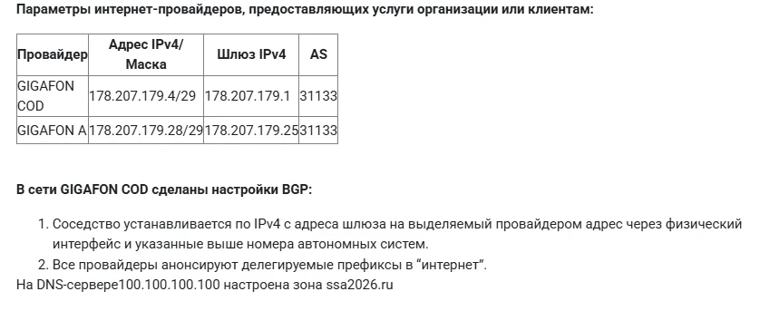
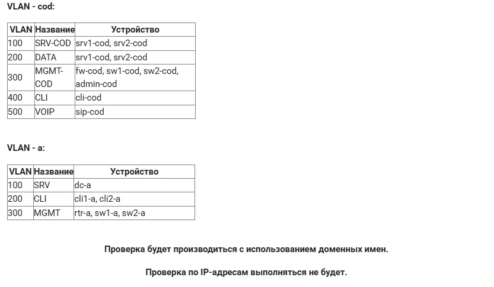

# Professionals_2026

**REGION2026 - Сетевое и Системное администрирование**

## Модуль Б. Настройка технических и программных средств информационно-коммуникационных систем

> ⚠️ **Дисклеймер**
> 
> Всё ниже приведённое:
> - не является официальной рекомендацией или призывом к действию
> - является частным мнением и не претендует на универсальность
> - отражает личный опыт и мнение одного человека
> - основано на субъективном взгляде и не является истиной в последней инстанции для всех
> - является частным случаем и не может рассматриваться как обязательная к применению инструкция

**Время на выполнение модуля:** 7 часов

---

## 📋 Содержание

- [Схема подключения](#схема-подключения)
- [Виртуальные машины и оборудование](#виртуальные-машины-и-оборудование)
- [Параметры интернет-провайдеров](#параметры-интернет-провайдеров)
- [Структура VLAN](#структура-vlan)
- [Модули настройки](#модули-настройки)

---

## Схема подключения

<!-- TODO: Добавить схему сети -->
*Схема сети будет добавлена позже*

---

## Виртуальные машины и оборудование

На виртуальных машинах и оборудовании используются следующие версии ОС и технологические решения:

| Название устройства | ОС | vCPU | RAM | SSD |
|---------------------|-----|------|-----|-----|
| rtr-cod | EcoRouterOS (7-jasmine) | 2 | 4 | 6 |
| fw-cod | Ideco NGFW NOVUM 21 (21.5.99) | 4 | 16 | 150 |
| sw1-cod | Альт Сервер 11 | 1 | 1 | 10 |
| sw2-cod | Альт Сервер 11 | 1 | 1 | 10 |
| cli-cod | Альт Рабочая станция 11 | 2 | 2 | 20 |
| srv1-cod | Альт Сервер 11 | 2 | 2 | 20 |
| srv2-cod | Альт Сервер 11 | 2 | 2 | 20 |
| sip-cod | SNG7-PBX16 | 2 | 2 | 20 |
| admin-cod | Альт Рабочая станция 11 | 2 | 2 | 20 |
| rtr-a | EcoRouterOS (7-jasmine) | 2 | 4 | 6 |
| sw1-a | Альт Сервер 11 | 1 | 1 | 10 |
| sw2-a | Альт Сервер 11 | 1 | 1 | 10 |
| dc-a | Альт Сервер 11 | 2 | 2 | 20 |
| cli1-a | Альт Рабочая станция 11 | 2 | 2 | 20 |
| cli2-a | Альт Рабочая станция 11 | 2 | 2 | 20 |

**Итого:** 28 vCPU, 44 GB RAM, 362 GB SSD

---

## Параметры интернет-провайдеров

| Провайдер | Адрес IPv4/Маска | Шлюз IPv4 | AS |
|-----------|------------------|-----------|------|
| GIGAFON COD | 178.207.179.4/29 | 178.207.179.1 | 31133 |
| GIGAFON A | 178.207.179.28/29 | 178.207.179.25 | 31133 |

### Настройки BGP в сети GIGAFON COD

1. Соседство устанавливается по IPv4 с адреса шлюза на выделяемый провайдером адрес через физический интерфейс и указанные выше номера автономных систем
2. Все провайдеры анонсируют делегируемые префиксы в "интернет"

**DNS-сервер:** На DNS-сервере 100.100.100.100 настроена зона `ssa2026.ru`

---

## Структура VLAN

### VLAN - COD

| VLAN | Название | Устройство |
|------|----------|------------|
| 100 | SRV-COD | srv1-cod, srv2-cod |
| 200 | DATA | srv1-cod, srv2-cod |
| 300 | MGMT-COD | fw-cod, sw1-cod, sw2-cod, admin-cod |
| 400 | CLI | cli-cod |
| 500 | VOIP | sip-cod |

### VLAN - A

| VLAN | Название | Устройство |
|------|----------|------------|
| 100 | SRV | dc-a |
| 200 | CLI | cli1-a, cli2-a |
| 300 | MGMT | rtr-a, sw1-a, sw2-a |

> ⚠️ **Важно:** Проверка будет производиться с использованием доменных имен. Проверка по IP-адресам выполняться не будет.

---

## Модули настройки

| № | Название модуля | Статус |
|---|-----------------|--------|
| 1 | [Настройка имён и IP-адресации на устройствах rtr-cod и rtr-a](modules/01-rtr-ip-config.md) | ✅ |
| 2 | [Подход к настройке fw-cod (Ideco NGFW)](modules/02-fw-cod-config.md) | ✅ |
| 3 | [Настройка маршрутизации BGP на rtr-cod](modules/03-bgp-config.md) | ✅ |
| 4 | [Настройка туннелей между офисом «a» и «cod»](modules/04-tunnel-config.md) | ✅ |
| 5 | [Настройка доступа в Интернет (NAT/PAT)](modules/05-nat-config.md) | ✅ |
| 6 | [Настройка динамической маршрутизации OSPF](modules/06-ospf-config.md) | ✅ |
| 7 | [Настройка коммутации между sw1-a и sw2-a](modules/07-switching-config.md) | ✅ |
| 8 | [Настройка доступа к веб-интерфейсу fw-cod](modules/08-fwcod-web-config.md) | ✅ |
| 9 | ... | 🔜 |

---

## 📝 Лицензия

Данный материал предоставляется "как есть" в образовательных целях.

## 🤝 Вклад

Если вы нашли ошибку или хотите дополнить материал, создайте Issue или Pull Request.
