# Модуль 0. Настройка виртуальной машины ISP

## Описание

Данный модуль описывает настройку виртуальной машины ISP, которая выступает в роли интернет-провайдера для всей инфраструктуры.

## Задачи

- Настройка имени устройства
- Настройка IP-адресов на интерфейсах
- Настройка пересылки пакетов (forwarding)
- Настройка NAT (iptables)
- Настройка DNS-сервера (BIND)
- Настройка NTP-сервера (Chrony)
- Настройка маршрутизации BGP (FRR)

---

## 1. Настройка имени устройства

### 1.1 Установка hostname

```bash
hostnamectl set-hostname isp; exec bash
```

### 1.2 Настройка файла /etc/sysconfig/network

Также рекомендуется указать имя в файле `/etc/sysconfig/network`:

```bash
vim /etc/sysconfig/network
```

Указать следующие параметры:

```
HOSTNAME=isp
DOMAINNAME=ssa2026.ru
```

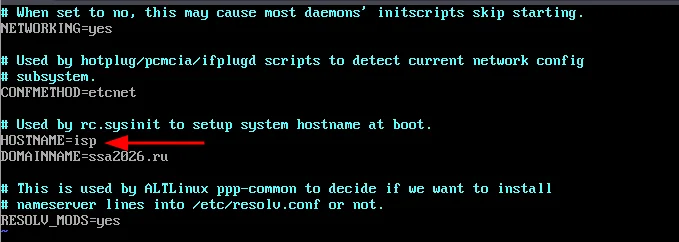

---

## 2. Настройка IP-адресов

### 2.1 Описание интерфейсов

| Интерфейс | Назначение | IP-адрес |
|-----------|------------|----------|
| ens19 | Доступ в сеть Интернет (SDN Simple Zone) | 100.100.100.100/24 |
| ens20 | Сеть в сторону rtr-cod | 178.207.179.1/29 |
| ens21 | Сеть в сторону rtr-a | 178.207.179.25/29 |

### 2.2 Проверка наличия интерфейсов

```bash
ip -c -br a
```

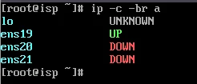

### 2.3 Настройка файла options для ens19

Для доступа в сеть Интернет на ISP будет задаваться статическая конфигурация.

Файл `/etc/net/ifaces/ens19/options`:

```
BOOTPROTO=static
TYPE=eth
```

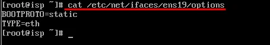

### 2.4 Копирование конфигурации для других интерфейсов

Копируем рекурсивно директорию ens19 для интерфейсов ens20 и ens21:

```bash
cp -r /etc/net/ifaces/ens19 /etc/net/ifaces/ens20
cp -r /etc/net/ifaces/ens19 /etc/net/ifaces/ens21
```

### 2.5 Назначение IP-адресов

```bash
echo "100.100.100.100/24" > /etc/net/ifaces/ens19/ipv4address
echo "178.207.179.1/29" > /etc/net/ifaces/ens20/ipv4address
echo "178.207.179.25/29" > /etc/net/ifaces/ens21/ipv4address
```

### 2.6 Настройка шлюза и DNS (временно)

Для установки необходимых пакетов:

```bash
echo "default via 100.100.100.1" > /etc/net/ifaces/ens19/ipv4route
echo "nameserver 77.88.8.8" > /etc/net/ifaces/ens19/resolv.conf
```

### 2.7 Проверка IP-адресов

```bash
ip -c -br -4 a
```

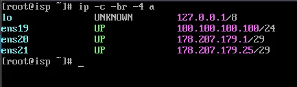

---

## 3. Настройка пересылки пакетов (Forwarding)

### 3.1 Включение IP forwarding

Для того чтобы устройство ISP могло пересылать пакеты с интерфейса на интерфейс, необходимо включить пересылку пакетов.

В конфигурационном файле `/etc/net/sysctl.conf` в параметре `net.ipv4.ip_forward = 0` заменить значение с 0 на 1:

```bash
sed -i "s/net.ipv4.ip_forward = 0/net.ipv4.ip_forward = 1/g" /etc/net/sysctl.conf
```

### 3.2 Применение настроек

```bash
systemctl restart network
```

### 3.3 Проверка

```bash
sysctl net.ipv4.ip_forward
ping -c3 ya.ru
```

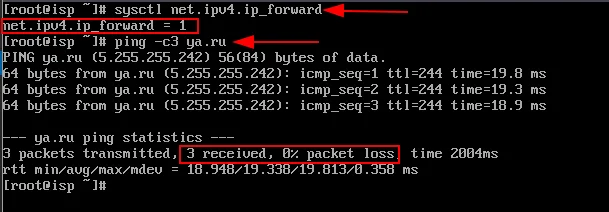

---

## 4. Настройка NAT (iptables)

### 4.1 Установка iptables

```bash
apt-get update && apt-get install -y iptables
```

### 4.2 Настройка правил NAT

Реализация сетевой трансляции адресов с помощью iptables:

- `ens19` — внешний интерфейс, подключённый к магистральному провайдеру
- Трансляция адресов выполняется только из конкретных сетей rtr-cod и rtr-a

```bash
iptables -t nat -A POSTROUTING -s 178.207.179.0/29 -o ens19 -j MASQUERADE
iptables -t nat -A POSTROUTING -s 178.207.179.24/29 -o ens19 -j MASQUERADE
```

### 4.3 Сохранение правил

```bash
iptables-save >> /etc/sysconfig/iptables
```

### 4.4 Включение службы iptables

```bash
systemctl enable --now iptables
```

### 4.5 Проверка правил

```bash
iptables -t nat -L POSTROUTING -v -n
```

---

## 5. Настройка DNS-сервера (BIND)

### 5.1 Установка BIND

```bash
apt-get install bind bind-utils -y
```

### 5.2 Настройка resolv.conf

После установки пакета bind приведём конфигурационный файл `/etc/net/ifaces/ens19/resolv.conf` к следующему виду:

```
search ssa2026.region
nameserver 100.100.100.100
```


Применение настроек:

```bash
systemctl restart network
```

### 5.3 Настройка options.conf

Редактирование конфигурационного файла `/var/lib/bind/etc/options.conf`:

```bash
vim /var/lib/bind/etc/options.conf
```

Основные параметры:

- **listen-on** — адреса и порты, на которых DNS-сервер будет слушать запросы
- **forwarders** — сервера, куда будут перенаправляться запросы, на которые нет информации в локальной зоне
- **allow-query** — IP-адреса и подсети, от которых будут обрабатываться запросы

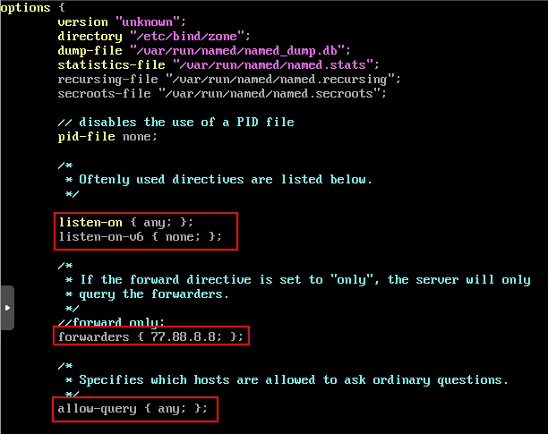

### 5.4 Добавление зон в rfc1912.conf

Добавить зоны прямого и обратного просмотра в файл `/var/lib/bind/etc/rfc1912.conf`:

```bash
vim /var/lib/bind/etc/rfc1912.conf
```

Добавить в конец файла:

```
zone "ssa2026.region" {
    type master;
    file "ssa2026.region";
};
```

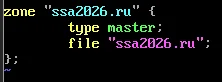

### 5.5 Создание файла зоны

Создать файл зоны прямого просмотра из шаблона:

```bash
cp /var/lib/bind/etc/zone/empty /var/lib/bind/etc/zone/ssa2026.region
```

Настройка файла зоны `/var/lib/bind/etc/zone/ssa2026.region`:

```bash
vim /var/lib/bind/etc/zone/ssa2026.region
```

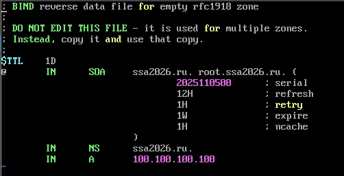

### 5.6 Установка прав на файл зоны

```bash
chown root:named /var/lib/bind/etc/zone/ssa2026.region
```

### 5.7 Генерация rndc.key

```bash
rndc-confgen > /var/lib/bind/etc/rndc.key
sed -i '6,$d' /var/lib/bind/etc/rndc.key
```

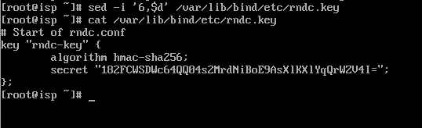

### 5.8 Проверка конфигурации

```bash
named-checkconf
named-checkconf -z
```

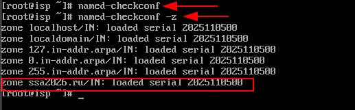

### 5.9 Запуск службы BIND

```bash
systemctl enable --now bind.service
```

### 5.10 Проверка работоспособности DNS

```bash
host ssa2026.region
host ya.ru
```

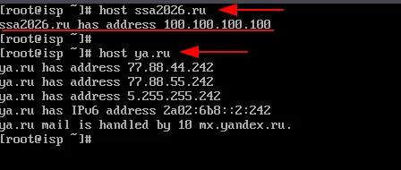

---

## 6. Настройка NTP-сервера (Chrony)

### 6.1 Настройка часового пояса

```bash
timedatectl set-timezone Europe/Moscow
```

> ⚠️ На JeOS возможно потребуется установка пакета tzdata:
> ```bash
> apt-get install -y tzdata
> ```

Проверка:

```bash
timedatectl
```

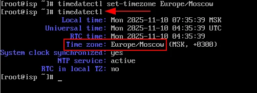

### 6.2 Настройка chrony.conf

Редактирование конфигурационного файла `/etc/chrony.conf`:

```bash
vim /etc/chrony.conf
```

Добавить следующую информацию:

```
server ntp0.ntp-servers.net iburst prefer minstratum 4
local stratum 5
allow 0.0.0.0/0
```

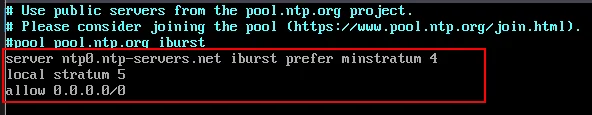

### 6.3 Перезагрузка службы

```bash
systemctl restart chronyd
```

### 6.4 Проверка

```bash
chronyc tracking
```

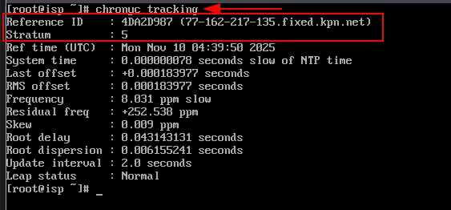

---

## 7. Настройка BGP (FRR)

### 7.1 Установка FRR

```bash
apt-get install -y frr
```

### 7.2 Активация BGP в daemons

В конфигурационном файле `/etc/frr/daemons` необходимо активировать протокол BGP:

```bash
vim /etc/frr/daemons
```

Изменить `bgpd=no` на `bgpd=yes`:

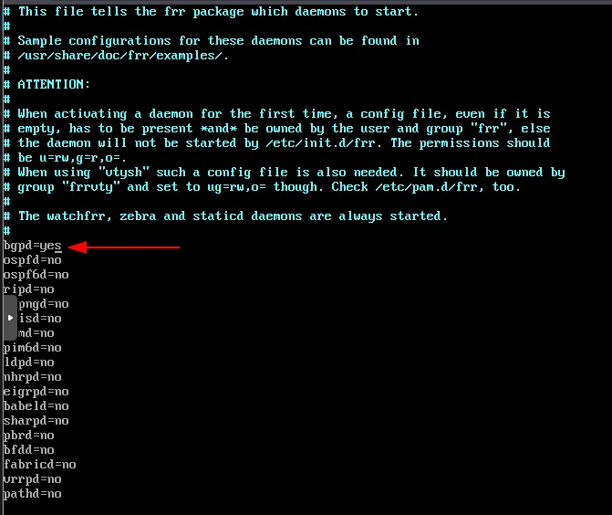

### 7.3 Запуск службы FRR

```bash
systemctl enable --now frr
```

### 7.4 Проверка запуска BGP

```bash
ss -tulpn | grep "bgp"
```

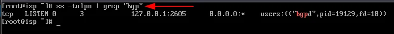

### 7.5 Настройка BGP через vtysh

Вход в интерфейс FRR:

```bash
vtysh
```

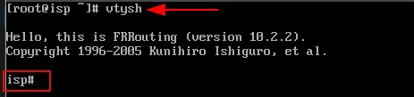

### 7.6 Конфигурация BGP

```
configure terminal
router bgp 31133
bgp router-id 100.100.100.100
neighbor 178.207.179.4 remote-as 64500
address-family ipv4 unicast
neighbor 178.207.179.4 default-originate
exit-address-family
end
wr mem
```

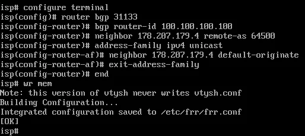

### 7.7 Проверка конфигурации

```
show running-config
```

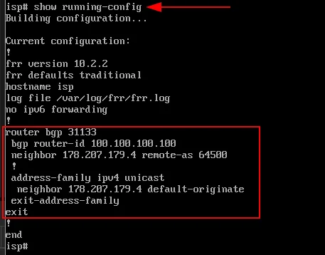

---

## 8. Проверка BGP-соседства (на rtr-cod)

> ⚠️ **Важно:** Данная проверка выполняется на маршрутизаторе rtr-cod без сохранения настроек, чтобы при перезагрузке конфигурация не сохранилась.

### 8.1 Временная настройка rtr-cod

```
ecorouter>en
ecorouter#conf t
ecorouter(config)#interface isp
ecorouter(config-if)#ip address 178.207.179.4/29
ecorouter(config-if)#exit
ecorouter(config)#  
ecorouter(config)#port te0
ecorouter(config-port)#service-instance te0/isp
ecorouter(config-service-instance)#encapsulation untagged 
ecorouter(config-service-instance)#connect ip interface isp 
ecorouter(config-service-instance)#exit
ecorouter(config-port)#exit
ecorouter(config)#
ecorouter(config)#router bgp 64500
ecorouter(config-router)#bgp router-id 178.207.179.4
ecorouter(config-router)#neighbor 178.207.179.1 remote-as 31133
ecorouter(config-router)#exit
ecorouter(config)#exit
ecorouter#
```

### 8.2 Проверка соседства BGP

```
ecorouter#
```

Результат — сообщение о поднятии соседства:

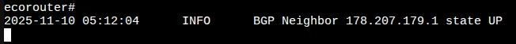

### 8.3 Проверка BGP summary

```
show ip bgp summary
```

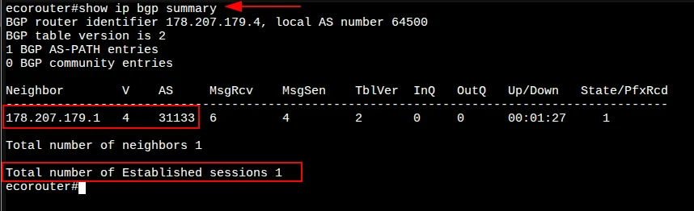

### 8.4 Проверка таблицы маршрутизации

```
show ip route
```

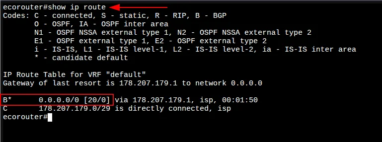

### 8.5 Проверка доступности интернета

```
ping 77.88.8.8
```

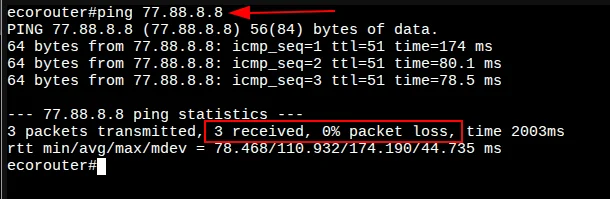

---

## Итоги

После выполнения данного модуля на виртуальной машине ISP настроено:

| Компонент | Статус |
|-----------|--------|
| Имя устройства (hostname) | ✅ |
| IP-адреса на интерфейсах | ✅ |
| Пересылка пакетов (forwarding) | ✅ |
| NAT (iptables) | ✅ |
| DNS-сервер (BIND) | ✅ |
| NTP-сервер (Chrony) | ✅ |
| BGP маршрутизация (FRR) | ✅ |

---

## Следующий модуль

➡️ [Модуль 1. Настройка имён и IP-адресации на устройствах rtr-cod и rtr-a](01-rtr-ip-config.md)
