# 1. Настройка имён и IP-адресации на устройствах rtr-cod и rtr-a

[← Вернуться к оглавлению](../README.md)

---

## Содержание

- [rtr-cod (EcoRouter)](#rtr-cod-ecorouter)
  - [Назначение имени устройства](#назначение-имени-на-устройство)
  - [Назначение IP-адресов](#назначение-ip-адресов-на-устройство)
- [rtr-a (EcoRouter)](#rtr-a-ecorouter)
  - [Назначение имени устройства](#назначение-имени-на-устройство-1)
  - [Назначение IP-адресов](#назначение-ip-адресов-на-устройство-1)
  - [Настройка маршрутизации между VLAN](#настройка-маршрутизации-между-vlan)

---

## rtr-cod (EcoRouter)

### Назначение имени на устройство

Для назначения имени устройства согласно требованиям задания используем следующие команды:

1. Переходим в режим администрирования (`enable`)
2. Переходим в режим конфигурации (`configure terminal`)
3. Задаём имя устройству (`hostname <NAME>`)
4. Задаём доменное имя (`ip domain-name <DOMAIN_NAME>`)
5. Сохраняем конфигурацию (`write memory`)

```
ecorouter>enable
ecorouter#configure terminal 
Enter configuration commands, one per line.  End with CNTL/Z.
ecorouter(config)#hostname rtr-cod
rtr-cod(config)#ip domain-name cod.ssa2026.region
rtr-cod(config)#write memory
Building configuration...

rtr-cod(config)#
```

#### Проверка имени устройства

Проверить имя устройства можно командой `show hostname` из режима администрирования (enable):

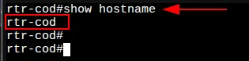

#### Проверка доменного имени

Проверить доменное имя устройства можно командой `show running-config | include domain-name` из режима администрирования (enable):

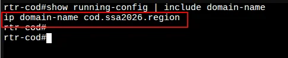

---

### Назначение IP-адресов на устройство

#### Основные понятия EcoRouter

| Уровень | Компонент | Описание |
|---------|-----------|----------|
| L1 | **Порт (port)** | Устройство в составе EcoRouter, работает на физическом уровне |
| L3 | **Интерфейс (interface)** | Логический интерфейс для адресации, работает на сетевом уровне |
| L2 | **Service instance (SI)** | Логический сабинтерфейс, работает на канальном уровне, связывает L1, L2 и L3 |

> **Service instance** необходим для соединения физического порта с интерфейсами L3, интерфейсами bridge, портами. Используется для гибкого управления трафиком на основании наличия меток VLAN в фреймах или их отсутствия. Сквозь сервисный интерфейс проходит весь трафик, приходящий на порт.

#### Алгоритм назначения IPv4-адреса на EcoRouter

1. Создать интерфейс с произвольным именем и назначить на него IPv4-адрес
2. В режиме конфигурирования порта создать service-instance с произвольным именем:
   - Указать (инкапсулировать), будет обрабатываться тегированный или не тегированный трафик
   - Указать, в какой интерфейс (ранее созданный) нужно отправить обработанные кадры

#### Просмотр физических портов

Посмотреть физические порты можно командой `show port brief` из режима администрирования (enable):

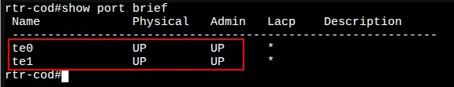

- **te0** — направлен в сторону ВМ ISP
- **te1** — направлен в сторону ВМ fw-cod

#### Создание интерфейса ISP

Создадим интерфейс с именем `isp` и назначим на него IP-адрес `178.207.179.4/29`:

```
rtr-cod(config)#interface isp
rtr-cod(config-if)#ip address 178.207.179.4/29
rtr-cod(config-if)#description "Connecting to an ISP provider"
rtr-cod(config-if)#exit
rtr-cod(config)#
```

#### Создание интерфейса fw-cod

Создадим интерфейс с именем `fw-cod` и назначим на него IP-адрес `172.16.1.1/30`:

```
rtr-cod(config)#interface fw-cod
rtr-cod(config-if)#ip address 172.16.1.1/30
rtr-cod(config-if)#description "Connecting to fw-cod"
rtr-cod(config-if)#exit
rtr-cod(config)#
```

#### Проверка интерфейсов (до привязки к портам)

Проверить назначенные IP-адреса можно командой `show ip interface brief`:

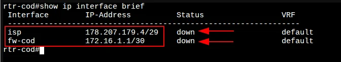

> ⚠️ Созданные интерфейсы пока не добавлены в какие-либо Service instance, а значит не привязаны к порту — отсюда статус **down**

#### Создание Service Instance для ISP (порт te0)

В режиме конфигурирования порта `te0` создаём service-instance:

```
rtr-cod(config)#port te0
rtr-cod(config-port)#service-instance te0/isp
rtr-cod(config-service-instance)#encapsulation untagged 
rtr-cod(config-service-instance)#connect ip interface isp 
rtr-cod(config-service-instance)#exit
rtr-cod(config-port)#exit
rtr-cod(config)#
```

#### Создание Service Instance для fw-cod (порт te1)

В режиме конфигурирования порта `te1` создаём service-instance:

```
rtr-cod(config)#port te1
rtr-cod(config-port)#service-instance te1/fw-cod
rtr-cod(config-service-instance)#encapsulation untagged 
rtr-cod(config-service-instance)#connect ip interface fw-cod 
rtr-cod(config-service-instance)#exit
rtr-cod(config-port)#exit
rtr-cod(config)#write memory
Building configuration...

rtr-cod(config)#
```

#### Проверка интерфейсов (после привязки к портам)

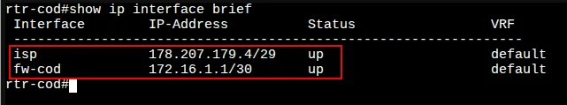

#### Проверка Service Instance

Проверить созданные Service instance можно командой `show service-instance brief`:

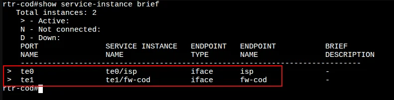

#### О маршруте по умолчанию

> ⚠️ IP-адрес шлюза по умолчанию на данном устройстве **не задаётся** вручную!
> 
> По условиям задания маршрутизатор ЦОД должен получать маршрут по умолчанию **по BGP**.
> Ручное создание маршрута по умолчанию **ЗАПРЕЩЕНО!**

#### Проверка связности с ISP

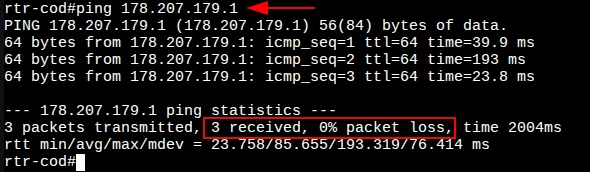

---

## rtr-a (EcoRouter)

### Назначение имени на устройство

Реализация аналогична rtr-cod:

- **Имя устройства:** `rtr-a`
- **Доменное имя:** `office.ssa2026.region`

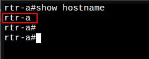


---

### Назначение IP-адресов на устройство

Реализация аналогична rtr-cod, за исключением того, что на базе физического порта `te1` должны быть созданы интерфейсы и Service instance с целью обработки тегированного трафика для маршрутизации между VLAN.

#### Создание интерфейса ISP

Должен быть создан интерфейс для подключения к интернет-провайдеру ISP с IP-адресом `178.207.179.28/29`.

#### Проверка интерфейса ISP (до и после)

До привязки к порту:

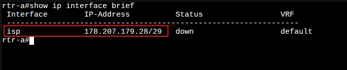

После создания Service instance:

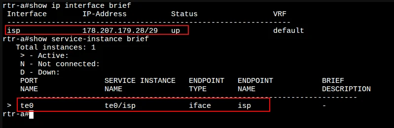

#### Настройка маршрута по умолчанию

> В отличие от rtr-cod, на rtr-a по заданию нет требований про настройку BGP, поэтому маршрут по умолчанию можно задать **вручную**.

```
rtr-a(config)#ip route 0.0.0.0/0 178.207.179.25
rtr-a(config)#
```

#### Проверка маршрута по умолчанию

Проверить назначенный маршрут можно командой `show ip route static`:

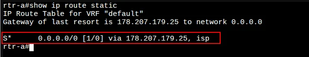

#### Проверка доступа в Интернет

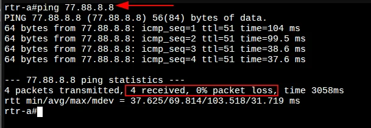

---

### Настройка маршрутизации между VLAN

#### Создание интерфейсов для VLAN

Создаём интерфейсы с произвольными именами для каждого VLAN и назначаем IP-адреса:

```
rtr-a(config)#interface vl100
rtr-a(config-if)#ip address 172.20.10.254/24
rtr-a(config-if)#description "VLAN - SRV"
rtr-a(config-if)#exit

rtr-a(config)#interface vl200
rtr-a(config-if)#ip address 172.20.20.254/24
rtr-a(config-if)#description "VLAN - CLI"
rtr-a(config-if)#exit

rtr-a(config)#interface vl300
rtr-a(config-if)#ip address 172.20.30.254/24
rtr-a(config-if)#description "VLAN - MGMT"
rtr-a(config-if)#exit
```

#### Проверка VLAN интерфейсов (до привязки)

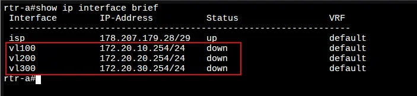

> ⚠️ Созданные интерфейсы пока не добавлены в Service instance — статус **down**

#### Операции над метками в сервисных интерфейсах

Есть три варианта операций над метками:
1. Удаление существующей метки/меток
2. Добавление новой метки (меток)
3. Трансляция метки/меток из одного значения в другое

**Пояснение команд:**

| Команда | Описание |
|---------|----------|
| `encapsulation dot1q <VID> exact` | Указание номера обрабатываемого VLAN. Опция `exact` показывает, что под это правило попадут кадры только с меткой равной `<VID>` |
| `rewrite pop 1` | Снимаем только одну верхнюю метку. На L3 кадр должен поступать без признаков VLAN |

#### Создание Service Instance для VLAN (порт te1)

```
rtr-a(config)#port te1

rtr-a(config-port)#service-instance te1/vl100
rtr-a(config-service-instance)#encapsulation dot1q 100
rtr-a(config-service-instance)#rewrite pop 1
rtr-a(config-service-instance)#connect ip interface vl100                   
rtr-a(config-service-instance)#exit

rtr-a(config-port)#service-instance te1/vl200
rtr-a(config-service-instance)#encapsulation dot1q 200
rtr-a(config-service-instance)#rewrite pop 1
rtr-a(config-service-instance)#connect ip interface vl200 
rtr-a(config-service-instance)#exit

rtr-a(config-port)#service-instance te1/vl300
rtr-a(config-service-instance)#encapsulation dot1q 300
rtr-a(config-service-instance)#rewrite pop 1
rtr-a(config-service-instance)#connect ip interface vl300 
rtr-a(config-service-instance)#exit

rtr-a(config-port)#exit
rtr-a(config)#write memory
Building configuration...

rtr-a(config)#
```

#### Проверка VLAN интерфейсов (после привязки)

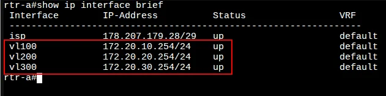

#### Проверка Service Instance

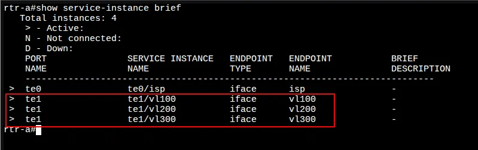

---

[← Вернуться к оглавлению](../README.md) | [Следующий модуль →](02-bgp-config.md)
