# 2. Подход к настройке fw-cod

[← Вернуться к оглавлению](../README.md) | [← Предыдущий модуль](01-rtr-ip-config.md) | [Следующий модуль →](03-bgp-config.md)

---

## Содержание

- [fw-cod (Ideco NGFW)](#fw-cod-ideco-ngfw)
  - [Создание учетной записи администратора](#создание-учетной-записи-администратора)
  - [Настройка интерфейса управления](#настройка-интерфейса-управления)

---

## fw-cod (Ideco NGFW)

### Создание учетной записи администратора

При первом запуске Ideco NGFW появится уведомление о необходимости создания аккаунта администратора:

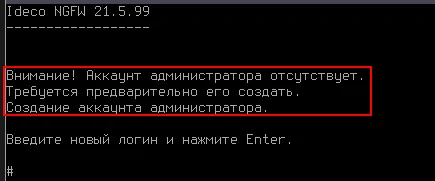

#### Требования к учётным данным

**Логин:**
- Не должен начинаться с цифры
- Не должен содержать специальных и пробельных символов, кроме дефиса `-`
- Длина логина — от 1 до 31 символа включительно

**Пароль:**
- Длина пароля — от 10 до 42 символов
- Содержит строчные и заглавные латинские буквы
- Содержит цифры
- Содержит специальные символы (`! # $ % & ' * +` и другие)

> ⚠️ Если пароль не соответствует требованиям политики безопасности, появится надпись с информацией, что пароль ненадежен. Потребуется ввести новый пароль с учетом требований.

#### Создание пользователя

Создадим пользователя `admin` с паролем `P@ssw0rd1234`:

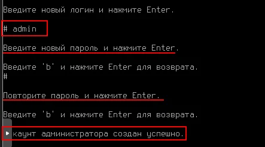

---

### Настройка интерфейса управления

#### Вход в систему

Выполните вход под созданным пользователем `admin` с паролем `P@ssw0rd1234`:

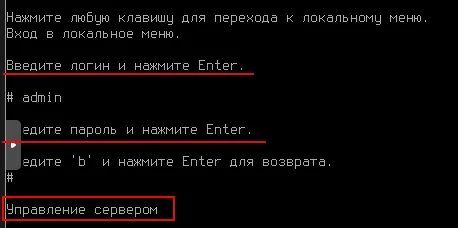

После успешного входа откроется меню **Управление сервером**.

---

#### Переход к настройке интерфейсов

Перейдите в раздел **Ethernet-интерфейсы (3)** → **Создать интерфейс (3)**:

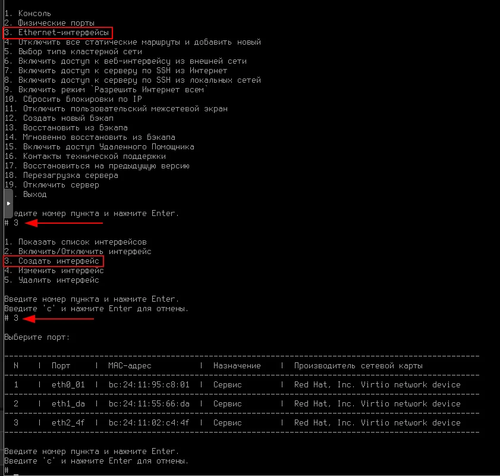

---

#### Пояснения в контексте текущего задания

> **Почему настраиваем через интерфейс в сторону rtr-cod?**

Поскольку Ideco рекомендуется настраивать через веб-интерфейс, необходимо настроить IP-адрес для этого доступа.

В сети `cod.ssa2026.region`:
- За маршрутизацию между VLAN будет отвечать fw-cod
- Под-интерфейсы для VLAN необходимо настраивать через веб-интерфейс (в консоли Ideco это реализовать сложно)
- Редактирование конфигурационных файлов напрямую не рекомендуется — можно лишиться технической поддержки

**Решение:**
1. Использовать интерфейс в сторону rtr-cod для первоначального доступа
2. После реализации туннеля и маршрутизации между rtr-cod и rtr-a
3. А также коммутации между sw1-a и sw2-a
4. Появится возможность конфигурировать fw-cod через веб-интерфейс с cli1-a или cli2-a
5. Что обеспечит полную связность между устройствами `cod.ssa2026.region` и `office.ssa2026.region`

---

#### Выбор порта

Для корректной идентификации сетевой карты используйте **MAC-адрес**. Сравните MAC-адреса на уровне виртуальной машины с портами в консоли Ideco:

Выберите порт в сторону виртуальной машины **rtr-cod** (в данном случае порт **1 — eth0_01**):

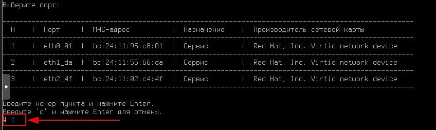

---

#### Настройка параметров интерфейса

**Шаг 1:** Введите имя интерфейса — `rtr-cod`:

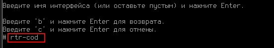

**Шаг 2:** Выберите роль **LAN** (пункт 2):

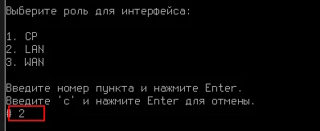

> **Типы ролей интерфейсов в Ideco:**
> - **CP (Control Plane)** — интерфейс администрирования для настройки NGFW через браузер
> - **LAN** — локальная сеть
> - **WAN** — внешняя сеть (интернет)

**Шаг 3:** Выберите **Системный контекст** (пункт 1):

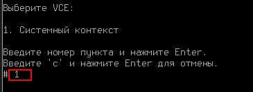

**Шаг 4:** Настройте адресацию **Вручную** (пункт 2):

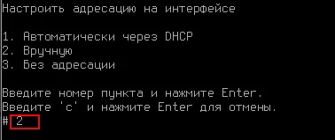

**Шаг 5:** Введите IP-адрес и маску в формате `ip/маска` — `172.16.1.2/30`:

---

#### Проверка настроек

Проверить созданный интерфейс можно, выбрав пункт меню **1. Показать список интерфейсов**:

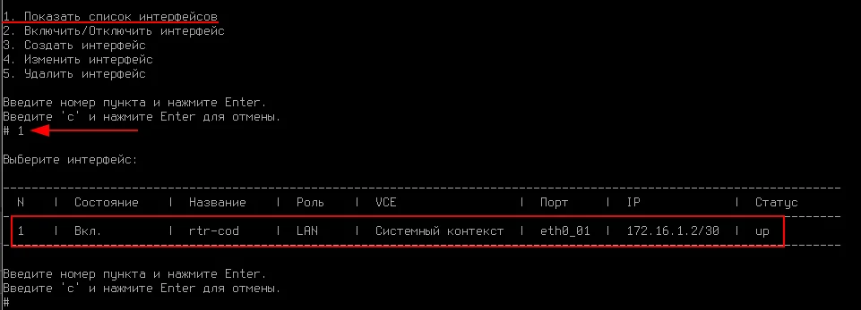

| N | Состояние | Название | Роль | VCE | Порт | IP | Статус |
|---|-----------|----------|------|-----|------|-------|--------|
| 1 | Вкл. | rtr-cod | LAN | Системный контекст | eth0_01 | 172.16.1.2/30 | up |

---

#### Доступ к веб-интерфейсу

При вводе `c` и нажатии Enter (или сочетания клавиш **Ctrl + D**) отобразится панель мониторинга с адресом веб-интерфейса:

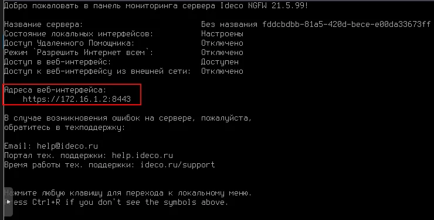

**Адрес веб-интерфейса:** `https://172.16.1.2:8443`

> 📝 **Примечание:** Доступ к веб-интерфейсу будет возможен после настройки туннеля и маршрутизации с устройств в сети `office.ssa2026.region` (например, с cli1-a или cli2-a).

---

[← Вернуться к оглавлению](../README.md) | [← Предыдущий модуль](01-rtr-ip-config.md) | [Следующий модуль →](03-bgp-config.md)
