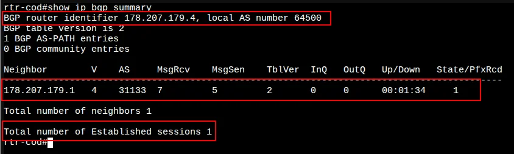
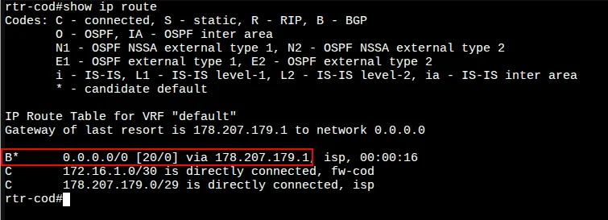
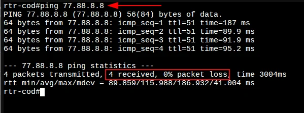

# 3. Настройка маршрутизации BGP на rtr-cod

[← Вернуться к оглавлению](../README.md) | [← Предыдущий модуль](02-fw-cod-config.md)

---

## Содержание

- [Вариант реализации](#вариант-реализации)
- [Базовая настройка BGP](#базовая-настройка-bgp)
- [Проверка настроек](#проверка-настроек)

---

## Вариант реализации

### rtr-cod (EcoRouter)

По условиям задания:
- Маршрутизатор ЦОД должен получать маршрут по умолчанию **по BGP**
- Ручное создание маршрута по умолчанию **ЗАПРЕЩЕНО!**
- Соседство устанавливается по IPv4 с адреса шлюза на выделяемый провайдером адрес

---

## Базовая настройка BGP

### Шаг 1: Запуск протокола BGP

Запустите протокол BGP, указав номер автономной системы:

```
rtr-cod(config)#router bgp 64500
rtr-cod(config-router)#
```

> 📝 **Примечание:** Номер AS `64500` — это приватная автономная система для rtr-cod.

---

### Шаг 2: Настройка Router ID

Укажите уникальный идентификатор маршрутизатора в протоколе BGP:

```
rtr-cod(config-router)#bgp router-id 178.207.179.4
rtr-cod(config-router)#
```

> 💡 В качестве Router ID обычно используется IP-адрес интерфейса маршрутизатора (в данном случае — адрес интерфейса ISP).

---

### Шаг 3: Настройка BGP-соседства

Сконфигурируйте BGP-соседство с интернет-провайдером ISP, указав адрес соседа и номер его AS:

```
rtr-cod(config-router)#neighbor 178.207.179.1 remote-as 31133
rtr-cod(config-router)#exit
rtr-cod(config)#write memory
Building configuration...

rtr-cod(config)#
```

| Параметр | Значение | Описание |
|----------|----------|----------|
| Neighbor IP | 178.207.179.1 | IP-адрес шлюза провайдера (GIGAFON COD) |
| Remote AS | 31133 | Номер автономной системы провайдера |

---

## Проверка настроек

### Проверка BGP-соседства

Проверить состояние всех соединений BGP можно командой `show ip bgp summary`:



**Ключевые показатели:**

| Параметр | Значение | Описание |
|----------|----------|----------|
| BGP router identifier | 178.207.179.4 | Наш Router ID |
| Local AS number | 64500 | Номер нашей AS |
| Neighbor | 178.207.179.1 | IP соседа (ISP) |
| AS | 31133 | AS соседа |
| State/PfxRcd | 1 | Получен 1 префикс (маршрут по умолчанию) |
| Established sessions | 1 | Сессия установлена |

---

### Проверка таблицы маршрутизации

Проверить маршрут по умолчанию можно командой `show ip route`:



В таблице маршрутизации появился маршрут по умолчанию, полученный по BGP:

```
B*      0.0.0.0/0 [20/0] via 178.207.179.1, isp, 00:00:16
```

**Расшифровка:**
- `B` — маршрут получен по BGP
- `*` — маршрут по умолчанию (candidate default)
- `[20/0]` — административная дистанция BGP / метрика
- `via 178.207.179.1` — next-hop (шлюз провайдера)
- `isp` — выходной интерфейс

---

### Проверка доступа в Интернет

Проверяем связность с внешним ресурсом:



```
rtr-cod#ping 77.88.8.8
PING 77.88.8.8 (77.88.8.8) 56(84) bytes of data.
64 bytes from 77.88.8.8: icmp_seq=1 ttl=51 time=187 ms
...
4 packets transmitted, 4 received, 0% packet loss
```

✅ Доступ в Интернет через BGP работает корректно!

---

## Итоговая конфигурация BGP

```
router bgp 64500
 bgp router-id 178.207.179.4
 neighbor 178.207.179.1 remote-as 31133
```

---

[← Вернуться к оглавлению](../README.md) | [← Предыдущий модуль](02-fw-cod-config.md) | [Следующий модуль →](04-tunnel-config.md)
