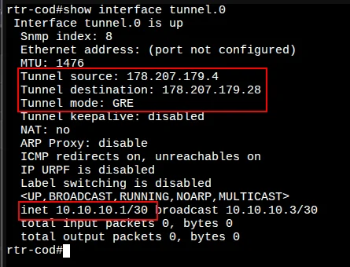
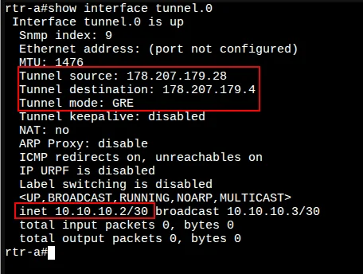
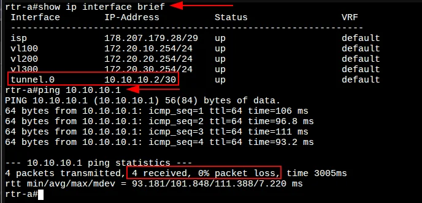

# 4. Настройка туннелей между офисом «a» и «cod»

[← Вернуться к оглавлению](../README.md) | [← Предыдущий модуль](03-bgp-config.md) | [Следующий модуль →](05-nat-config.md)

---

## Содержание

- [Обзор](#обзор)
- [rtr-cod (EcoRouter)](#rtr-cod-ecorouter)
- [rtr-a (EcoRouter)](#rtr-a-ecorouter)
- [Проверка связности](#проверка-связности)

---

## Обзор

Для связи между площадками `cod.ssa2026.region` и `office.ssa2026.region` необходимо настроить GRE-туннель между маршрутизаторами rtr-cod и rtr-a.

| Параметр | rtr-cod | rtr-a |
|----------|---------|-------|
| Tunnel IP | 10.10.10.1/30 | 10.10.10.2/30 |
| Source IP | 178.207.179.4 | 178.207.179.28 |
| Destination IP | 178.207.179.28 | 178.207.179.4 |
| Mode | GRE | GRE |

---

## rtr-cod (EcoRouter)

### Настройка туннеля GRE

#### Шаг 1: Создание интерфейса туннеля

Создайте интерфейс туннеля с именем `tunnel.0`:

```
rtr-cod(config)#interface tunnel.0
rtr-cod(config-if-tunnel)#
```

#### Шаг 2: Назначение IP-адреса

Назначьте IP-адрес в соответствии с требованиями задания:

```
rtr-cod(config-if-tunnel)#ip address 10.10.10.1/30
rtr-cod(config-if-tunnel)#
```

#### Шаг 3: Настройка параметров туннеля

Задайте режим работы туннеля GRE и адреса источника (rtr-cod) и назначения (rtr-a):

```
rtr-cod(config-if-tunnel)#ip tunnel 178.207.179.4 178.207.179.28 mode gre
rtr-cod(config-if-tunnel)#exit
rtr-cod(config)#write memory
Building configuration...

rtr-cod(config)#
```

#### Проверка туннеля на rtr-cod

Для просмотра состояния туннеля используется команда `show interface tunnel.0`:



**Ключевые параметры:**
- `Interface tunnel.0 is up` — туннель активен
- `Tunnel source: 178.207.179.4` — IP источника (rtr-cod)
- `Tunnel destination: 178.207.179.28` — IP назначения (rtr-a)
- `Tunnel mode: GRE` — режим туннеля
- `inet 10.10.10.1/30` — IP-адрес туннельного интерфейса

---

## rtr-a (EcoRouter)

### Настройка туннеля GRE

Реализация аналогична rtr-cod, но с зеркальными адресами источника и назначения.

#### Шаг 1: Создание интерфейса туннеля

```
rtr-a(config)#interface tunnel.0
rtr-a(config-if-tunnel)#
```

#### Шаг 2: Назначение IP-адреса

```
rtr-a(config-if-tunnel)#ip address 10.10.10.2/30
rtr-a(config-if-tunnel)#
```

#### Шаг 3: Настройка параметров туннеля

> ⚠️ **Важно:** Адреса источника и назначения меняются местами относительно rtr-cod!

```
rtr-a(config-if-tunnel)#ip tunnel 178.207.179.28 178.207.179.4 mode gre
rtr-a(config-if-tunnel)#exit
rtr-a(config)#write memory
Building configuration...

rtr-a(config)#
```

#### Проверка туннеля на rtr-a



**Ключевые параметры:**
- `Interface tunnel.0 is up` — туннель активен
- `Tunnel source: 178.207.179.28` — IP источника (rtr-a)
- `Tunnel destination: 178.207.179.4` — IP назначения (rtr-cod)
- `Tunnel mode: GRE` — режим туннеля
- `inet 10.10.10.2/30` — IP-адрес туннельного интерфейса

---

## Проверка связности

### Проверка интерфейсов и ping через туннель



Команда `show ip interface brief` показывает туннельный интерфейс в состоянии **up**:

| Interface | IP-Address | Status | VRF |
|-----------|------------|--------|-----|
| tunnel.0 | 10.10.10.2/30 | up | default |

Проверка связности с противоположным концом туннеля:

```
rtr-a#ping 10.10.10.1
PING 10.10.10.1 (10.10.10.1) 56(84) bytes of data.
64 bytes from 10.10.10.1: icmp_seq=1 ttl=64 time=106 ms
64 bytes from 10.10.10.1: icmp_seq=2 ttl=64 time=96.8 ms
64 bytes from 10.10.10.1: icmp_seq=3 ttl=64 time=111 ms
64 bytes from 10.10.10.1: icmp_seq=4 ttl=64 time=93.2 ms

--- 10.10.10.1 ping statistics ---
4 packets transmitted, 4 received, 0% packet loss
```

✅ GRE-туннель между rtr-cod и rtr-a работает корректно!

---

## Итоговая конфигурация

### rtr-cod

```
interface tunnel.0
 ip address 10.10.10.1/30
 ip tunnel 178.207.179.4 178.207.179.28 mode gre
```

### rtr-a

```
interface tunnel.0
 ip address 10.10.10.2/30
 ip tunnel 178.207.179.28 178.207.179.4 mode gre
```

---

[← Вернуться к оглавлению](../README.md) | [← Предыдущий модуль](03-bgp-config.md) | [Следующий модуль →](05-nat-config.md)
