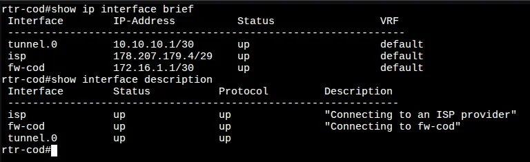
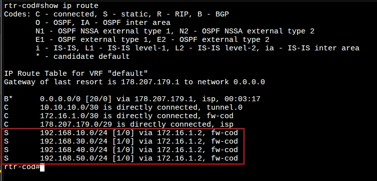
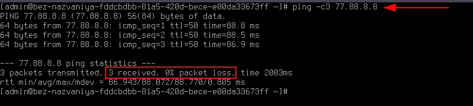
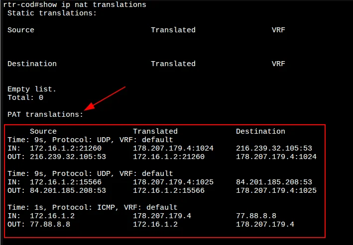
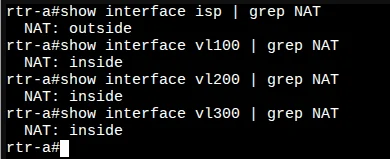
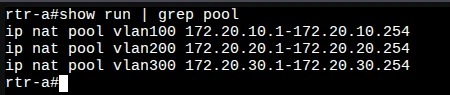
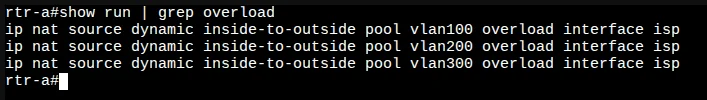
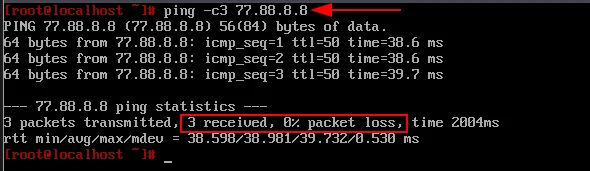
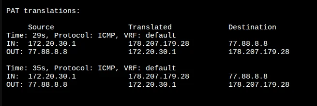

# 5. Настройка доступа в Интернет

[← Вернуться к оглавлению](../README.md) | [← Предыдущий модуль](04-tunnel-config.md) | [Следующий модуль →](06-ospf-config.md)

---

## Содержание

- [Обзор](#обзор)
- [rtr-cod (EcoRouter)](#rtr-cod-ecorouter)
  - [Настройка dynamic PAT](#настройка-dynamic-pat)
  - [Статические маршруты](#статические-маршруты)
  - [Проверка NAT](#проверка-nat)
- [rtr-a (EcoRouter)](#rtr-a-ecorouter)
  - [Настройка dynamic PAT](#настройка-dynamic-pat-1)
  - [Проверка NAT](#проверка-nat-1)

---

## Обзор

Для обеспечения доступа в Интернет из локальных сетей необходимо настроить динамическую трансляцию адресов (PAT/NAT overload) на маршрутизаторах rtr-cod и rtr-a.

---

## rtr-cod (EcoRouter)

### Настройка dynamic PAT

#### Шаг 1: Определение inside/outside интерфейсов

С точки зрения NAT:
- **outside** — интерфейс `isp` (в сторону Интернета)
- **inside** — интерфейс `fw-cod` (в сторону локальной сети)



Назначаем интерфейс `isp` как **outside**:

```
rtr-cod(config)#interface isp 
rtr-cod(config-if)#ip nat outside 
rtr-cod(config-if)#exit
rtr-cod(config)#
```

Назначаем интерфейс `fw-cod` как **inside**:

```
rtr-cod(config)#interface fw-cod 
rtr-cod(config-if)#ip nat inside 
rtr-cod(config-if)#exit
rtr-cod(config)#
```

---

#### Шаг 2: Создание NAT pool

Создаём NAT pool для указания диапазонов IP-адресов, которые будут попадать под правила трансляции.

> ⚠️ **Важно:** Необходимо указать не только диапазон из сети между rtr-cod и fw-cod, но и диапазоны из VLAN-сетей, т.к. в дальнейшем будет реализована маршрутизация между rtr-cod и fw-cod.

| VLAN | Сеть | Назначение |
|------|------|------------|
| - | 172.16.1.0/30 | Связь rtr-cod ↔ fw-cod |
| 100 | 192.168.10.0/24 | SRV-COD |
| 300 | 192.168.30.0/24 | MGMT-COD |
| 400 | 192.168.40.0/24 | CLI |
| 500 | 192.168.50.0/24 | VOIP |

> 📝 **Примечание:** Диапазон `192.168.20.0/24` (VLAN 200 - DATA) **не указываем**, т.к. по условиям задания: *"Для «cod» трафик VLAN - DATA не должен маршрутизироваться"*

```
rtr-cod(config)#ip nat pool fw-cod 172.16.1.1-172.16.1.2
rtr-cod(config)#ip nat pool vlan100 192.168.10.1-192.168.10.254
rtr-cod(config)#ip nat pool vlan300 192.168.30.1-192.168.30.254
rtr-cod(config)#ip nat pool vlan400 192.168.40.1-192.168.40.254
rtr-cod(config)#ip nat pool vlan500 192.168.50.1-192.168.50.254
rtr-cod(config)#
```

---

#### Шаг 3: Создание правил трансляции

Создаём правила трансляции адресов для каждого NAT pool через outside-интерфейс:

```
rtr-cod(config)#ip nat source dynamic inside pool fw-cod overload interface isp 
rtr-cod(config)#ip nat source dynamic inside pool vlan100 overload interface isp
rtr-cod(config)#ip nat source dynamic inside pool vlan300 overload interface isp 
rtr-cod(config)#ip nat source dynamic inside pool vlan400 overload interface isp 
rtr-cod(config)#ip nat source dynamic inside pool vlan500 overload interface isp 
rtr-cod(config)#write memory
Building configuration...

rtr-cod(config)#
```

---

### Статические маршруты

Добавляем статические маршруты в локальные сети COD:

> ⚠️ **Почему статические маршруты, а не OSPF?**
> 
> По условиям задания динамическую маршрутизацию (OSPF) между rtr-cod и fw-cod реализовать нельзя, т.к. на rtr-cod *"Все интерфейсы, кроме туннельных, должны быть переведены в пассивный режим"*.

> 📝 **Примечание:** Маршрут в сеть `192.168.20.0/24` (VLAN 200) **не добавляем**, т.к. *"Для «cod» трафик VLAN - DATA не должен маршрутизироваться"*.

```
rtr-cod(config)#ip route 192.168.10.0/24 172.16.1.2
rtr-cod(config)#ip route 192.168.30.0/24 172.16.1.2
rtr-cod(config)#ip route 192.168.40.0/24 172.16.1.2
rtr-cod(config)#ip route 192.168.50.0/24 172.16.1.2
rtr-cod(config)#write memory
Building configuration...

rtr-cod(config)#
```

#### Проверка таблицы маршрутизации



---

### Проверка NAT

#### Проверка доступа в Интернет с fw-cod

Для проверки используем консоль Ideco (пункт меню **1. Консоль**):


**Временно** назначаем адрес шлюза по умолчанию:

```bash
ip route add 0.0.0.0/0 via 172.16.1.1
```

Проверяем доступ в Интернет:



```
ping -c3 77.88.8.8
3 packets transmitted, 3 received, 0% packet loss
```

#### Проверка таблицы трансляции

На rtr-cod проверяем таблицу трансляции командой `show ip nat translations`:



✅ PAT-трансляция работает: адреса из сети `172.16.1.0/30` транслируются в `178.207.179.4`.

---

## rtr-a (EcoRouter)

### Настройка dynamic PAT

#### Шаг 1: Определение inside/outside интерфейсов

С точки зрения NAT:
- **outside** — интерфейс `isp`
- **inside** — интерфейсы `vl100`, `vl200`, `vl300`

```
rtr-a(config)#interface isp 
rtr-a(config-if)#ip nat outside 
rtr-a(config-if)#exit
rtr-a(config)#
```

```
rtr-a(config)#interface vl100
rtr-a(config-if)#ip nat inside 
rtr-a(config-if)#exit
rtr-a(config)#
```

```
rtr-a(config)#interface vl200
rtr-a(config-if)#ip nat inside 
rtr-a(config-if)#exit
rtr-a(config)#
```

```
rtr-a(config)#interface vl300
rtr-a(config-if)#ip nat inside 
rtr-a(config-if)#exit
rtr-a(config)#
```

#### Проверка NAT-интерфейсов



---

#### Шаг 2: Создание NAT pool

| VLAN | Сеть | Назначение |
|------|------|------------|
| 100 | 172.20.10.0/24 | SRV |
| 200 | 172.20.20.0/24 | CLI |
| 300 | 172.20.30.0/24 | MGMT |

```
rtr-a(config)#ip nat pool vlan100 172.20.10.1-172.20.10.254
rtr-a(config)#ip nat pool vlan200 172.20.20.1-172.20.20.254
rtr-a(config)#ip nat pool vlan300 172.20.30.1-172.20.30.254
rtr-a(config)#
```



---

#### Шаг 3: Создание правил трансляции

```
rtr-a(config)#ip nat source dynamic inside-to-outside pool vlan100 overload interface isp
rtr-a(config)#ip nat source dynamic inside-to-outside pool vlan200 overload interface isp
rtr-a(config)#ip nat source dynamic inside-to-outside pool vlan300 overload interface isp
rtr-a(config)#write memory
Building configuration...

rtr-a(config)#
```



---

### Проверка NAT

#### Проверка доступа в Интернет с sw1-a

Для проверки на sw1-a временно создаём тегированный подинтерфейс с IP-адресом из VLAN 300:

```bash
ip link add link ens19 name ens19.300 type vlan id 300
ip link set dev ens19.300 up
ip addr add 172.20.30.1/24 dev ens19.300
ip route add 0.0.0.0/0 via 172.20.30.254
```

Проверяем доступ в Интернет:



```
ping -c3 77.88.8.8
3 packets transmitted, 3 received, 0% packet loss
```

#### Проверка таблицы трансляции

На rtr-a проверяем таблицу трансляции командой `show ip nat translations`:



✅ PAT-трансляция работает: адреса из сети `172.20.30.0/24` транслируются в `178.207.179.28`.

---

## Итоговая конфигурация

### rtr-cod

```
! NAT interfaces
interface isp
 ip nat outside

interface fw-cod
 ip nat inside

! NAT pools
ip nat pool fw-cod 172.16.1.1-172.16.1.2
ip nat pool vlan100 192.168.10.1-192.168.10.254
ip nat pool vlan300 192.168.30.1-192.168.30.254
ip nat pool vlan400 192.168.40.1-192.168.40.254
ip nat pool vlan500 192.168.50.1-192.168.50.254

! NAT rules
ip nat source dynamic inside pool fw-cod overload interface isp
ip nat source dynamic inside pool vlan100 overload interface isp
ip nat source dynamic inside pool vlan300 overload interface isp
ip nat source dynamic inside pool vlan400 overload interface isp
ip nat source dynamic inside pool vlan500 overload interface isp

! Static routes
ip route 192.168.10.0/24 172.16.1.2
ip route 192.168.30.0/24 172.16.1.2
ip route 192.168.40.0/24 172.16.1.2
ip route 192.168.50.0/24 172.16.1.2
```

### rtr-a

```
! NAT interfaces
interface isp
 ip nat outside

interface vl100
 ip nat inside

interface vl200
 ip nat inside

interface vl300
 ip nat inside

! NAT pools
ip nat pool vlan100 172.20.10.1-172.20.10.254
ip nat pool vlan200 172.20.20.1-172.20.20.254
ip nat pool vlan300 172.20.30.1-172.20.30.254

! NAT rules
ip nat source dynamic inside-to-outside pool vlan100 overload interface isp
ip nat source dynamic inside-to-outside pool vlan200 overload interface isp
ip nat source dynamic inside-to-outside pool vlan300 overload interface isp
```

---

[← Вернуться к оглавлению](../README.md) | [← Предыдущий модуль](04-tunnel-config.md) | [Следующий модуль →](06-ospf-config.md)
