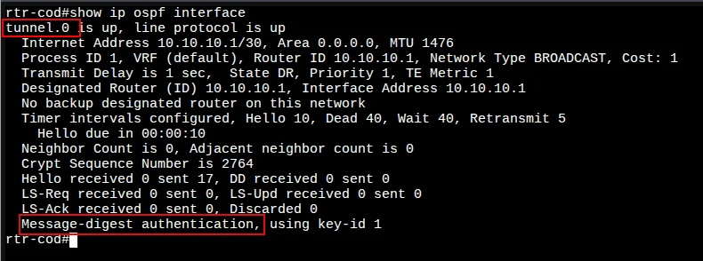
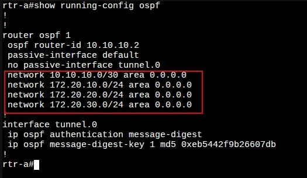
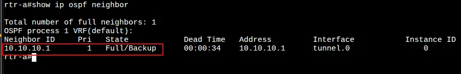
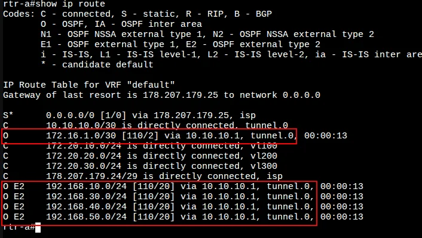
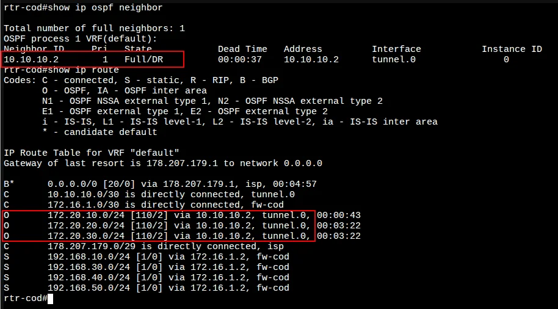

# 6. Настройка динамической маршрутизации между офисом «a» и «cod»

[← Вернуться к оглавлению](../README.md) | [← Предыдущий модуль](05-nat-config.md) | [Следующий модуль →](07-switching-config.md)

---

## Содержание

- [Обзор](#обзор)
- [rtr-cod (EcoRouter)](#rtr-cod-ecorouter)
- [rtr-a (EcoRouter)](#rtr-a-ecorouter)
- [Проверка OSPF](#проверка-ospf)

---

## Обзор

Для обеспечения динамической маршрутизации между площадками `cod.ssa2026.region` и `office.ssa2026.region` необходимо настроить OSPF через GRE-туннель.

По условиям задания:
- Все интерфейсы, кроме туннельных, должны быть переведены в пассивный режим
- Протокол маршрутизации должен быть защищён парольной аутентификацией

---

## rtr-cod (EcoRouter)

### Настройка динамической маршрутизации OSPF

#### Шаг 1: Запуск процесса OSPF

Перейдите в режим конфигурирования протокола:

```
rtr-cod(config)#router ospf 1
rtr-cod(config-router)#
```

#### Шаг 2: Настройка Router ID

Сконфигурируйте OSPF идентификатор маршрутизатора (используем туннельный IP-адрес):

```
rtr-cod(config-router)#router-id 10.10.10.1
rtr-cod(config-router)#
```

#### Шаг 3: Настройка пассивных интерфейсов

Переводим все интерфейсы в пассивный режим:

```
rtr-cod(config-router)#passive-interface default 
rtr-cod(config-router)#
```

Исключаем интерфейс `tunnel.0` из пассивного режима для установления соседства:

```
rtr-cod(config-router)#no passive-interface tunnel.0 
rtr-cod(config-router)#
```

#### Шаг 4: Объявление сетей

Объявляем сети и импортируем статические маршруты:

```
rtr-cod(config-router)#redistribute static 
rtr-cod(config-router)#network 10.10.10.0/30 area 0
rtr-cod(config-router)#network 172.16.1.0/30 area 0
rtr-cod(config-router)#exit
rtr-cod(config)#
```

> 📝 **Примечание:** Команда `redistribute static` импортирует ранее настроенные статические маршруты до локальных сетей COD в процесс OSPF для анонсирования соседям.

#### Шаг 5: Настройка аутентификации

Обеспечиваем защиту протокола маршрутизации посредством MD5-аутентификации:

```
rtr-cod(config)#interface tunnel.0
rtr-cod(config-if-tunnel)#ip ospf authentication message-digest 
rtr-cod(config-if-tunnel)#ip ospf message-digest-key 1 md5 P@ssw0rd
rtr-cod(config-if-tunnel)#exit
rtr-cod(config)#write memory
Building configuration...

rtr-cod(config)#
```

#### Проверка OSPF на интерфейсе

Просмотр данных о состоянии интерфейсов OSPF командой `show ip ospf interface`:



**Ключевые параметры:**
- `tunnel.0 is up, line protocol is up` — интерфейс активен
- `Area 0.0.0.0` — область OSPF
- `Message-digest authentication, using key-id 1` — MD5-аутентификация включена

---

## rtr-a (EcoRouter)

### Настройка динамической маршрутизации OSPF

#### Шаг 1: Запуск процесса OSPF

```
rtr-a(config)#router ospf 1
rtr-a(config-router)#
```

#### Шаг 2: Настройка Router ID

```
rtr-a(config-router)#router-id 10.10.10.2
rtr-a(config-router)#
```

#### Шаг 3: Настройка пассивных интерфейсов

```
rtr-a(config-router)#passive-interface default 
rtr-a(config-router)#no passive-interface tunnel.0 
rtr-a(config-router)#
```

#### Шаг 4: Объявление сетей

На rtr-a объявляем сети туннеля и локальных VLAN:

```
rtr-a(config-router)#network 10.10.10.0/30 area 0
rtr-a(config-router)#network 172.20.10.0/24 area 0
rtr-a(config-router)#network 172.20.20.0/24 area 0
rtr-a(config-router)#network 172.20.30.0/24 area 0
rtr-a(config-router)#exit
rtr-a(config)#
```

| Сеть | Описание |
|------|----------|
| 10.10.10.0/30 | Туннель между rtr-cod и rtr-a |
| 172.20.10.0/24 | VLAN 100 - SRV |
| 172.20.20.0/24 | VLAN 200 - CLI |
| 172.20.30.0/24 | VLAN 300 - MGMT |

#### Шаг 5: Настройка аутентификации

> ⚠️ **Важно:** Пароль должен совпадать с паролем на rtr-cod!

```
rtr-a(config)#interface tunnel.0
rtr-a(config-if-tunnel)#ip ospf authentication message-digest 
rtr-a(config-if-tunnel)#ip ospf message-digest-key 1 md5 P@ssw0rd
rtr-a(config-if-tunnel)#exit
rtr-a(config)#write memory
Building configuration...

rtr-a(config)#
```

#### Проверка конфигурации OSPF



---

## Проверка OSPF

### Проверка соседства на rtr-a

Команда `show ip ospf neighbor`:



| Neighbor ID | State | Interface |
|-------------|-------|-----------|
| 10.10.10.1 | Full/Backup | tunnel.0 |

✅ Соседство установлено в состоянии **Full**!

### Проверка таблицы маршрутизации на rtr-a

Команда `show ip route`:



Маршруты, полученные по OSPF (помечены `O` и `O E2`):

| Тип | Сеть | Via | Интерфейс |
|-----|------|-----|-----------|
| O | 172.16.1.0/30 | 10.10.10.1 | tunnel.0 |
| O E2 | 192.168.10.0/24 | 10.10.10.1 | tunnel.0 |
| O E2 | 192.168.30.0/24 | 10.10.10.1 | tunnel.0 |
| O E2 | 192.168.40.0/24 | 10.10.10.1 | tunnel.0 |
| O E2 | 192.168.50.0/24 | 10.10.10.1 | tunnel.0 |

> 📝 `O E2` — маршруты типа External Type 2, полученные через `redistribute static` на rtr-cod.

### Проверка соседства и маршрутов на rtr-cod

Команды `show ip ospf neighbor` и `show ip route`:



| Neighbor ID | State | Interface |
|-------------|-------|-----------|
| 10.10.10.2 | Full/DR | tunnel.0 |

Маршруты, полученные по OSPF:

| Тип | Сеть | Via | Интерфейс |
|-----|------|-----|-----------|
| O | 172.20.10.0/24 | 10.10.10.2 | tunnel.0 |
| O | 172.20.20.0/24 | 10.10.10.2 | tunnel.0 |
| O | 172.20.30.0/24 | 10.10.10.2 | tunnel.0 |

### Проверка связности между площадками

Проверка связности между sw1-a и fw-cod (при наличии временных маршрутов):


```
tracepath -n 172.16.1.2
 1:  172.20.30.254    72.228ms
 2:  172.20.30.254    21.991ms
 3:  10.10.10.1       64.922ms pmtu 1476
 4:  172.16.1.2       99.717ms reached
```

✅ Трафик проходит через туннель (10.10.10.1) между площадками!

---

## Итоговая конфигурация

### rtr-cod

```
router ospf 1
 router-id 10.10.10.1
 passive-interface default
 no passive-interface tunnel.0
 redistribute static
 network 10.10.10.0/30 area 0
 network 172.16.1.0/30 area 0

interface tunnel.0
 ip ospf authentication message-digest
 ip ospf message-digest-key 1 md5 P@ssw0rd
```

### rtr-a

```
router ospf 1
 router-id 10.10.10.2
 passive-interface default
 no passive-interface tunnel.0
 network 10.10.10.0/30 area 0
 network 172.20.10.0/24 area 0
 network 172.20.20.0/24 area 0
 network 172.20.30.0/24 area 0

interface tunnel.0
 ip ospf authentication message-digest
 ip ospf message-digest-key 1 md5 P@ssw0rd
```

---

[← Вернуться к оглавлению](../README.md) | [← Предыдущий модуль](05-nat-config.md) | [Следующий модуль →](07-switching-config.md)
