# 8. Настройка доступа к веб-интерфейсу fw-cod и лицензирование

[← Вернуться к оглавлению](../README.md) | [← Предыдущий модуль](07-switching-config.md) | [Следующий модуль →](09-next-config.md)

---

## Содержание

- [Обзор](#обзор)
- [fw-cod (Ideco NGFW)](#fw-cod-ideco-ngfw)
  - [Проверка маршрута по умолчанию](#проверка-маршрута-по-умолчанию)
- [cli1-a (Alt Workstation)](#cli1-a-alt-workstation)
  - [Базовая настройка устройства](#базовая-настройка-устройства)
  - [Настройка сети](#настройка-сети)
- [Доступ к веб-интерфейсу fw-cod](#доступ-к-веб-интерфейсу-fw-cod)
- [Базовая настройка fw-cod через веб-интерфейс](#базовая-настройка-fw-cod-через-веб-интерфейс)
- [Получение лицензии fw-cod](#получение-лицензии-fw-cod)

---

## Обзор

После настройки коммутации и маршрутизации появилась возможность получить доступ к веб-интерфейсу fw-cod с рабочих станций в офисе «a» через GRE-туннель.

---

## fw-cod (Ideco NGFW)

### Проверка маршрута по умолчанию

Выполните вход на fw-cod из-под ранее созданного пользователя и перейдите в консоль (пункт 1):

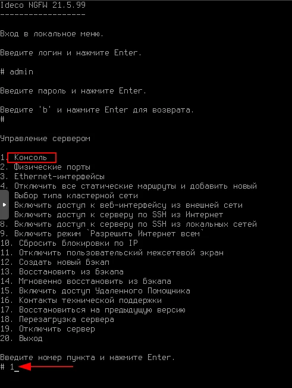

Проверьте таблицу маршрутов командой `ip r`:

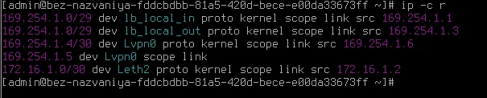

Если отсутствует маршрут по умолчанию, его необходимо **временно** добавить:

```bash
ip route add 0.0.0.0/0 via 172.16.1.1
```

Повторно проверьте таблицу маршрутов:

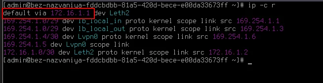

✅ Маршрут по умолчанию через `172.16.1.1` (rtr-cod) добавлен.

---

## cli1-a (Alt Workstation)

### Базовая настройка устройства

#### Переход в Центр управления системой

Откройте меню приложений и перейдите в **Настройки → Центр управления системой**:

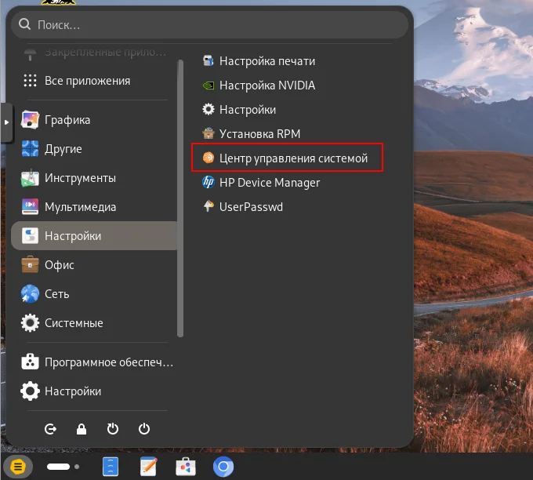

#### Настройка Ethernet-интерфейсов

В ЦУС перейдите в раздел **Сеть → Ethernet-интерфейсы**:

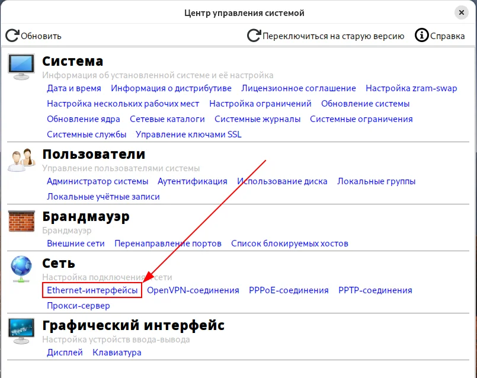

#### Назначение имени устройства

Назначьте имя устройства в соответствии с топологией — `cli1-a.office.ssa2026.region`:

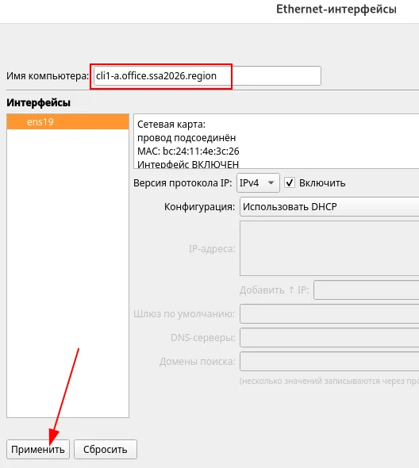

#### Выбор сетевой подсистемы

В качестве режима работы сетевой подсистемы выберите **NetworkManager (native)**:

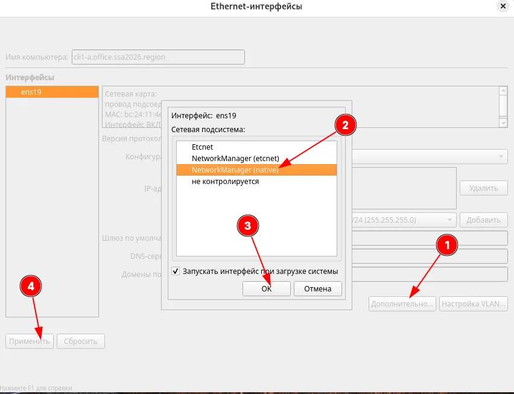

**Порядок действий:**
1. Нажмите **Дополнительно...**
2. Выберите **NetworkManager (native)**
3. Нажмите **OK**
4. Нажмите **Применить**

---

### Настройка сети

#### Переход в настройки сети

Откройте **Настройки** из меню приложений:

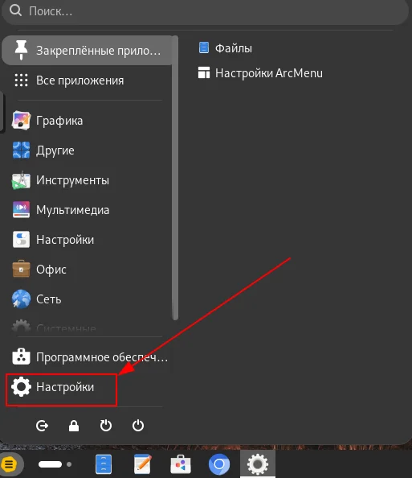

В разделе **Сеть** перейдите к настройке сетевого подключения (значок шестерёнки):

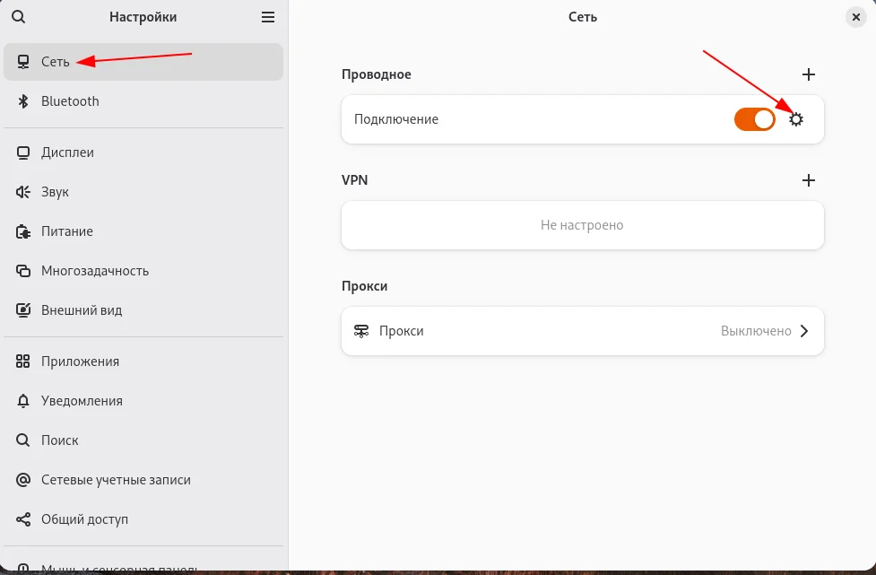

#### Настройка IPv4

На вкладке **IPv4** задайте параметры вручную:

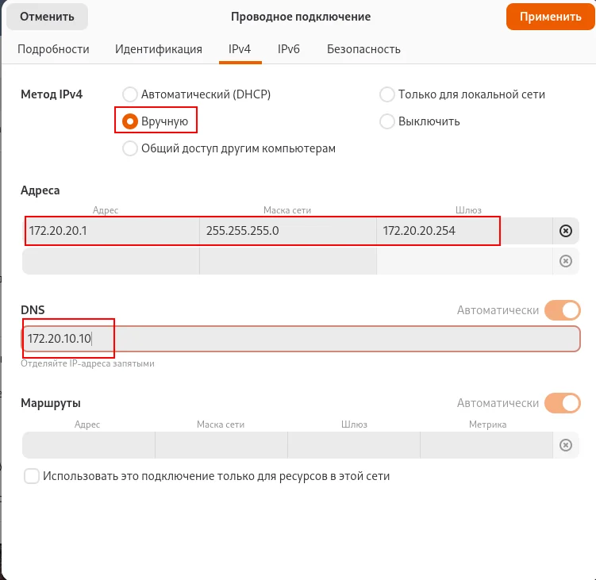

| Параметр | Значение |
|----------|----------|
| Метод IPv4 | Вручную |
| Адрес | 172.20.20.1 |
| Маска сети | 255.255.255.0 |
| Шлюз | 172.20.20.254 |
| DNS | 172.20.10.10 |

> 📝 **Примечание:** В качестве DNS-сервера указываем IP-адрес dc-a (172.20.10.10).

Нажмите **Применить**.

#### Проверка настроек

Проверьте настройки на вкладке **Подробности**:

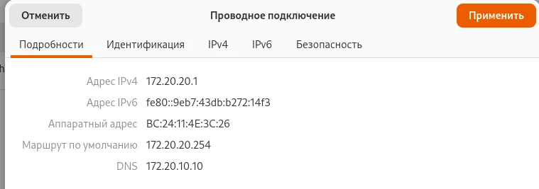

---

## Доступ к веб-интерфейсу fw-cod

### Подключение через браузер

Откройте браузер и перейдите по адресу **https://172.16.1.2:8443**:

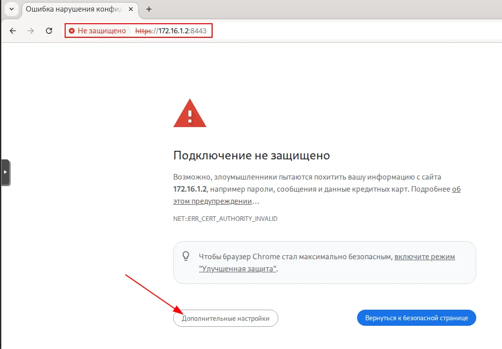

> ⚠️ Браузер покажет предупреждение о небезопасном подключении. Нажмите **Дополнительные настройки** и перейдите на сайт.

### Авторизация

Выполните вход с учётными данными администратора:
- **Логин:** admin
- **Пароль:** P@ssw0rd1234

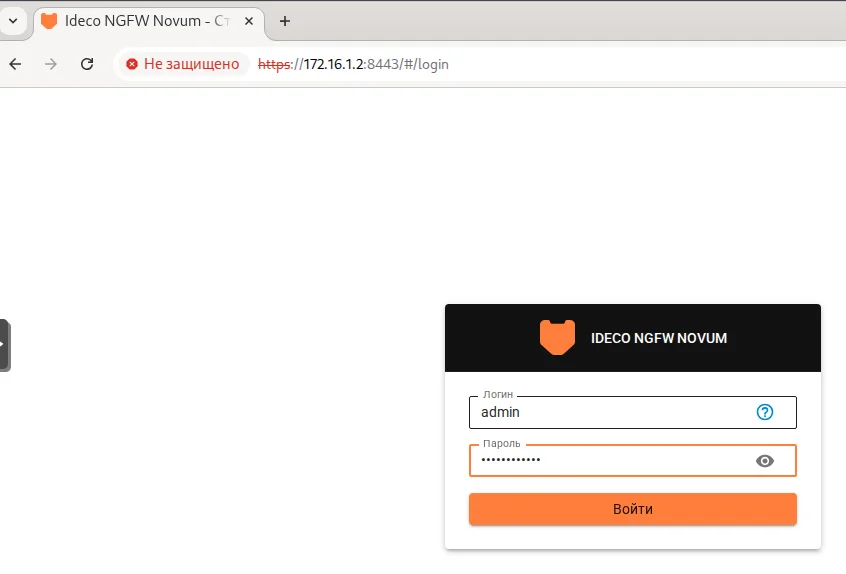

### Панель мониторинга

После успешного входа откроется панель мониторинга:

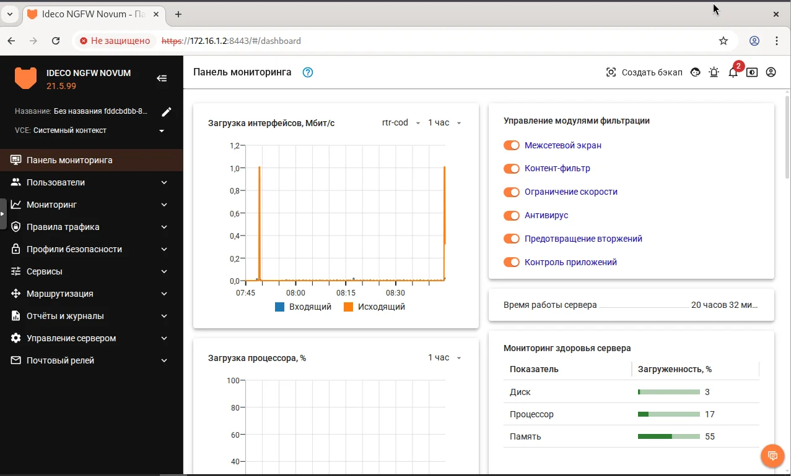

---

## Базовая настройка fw-cod через веб-интерфейс

### Назначение имени устройства

Нажмите на значок карандаша рядом с названием и задайте имя устройства согласно топологии — `fw-cod.cod.ssa2026.region`:

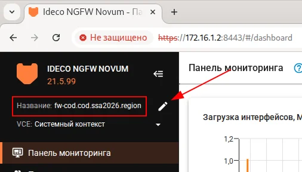

---

### Настройка маршрута по умолчанию

#### Создание объекта IP-адрес

Для создания постоянного маршрута по умолчанию сначала создадим объект с IP-адресом шлюза.

Перейдите в **Правила трафика → Объекты** и нажмите **+ Добавить**:

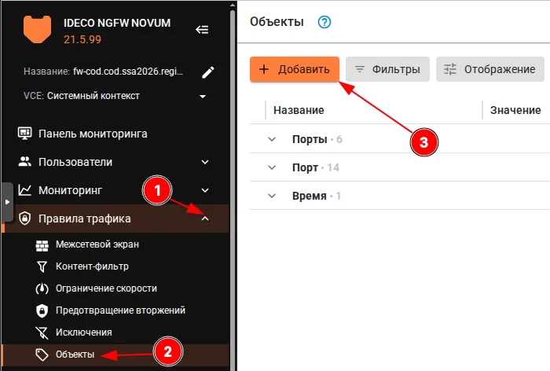

Заполните форму:

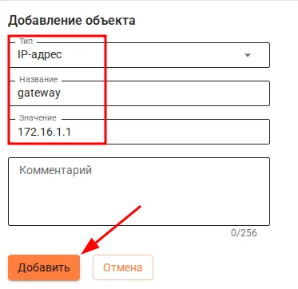

| Параметр | Значение |
|----------|----------|
| Тип | IP-адрес |
| Название | gateway |
| Значение | 172.16.1.1 |

Нажмите **Добавить**.

Результат:

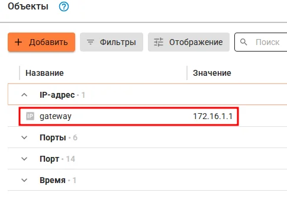

---

#### Создание статического маршрута

Перейдите в **Маршрутизация → Статическая** и нажмите **+ Добавить**:


Заполните форму:

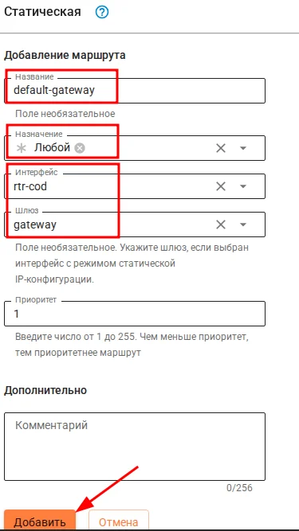

| Параметр | Значение |
|----------|----------|
| Название | default-gateway |
| Назначение | Любой |
| Интерфейс | rtr-cod |
| Шлюз | gateway |
| Приоритет | 1 |

Нажмите **Добавить**.

#### Результат успешного добавления статического маршрута

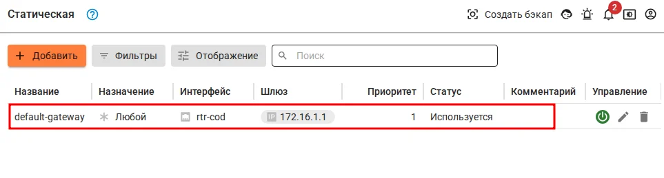

✅ Постоянный маршрут по умолчанию настроен!

> 📝 **Примечание:** Теперь временный маршрут, добавленный через консоль командой `ip route add`, можно удалить — он будет заменён постоянным маршрутом через веб-интерфейс.

---

## Получение лицензии fw-cod

### Проверка доступа в Интернет

Для получения лицензии у fw-cod должен быть доступ в сеть Интернет, а именно до `my.ideco.ru`.

Перейдите в **Управление сервером → Терминал** и проверьте доступность сервера лицензирования:

```bash
ping -c3 my.ideco.ru
```

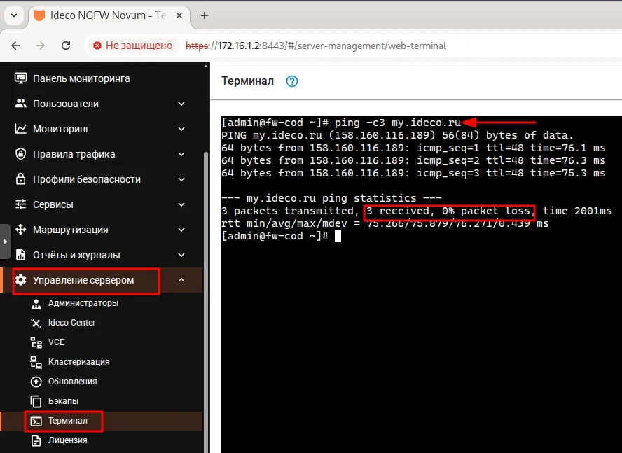

✅ Сервер `my.ideco.ru` доступен (3 received, 0% packet loss).

---

### Настройка способа обновления лицензии

Перейдите в **Управление сервером → Лицензия**.

Выберите **Автоматическое обновление** в качестве способа обновления и нажмите **Сохранить**:

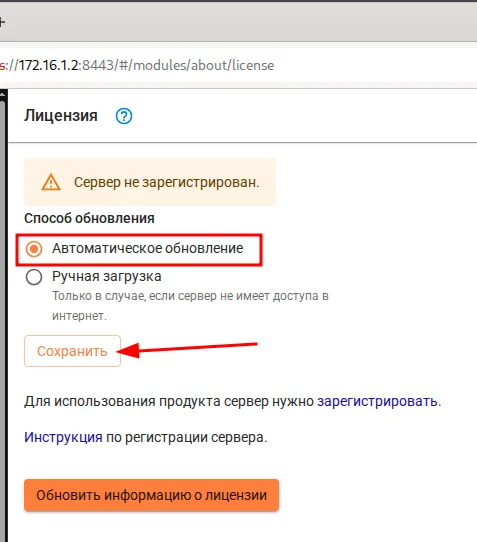

---

### Регистрация сервера

Для регистрации сервера нажмите ссылку **зарегистрировать**:

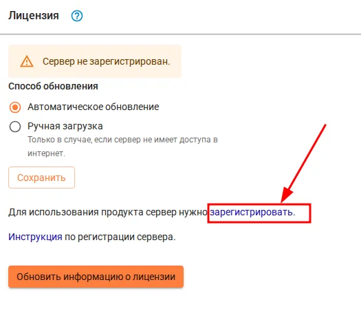

---

### Решение проблемы с DNS на cli1-a

При попытке перейти на сайт `my.ideco.ru` может возникнуть ошибка DNS:

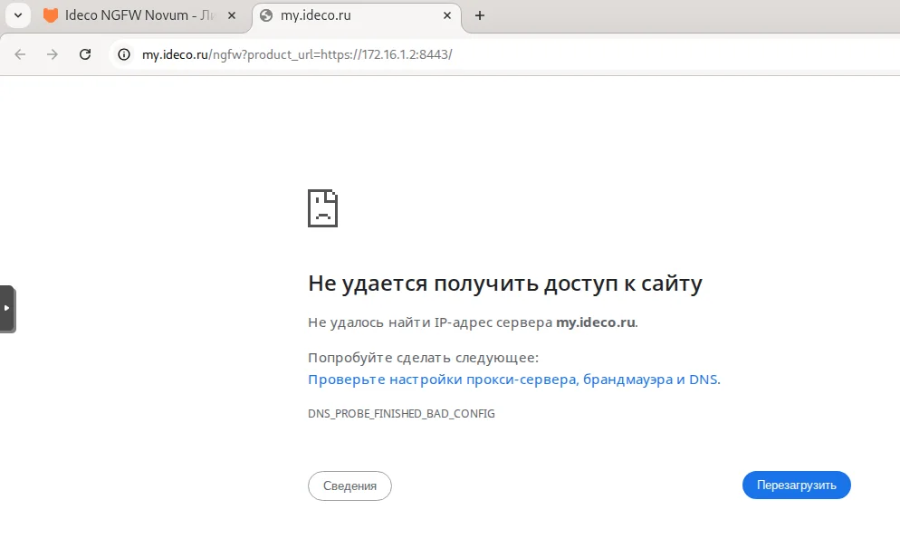

> ⚠️ **Причина:** На dc-a пока не настроен DNS-сервер, поэтому имя `my.ideco.ru` не может быть разрешено.

#### Временное решение

Необходимо **временно** назначить публичный DNS-сервер на cli1-a:

```bash
su -
echo "nameserver 77.88.8.8" > /etc/resolv.conf
```

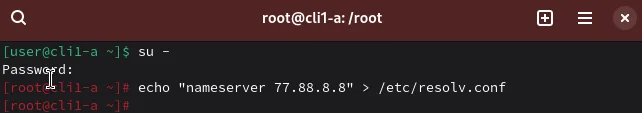

> 📝 **Примечание:** После настройки DNS на dc-a верните настройки обратно на `172.20.10.10`.

---

### Вход в личный кабинет MY.IDECO

После исправления DNS откроется страница входа в личный кабинет MY.IDECO:

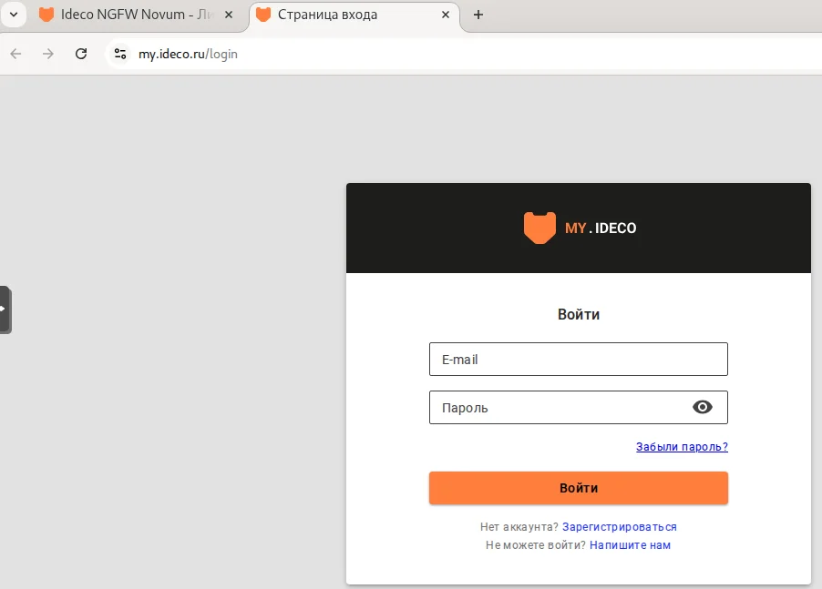

Выполните вход с учётными данными вашей организации.

---

### Добавление сервера в личном кабинете

В открывшемся окне выберите компанию и нажмите **Добавить**:


| Параметр | Значение |
|----------|----------|
| Компания | au.team |

После добавления сервера вернитесь в веб-интерфейс fw-cod и нажмите **Обновить информацию о лицензии** для проверки состояния лицензии.

---

### Результат успешного лицензирования

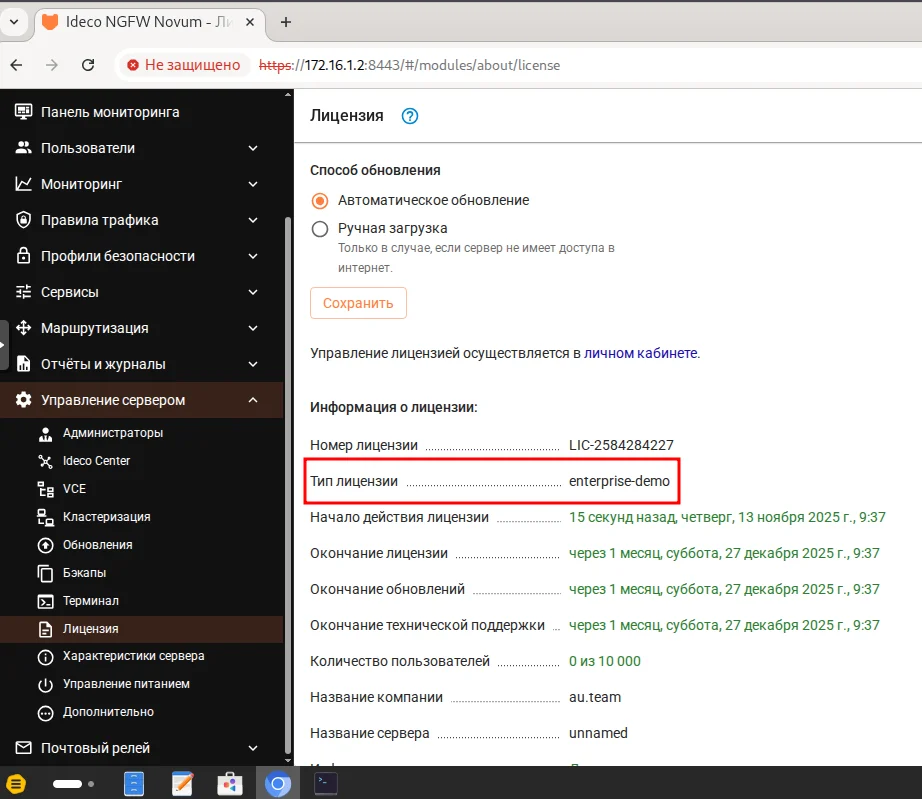

✅ Лицензия успешно получена!

| Параметр | Значение |
|----------|----------|
| Номер лицензии | LIC-2584284227 |
| Тип лицензии | enterprise-demo |
| Начало действия | 13 ноября 2025 г. |
| Окончание лицензии | 27 декабря 2025 г. |
| Количество пользователей | 0 из 10 000 |
| Название компании | au.team |

---

## Итоговая конфигурация

### cli1-a

| Параметр | Значение |
|----------|----------|
| Hostname | cli1-a.office.ssa2026.region |
| IP-адрес | 172.20.20.1/24 |
| Шлюз | 172.20.20.254 |
| DNS | 172.20.10.10 (временно 77.88.8.8) |
| Сетевая подсистема | NetworkManager |

### fw-cod

| Параметр | Значение |
|----------|----------|
| Hostname | fw-cod.cod.ssa2026.region |
| Веб-интерфейс | https://172.16.1.2:8443 |
| Маршрут по умолчанию | 0.0.0.0/0 via 172.16.1.1 (rtr-cod) |
| Лицензия | enterprise-demo (активна) |

---

[← Вернуться к оглавлению](../README.md) | [← Предыдущий модуль](07-switching-config.md) | [Следующий модуль →](09-fwcod-vlan-config.md)
