# 10. Настройка коммутации между sw1-cod и sw2-cod

[← Вернуться к оглавлению](../README.md) | [← Предыдущий модуль](09-fwcod-vlan-config.md) | [Следующий модуль →](11-next-config.md)

---

## Содержание

- [Обзор](#обзор)
- [sw1-cod — Базовая настройка](#sw1-cod--базовая-настройка)
  - [Назначение имени устройства](#назначение-имени-устройства)
- [fw-cod — Настройка авторизации](#fw-cod--настройка-авторизации)
  - [Создание пользователя](#создание-пользователя)
  - [Настройка авторизации по подсетям](#настройка-авторизации-по-подсетям)
- [sw1-cod — Настройка коммутации](#sw1-cod--настройка-коммутации)
  - [Подготовка интерфейсов](#подготовка-интерфейсов)
  - [Установка Open vSwitch](#установка-open-vswitch)
- [sw2-cod — Базовая настройка](#sw2-cod--базовая-настройка)
- [sw1-cod — Конфигурация Open vSwitch](#sw1-cod--конфигурация-open-vswitch)
  - [Создание коммутатора](#создание-коммутатора)
  - [Добавление access-портов](#добавление-access-портов)
  - [Добавление trunk-порта](#добавление-trunk-порта)
  - [Создание bond-интерфейса](#создание-bond-интерфейса)
  - [Настройка management-интерфейса](#настройка-management-интерфейса)

---

## Обзор

В данном модуле настраивается коммутация в офисе COD с использованием **Open vSwitch** на серверах Альт Сервер 11, выполняющих роль коммутаторов.

### Схема подключения sw1-cod

| Интерфейс | Направление | VLAN | Тип порта |
|-----------|-------------|------|-----------|
| ens19 | fw-cod | 100,200,300,400,500 | trunk |
| ens21 | sw2-cod (bond) | 100,200,300,400,500 | trunk |
| ens22 | sw2-cod (bond) | 100,200,300,400,500 | trunk |
| enp2s1 | srv1-cod | 100 | access |
| enp2s29 | admin-cod | 300 | access |
| enp3s12 | srv2-cod | 200 | access |

> ⚠️ **Примечание:** Имена интерфейсов могут отличаться в вашей конфигурации. Сверку производите по MAC-адресам.

---

## sw1-cod — Базовая настройка

### Назначение имени устройства

Для назначения имени устройства согласно топологии используйте команду:

```bash
hostnamectl set-hostname sw1-cod.cod.ssa2026.region; exec bash
```

Также рекомендуется указать имя в файле `/etc/sysconfig/network`:

```bash
nano /etc/sysconfig/network
```

Укажите имя в параметре `HOSTNAME`:

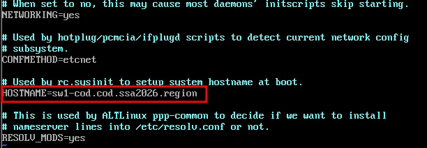

Проверьте результат командой:

```bash
hostname -f
```

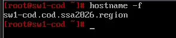

✅ Имя устройства `sw1-cod.cod.ssa2026.region` успешно назначено.

---

## fw-cod — Настройка авторизации

> 📝 **Важно:** Авторизация — необходимое условие для доступа пользователя в Интернет через NGFW Novum. Для работы в пределах локальной сети авторизация не требуется.

### Создание пользователя

Откройте браузер и перейдите по адресу **https://172.16.1.2:8443**.

Перейдите в **Пользователи → Учётные записи** и нажмите **Добавить пользователя**:

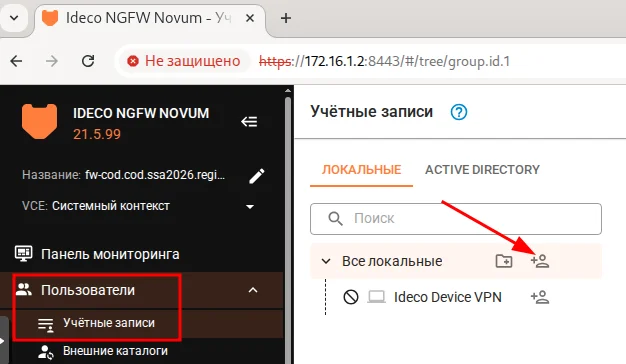

Заполните форму добавления пользователя:

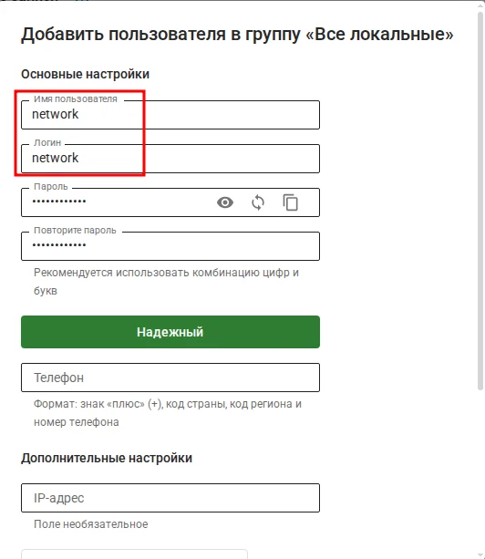

| Параметр | Значение |
|----------|----------|
| Имя пользователя | network |
| Логин | network |
| Пароль | (оставить сгенерированный) |

> 📝 **Примечание:** Пароль можно оставить сгенерированным случайным образом — он не потребуется для авторизации по подсетям.

Нажмите **Добавить**.

Результат успешного добавления пользователя:

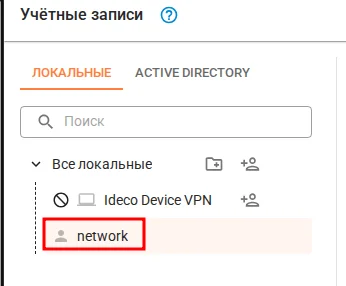

### Настройка авторизации по подсетям

Перейдите в **Пользователи → Авторизация → ПО ПОДСЕТЯМ** и нажмите **+ Добавить**:

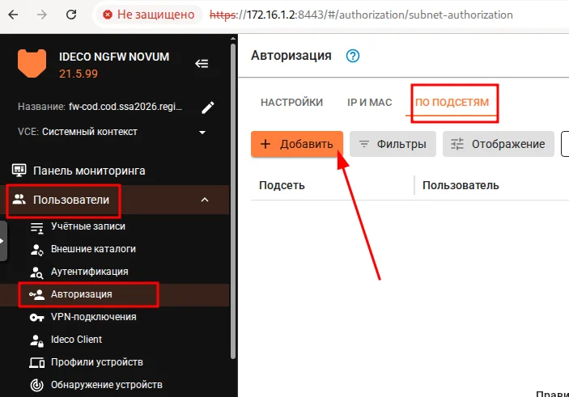

В форме **Добавление правила авторизации** укажите:

| Параметр | Значение |
|----------|----------|
| Пользователь | network |
| Подсеть | 192.168.0.0/16 |

> 📝 **Примечание:** В сеть `192.168.0.0/16` входят все подсети офиса COD:
> - 192.168.10.0/24 (SRV-COD)
> - 192.168.20.0/24 (DATA)
> - 192.168.30.0/24 (MGMT-COD)
> - 192.168.40.0/24 (CLI)
> - 192.168.50.0/24 (VOIP)

Нажмите **Добавить**.

✅ Авторизация по подсетям настроена.

---

## sw1-cod — Настройка коммутации

### Подготовка интерфейсов

Проверьте интерфейсы и определите их направление (сверка по MAC-адресам):

```bash
ip -c -br a
```


В данном примере:
- `ens19` — интерфейс в сторону fw-cod
- `ens21` — интерфейс в сторону sw2-cod
- `ens22` — интерфейс в сторону sw2-cod
- `enp2s1` — интерфейс в сторону srv1-cod
- `enp2s29` — интерфейс в сторону admin-cod
- `enp3s12` — интерфейс в сторону srv2-cod

Проверьте наличие директорий для интерфейсов:

```bash
ls /etc/net/ifaces/
```

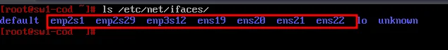

Для каждого интерфейса создайте директорию и файл `options`:

```bash
# Создание директорий
mkdir -p /etc/net/ifaces/{ens19,ens21,ens22,enp2s1,enp2s29,enp3s12}

# Создание файлов options для каждого интерфейса
for iface in ens19 ens21 ens22 enp2s1 enp2s29 enp3s12; do
    cat > /etc/net/ifaces/$iface/options << EOF
TYPE=eth
BOOTPROTO=static
EOF
done
```

Перезагрузите службу network:

```bash
systemctl restart network
```

Проверьте, что все интерфейсы перешли в статус UP:

```bash
ip -c -br a
```

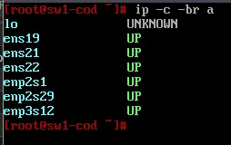

✅ Все интерфейсы в статусе UP.

---

### Установка Open vSwitch

Временно создайте подинтерфейс с VLAN 300 для доступа в Интернет:

```bash
ip link add link ens19 name ens19.300 type vlan id 300
ip link set dev ens19.300 up
ip addr add 192.168.30.1/24 dev ens19.300
ip route add 0.0.0.0/0 via 192.168.30.254
echo "nameserver 77.88.8.8" > /etc/resolv.conf
```

Обновите список пакетов и установите Open vSwitch:

```bash
apt-get update && apt-get install -y openvswitch
```

Включите и добавьте в автозагрузку:

```bash
systemctl enable --now openvswitch
```

Отключите автоматическое удаление настроек OVS при перезагрузке:

```bash
sed -i "s/OVS_REMOVE=yes/OVS_REMOVE=no/g" /etc/net/ifaces/default/options
```

Перезагрузите сервер:

```bash
reboot
```

После перезагрузки создайте временный коммутатор для доступа sw2-cod к Интернету:

```bash
ovs-vsctl add-br br0
ovs-vsctl add-port br0 ens19
ovs-vsctl add-port br0 ens21
```

---

## sw2-cod — Базовая настройка

### Назначение имени устройства

Аналогично sw1-cod:

```bash
hostnamectl set-hostname sw2-cod.cod.ssa2026.region; exec bash
```

Проверьте результат:

```bash
hostname -f
```

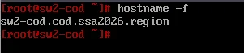

### Установка Open vSwitch

Создайте временный подинтерфейс для доступа в Интернет:

```bash
ip link add link ens19 name ens19.300 type vlan id 300
ip link set up ens19
ip link set up ens19.300
ip addr add 192.168.30.2/24 dev ens19.300
ip route add 0.0.0.0/0 via 192.168.30.254
echo "nameserver 77.88.8.8" > /etc/resolv.conf
```

Установите Open vSwitch:

```bash
apt-get update && apt-get install -y openvswitch
systemctl enable --now openvswitch
sed -i "s/OVS_REMOVE=yes/OVS_REMOVE=no/g" /etc/net/ifaces/default/options
reboot
```

---

## sw1-cod — Конфигурация Open vSwitch

### Создание коммутатора

Удалите временный коммутатор и создайте основной:

```bash
ovs-vsctl del-br br0
ovs-vsctl add-br sw1-cod
```

Проверьте создание коммутатора:

```bash
ovs-vsctl show
```

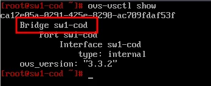

### Добавление access-портов

Добавьте интерфейсы как access-порты с указанием VLAN:

```bash
# admin-cod (VLAN 300)
ovs-vsctl add-port sw1-cod enp2s29 tag=300

# srv1-cod (VLAN 100)
ovs-vsctl add-port sw1-cod enp2s1 tag=100

# srv2-cod (VLAN 200)
ovs-vsctl add-port sw1-cod enp3s12 tag=200
```

### Добавление trunk-порта

Добавьте интерфейс в сторону fw-cod как trunk-порт:

```bash
ovs-vsctl add-port sw1-cod ens19 trunk=100,200,300,400,500
```

Проверьте добавление портов:

```bash
ovs-vsctl show
```

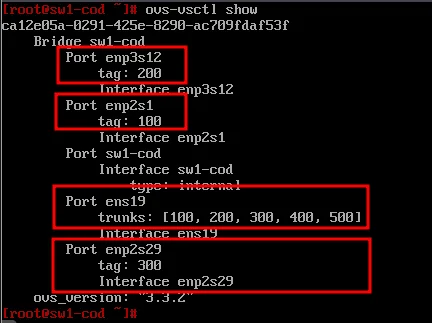

### Создание bond-интерфейса

Включите модуль ядра для тегированного трафика (802.1Q):

```bash
modprobe 8021q
echo "8021q" | tee -a /etc/modules
```

Создайте bond-интерфейс в режиме active-backup:

```bash
ovs-vsctl add-bond sw1-cod bond0 ens21 ens22 bond_mode=active-backup
```

Настройте bond как trunk-порт:

```bash
ovs-vsctl set port bond0 trunk=100,200,300,400,500
```

Проверьте конфигурацию:

```bash
ovs-vsctl show
```

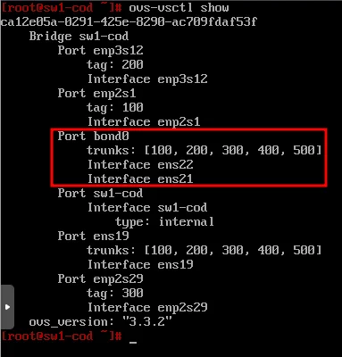

### Настройка management-интерфейса

Создайте директорию для management-интерфейса:

```bash
mkdir /etc/net/ifaces/mgmt-cod
```

Создайте файл `options`:

```bash
vim /etc/net/ifaces/mgmt-cod/options
```

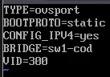

Содержимое файла:

```
TYPE=ovsport
BOOTPROTO=static
CONFIG_IPV4=yes
BRIDGE=sw1-cod
VID=300
```

| Параметр | Описание |
|----------|----------|
| TYPE | Тип интерфейса (ovsport) |
| BOOTPROTO | Способ назначения сетевых параметров |
| CONFIG_IPV4 | Использовать конфигурацию IPv4 |
| BRIDGE | Мост, к которому добавляется интерфейс |
| VID | Принадлежность к VLAN |

Назначьте IP-адрес и шлюз:

```bash
echo "192.168.30.1/24" > /etc/net/ifaces/mgmt-cod/ipv4address
echo "default via 192.168.30.254" > /etc/net/ifaces/mgmt-cod/ipv4route
```

Перезагрузите службу network:

```bash
systemctl restart network
```

Проверьте назначенный IP-адрес:

```bash
ip -c -br -4 a
```


Проверьте маршрут по умолчанию:

```bash
ip -c r
```

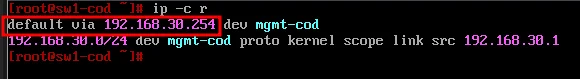

Проверьте, что интерфейс добавился в коммутатор:

```bash
ovs-vsctl show
```

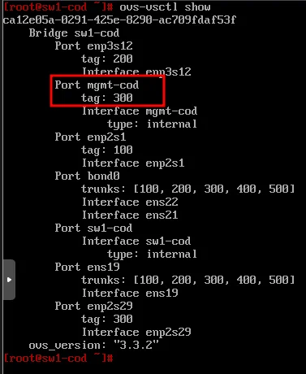

Настройте NativeVLAN для management-интерфейса:

```bash
ovs-vsctl set port mgmt-cod vlan_mode=native-untagged
```

Проверьте настройку:

```bash
ovs-vsctl list port mgmt-cod
```

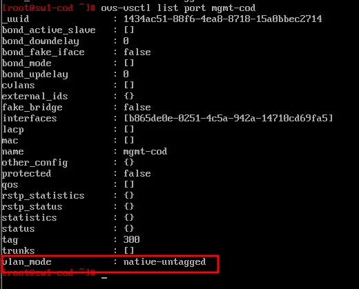

✅ Коммутация на sw1-cod успешно настроена!

---

## Итоговая конфигурация

### sw1-cod — Open vSwitch

| Порт | Интерфейс | Тип | VLAN/Trunk |
|------|-----------|-----|------------|
| enp2s29 | admin-cod | access | 300 |
| enp2s1 | srv1-cod | access | 100 |
| enp3s12 | srv2-cod | access | 200 |
| ens19 | fw-cod | trunk | 100,200,300,400,500 |
| bond0 | sw2-cod | trunk | 100,200,300,400,500 |
| mgmt-cod | management | internal | 300 (native-untagged) |

### sw1-cod — Сетевые параметры

| Параметр | Значение |
|----------|----------|
| Hostname | sw1-cod.cod.ssa2026.region |
| Management IP | 192.168.30.1/24 |
| Gateway | 192.168.30.254 |
| VLAN | 300 (MGMT-COD) |

### sw2-cod — Сетевые параметры

| Параметр | Значение |
|----------|----------|
| Hostname | sw2-cod.cod.ssa2026.region |
| Management IP | 192.168.30.2/24 |
| Gateway | 192.168.30.254 |
| VLAN | 300 (MGMT-COD) |

---

[← Вернуться к оглавлению](../README.md) | [← Предыдущий модуль](09-fwcod-vlan-config.md) | [Следующий модуль →](11-next-config.md)
