# 11. Настройка имён и IP-адресов на всех остальных устройствах

[← Вернуться к оглавлению](../README.md) | [← Предыдущий модуль](10-switching-cod-config.md) | [Следующий модуль →](12-next-config.md)

---

## Содержание

- [Обзор](#обзор)
- [cli-cod (Альт Рабочая станция)](#cli-cod-альт-рабочая-станция)
- [cli2-a (Альт Рабочая станция)](#cli2-a-альт-рабочая-станция)
- [admin-cod (Альт Рабочая станция)](#admin-cod-альт-рабочая-станция)
- [srv1-cod (Альт Сервер)](#srv1-cod-альт-сервер)
- [srv2-cod (Альт Сервер)](#srv2-cod-альт-сервер)
- [dc-a (Альт Сервер)](#dc-a-альт-сервер)
- [Итоговая таблица IP-адресов](#итоговая-таблица-ip-адресов)

---

## Обзор

В данном модуле настраиваются имена устройств и IP-адресация на всех оставшихся виртуальных машинах офисов COD и A.

### Устройства офиса COD

| Устройство | ОС | VLAN | IP-адрес | Шлюз |
|------------|-------|------|----------|------|
| cli-cod | Альт Рабочая станция | 400 | 192.168.40.40/24 | 192.168.40.254 |
| admin-cod | Альт Рабочая станция | 300 | 192.168.30.30/24 | 192.168.30.254 |
| srv1-cod | Альт Сервер | 100, 200 | 192.168.10.1/24, 192.168.20.1/24 | 192.168.10.254 |
| srv2-cod | Альт Сервер | 100, 200 | 192.168.10.2/24, 192.168.20.2/24 | 192.168.10.254 |

### Устройства офиса A

| Устройство | ОС | VLAN | IP-адрес | Шлюз |
|------------|-------|------|----------|------|
| cli2-a | Альт Рабочая станция | 200 | 172.20.20.2/24 | 172.20.20.254 |
| dc-a | Альт Сервер | 100 | 172.20.10.10/24 | 172.20.10.254 |

---

## cli-cod (Альт Рабочая станция)

### Назначение имени устройства

Откройте **Центр управления системой** (ЦУС/ACC):

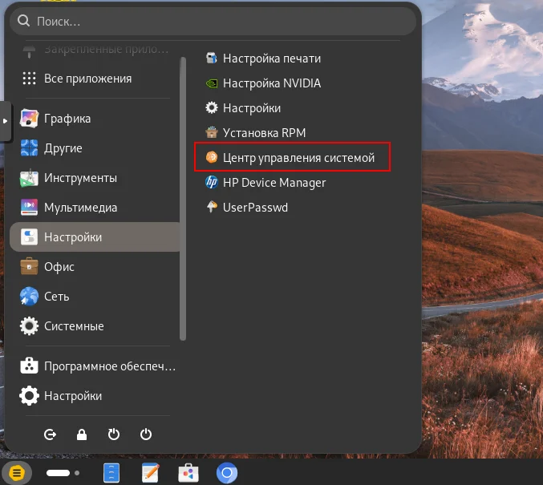

Перейдите в раздел **Сеть → Ethernet-интерфейсы**:

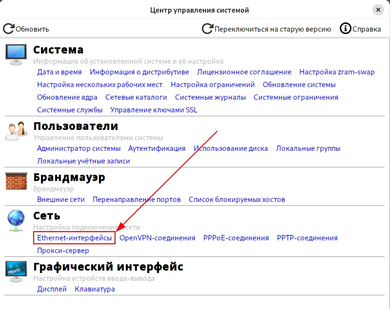

Укажите имя компьютера `cli-cod.cod.ssa2026.region` и нажмите **Применить**:

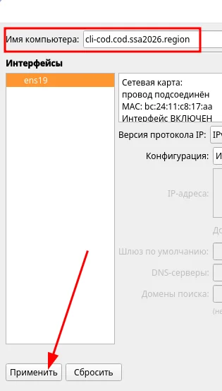

### Настройка сетевой подсистемы

В качестве режима работы сетевой подсистемы выберите **NetworkManager (native)**:

1. Нажмите кнопку **Дополнительно**
2. Выберите **NetworkManager (native)**
3. Нажмите **OK**
4. Нажмите **Применить**

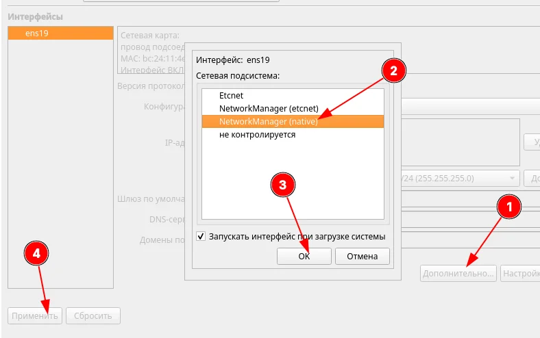

### Настройка сетевых параметров

Откройте стандартные **Настройки**:

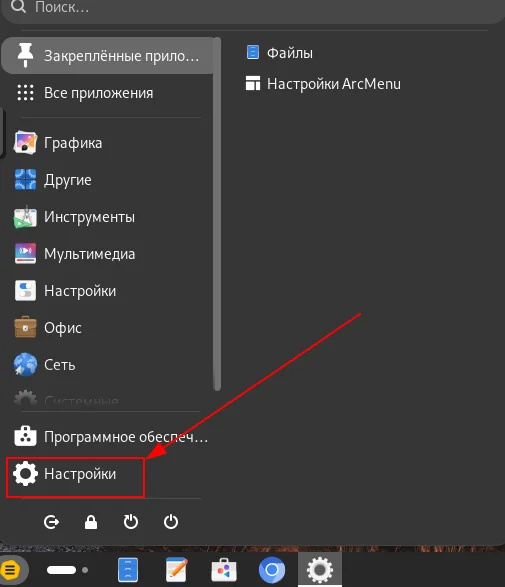

Перейдите в раздел **Сеть** и нажмите на шестерёнку рядом с подключением:


На вкладке **Подробности** проверьте настройки:


| Параметр | Значение |
|----------|----------|
| Адрес IPv4 | 192.168.40.40 |
| Маршрут по умолчанию | 192.168.40.254 |
| DNS | 192.168.10.1 |

### Проверка доступа в Интернет

```bash
ping -c3 77.88.8.8
```

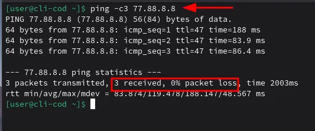

✅ Доступ в Интернет работает (3 received, 0% packet loss).

---

## cli2-a (Альт Рабочая станция)

### Базовая настройка

Настройка выполняется аналогично cli-cod через **Центр управления системой** и **Настройки**.

Проверьте имя устройства:

```bash
hostname -f
```


✅ Имя: `cli2-a.office.ssa2026.region`

### Сетевые параметры

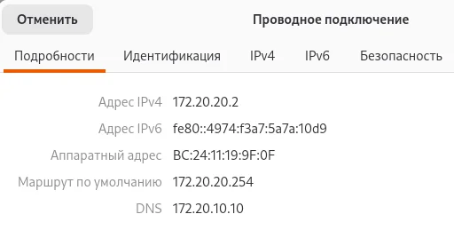

| Параметр | Значение |
|----------|----------|
| Адрес IPv4 | 172.20.20.2 |
| Маршрут по умолчанию | 172.20.20.254 |
| DNS | 172.20.10.10 |

### Проверка доступа в Интернет

```bash
ping -c3 77.88.8.8
```

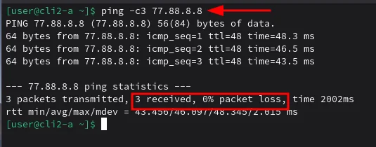

✅ Доступ в Интернет работает (3 received, 0% packet loss).

### Проверка связности с офисом COD

```bash
ping -c3 192.168.40.40
tracepath -n 192.168.40.40
```

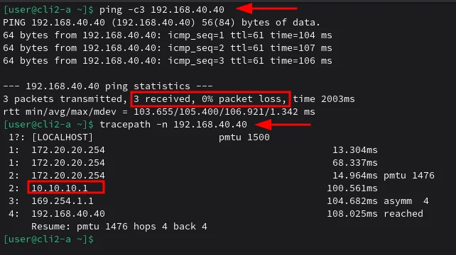

✅ Связность между офисами работает через GRE-туннель (10.10.10.1).

---

## admin-cod (Альт Рабочая станция)

### Базовая настройка

Настройка выполняется аналогично cli-cod через **Центр управления системой** и **Настройки**.

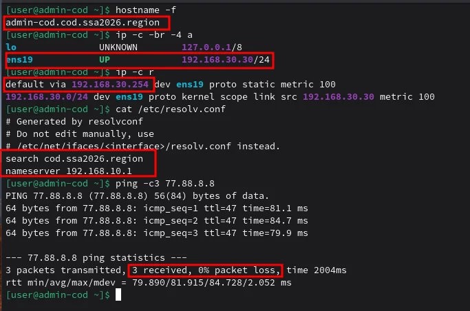

| Параметр | Значение |
|----------|----------|
| Hostname | admin-cod.cod.ssa2026.region |
| IP-адрес | 192.168.30.30/24 |
| Шлюз | 192.168.30.254 |
| DNS | 192.168.10.1 |
| Домен поиска | cod.ssa2026.region |

### Проверка

```bash
hostname -f
ip -c -br -4 a
ip -c r
cat /etc/resolv.conf
ping -c3 77.88.8.8
```

✅ Доступ в Интернет работает (3 received, 0% packet loss).

---

## srv1-cod (Альт Сервер)

### Назначение имени устройства

```bash
hostnamectl set-hostname srv1-cod.cod.ssa2026.region; exec bash
```

Также укажите имя в файле `/etc/sysconfig/network`:

```bash
vim /etc/sysconfig/network
```

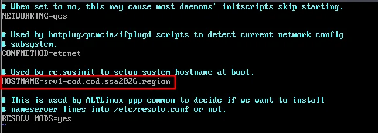

Укажите параметр `HOSTNAME`:

```
HOSTNAME=srv1-cod.cod.ssa2026.region
```

Проверьте результат:

```bash
hostname -f
```


✅ Имя: `srv1-cod.cod.ssa2026.region`

### Определение интерфейсов

Проверьте интерфейсы (сверка по MAC-адресам):

```bash
ip -c -br a
```

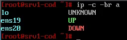

В данном примере:
- `ens19` — интерфейс в сторону sw1-cod (VLAN 100)
- `ens20` — интерфейс в сторону sw1-cod (VLAN 200)

### Настройка интерфейсов

Создайте директории и файлы `options` для каждого интерфейса:

```bash
mkdir -p /etc/net/ifaces/{ens19,ens20}

cat > /etc/net/ifaces/ens19/options << EOF
TYPE=eth
BOOTPROTO=static
EOF

cat > /etc/net/ifaces/ens20/options << EOF
TYPE=eth
BOOTPROTO=static
EOF
```

Проверьте содержимое:

```bash
ls /etc/net/ifaces/
cat /etc/net/ifaces/ens19/options
cat /etc/net/ifaces/ens20/options
```

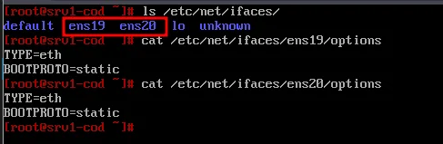

### Назначение IP-адресов

Задайте IP-адрес на интерфейс ens19 (VLAN 100):

```bash
echo "192.168.10.1/24" > /etc/net/ifaces/ens19/ipv4address
```

Задайте шлюз по умолчанию для интерфейса ens19:

```bash
echo "default via 192.168.10.254" > /etc/net/ifaces/ens19/ipv4route
```

Задайте IP-адрес на интерфейс ens20 (VLAN 200):

```bash
echo "192.168.20.1/24" > /etc/net/ifaces/ens20/ipv4address
```

> ⚠️ **Примечание:** Шлюз для VLAN 200 не задаётся — по условиям задания данный VLAN не должен маршрутизироваться.

Перезагрузите службу network:

```bash
systemctl restart network
```

### Проверка конфигурации

```bash
ip -c -br -4 a
ip -c r
ping -c3 77.88.8.8
```

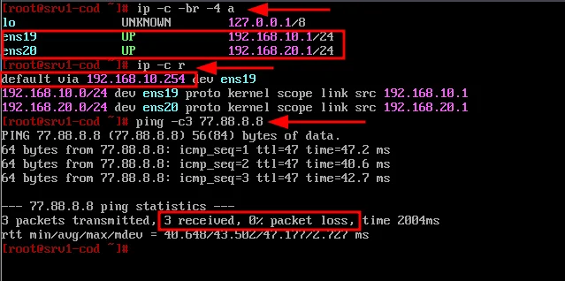

| Интерфейс | VLAN | IP-адрес | Шлюз |
|-----------|------|----------|------|
| ens19 | 100 | 192.168.10.1/24 | 192.168.10.254 |
| ens20 | 200 | 192.168.20.1/24 | — |

✅ Доступ в Интернет работает (3 received, 0% packet loss).

---

## srv2-cod (Альт Сервер)

### Базовая настройка

Настройка выполняется аналогично srv1-cod.

```bash
hostnamectl set-hostname srv2-cod.cod.ssa2026.region; exec bash
```

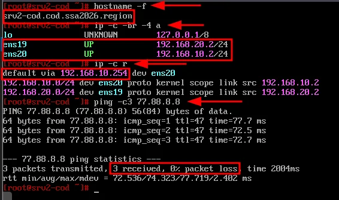

| Параметр | Значение |
|----------|----------|
| Hostname | srv2-cod.cod.ssa2026.region |
| ens19 (VLAN 200) | 192.168.20.2/24 |
| ens20 (VLAN 100) | 192.168.10.2/24 |
| Шлюз | 192.168.10.254 (через ens20) |

> ⚠️ **Примечание:** На srv2-cod интерфейсы подключены в обратном порядке: ens19 в VLAN 200, ens20 в VLAN 100. Сверяйте по MAC-адресам.

### Настройка интерфейсов

```bash
mkdir -p /etc/net/ifaces/{ens19,ens20}

# ens19 - VLAN 200
cat > /etc/net/ifaces/ens19/options << EOF
TYPE=eth
BOOTPROTO=static
EOF
echo "192.168.20.2/24" > /etc/net/ifaces/ens19/ipv4address

# ens20 - VLAN 100
cat > /etc/net/ifaces/ens20/options << EOF
TYPE=eth
BOOTPROTO=static
EOF
echo "192.168.10.2/24" > /etc/net/ifaces/ens20/ipv4address
echo "default via 192.168.10.254" > /etc/net/ifaces/ens20/ipv4route

systemctl restart network
```

✅ Доступ в Интернет работает (3 received, 0% packet loss).

---

## dc-a (Альт Сервер)

### Базовая настройка

Настройка выполняется аналогично srv1-cod.

```bash
hostnamectl set-hostname dc-a.office.ssa2026.region; exec bash
```

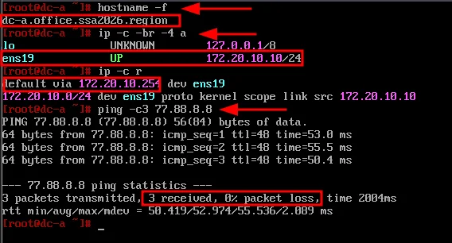

| Параметр | Значение |
|----------|----------|
| Hostname | dc-a.office.ssa2026.region |
| ens19 (VLAN 100) | 172.20.10.10/24 |
| Шлюз | 172.20.10.254 |

### Настройка интерфейса

```bash
mkdir -p /etc/net/ifaces/ens19

cat > /etc/net/ifaces/ens19/options << EOF
TYPE=eth
BOOTPROTO=static
EOF

echo "172.20.10.10/24" > /etc/net/ifaces/ens19/ipv4address
echo "default via 172.20.10.254" > /etc/net/ifaces/ens19/ipv4route

systemctl restart network
```

### Проверка

```bash
hostname -f
ip -c -br -4 a
ip -c r
ping -c3 77.88.8.8
```

✅ Доступ в Интернет работает (3 received, 0% packet loss).

---

## Итоговая таблица IP-адресов

### Офис COD

| Устройство | Интерфейс | VLAN | IP-адрес | Шлюз | DNS |
|------------|-----------|------|----------|------|-----|
| cli-cod | ens19 | 400 | 192.168.40.40/24 | 192.168.40.254 | 192.168.10.1 |
| admin-cod | ens19 | 300 | 192.168.30.30/24 | 192.168.30.254 | 192.168.10.1 |
| srv1-cod | ens19 | 100 | 192.168.10.1/24 | 192.168.10.254 | — |
| srv1-cod | ens20 | 200 | 192.168.20.1/24 | — | — |
| srv2-cod | ens20 | 100 | 192.168.10.2/24 | 192.168.10.254 | — |
| srv2-cod | ens19 | 200 | 192.168.20.2/24 | — | — |
| sw1-cod | mgmt-cod | 300 | 192.168.30.1/24 | 192.168.30.254 | — |
| sw2-cod | mgmt-cod | 300 | 192.168.30.2/24 | 192.168.30.254 | — |

### Офис A

| Устройство | Интерфейс | VLAN | IP-адрес | Шлюз | DNS |
|------------|-----------|------|----------|------|-----|
| cli1-a | — | 200 | 172.20.20.1/24 | 172.20.20.254 | 172.20.10.10 |
| cli2-a | — | 200 | 172.20.20.2/24 | 172.20.20.254 | 172.20.10.10 |
| dc-a | ens19 | 100 | 172.20.10.10/24 | 172.20.10.254 | — |

### Доменные имена

| Устройство | FQDN |
|------------|------|
| cli-cod | cli-cod.cod.ssa2026.region |
| admin-cod | admin-cod.cod.ssa2026.region |
| srv1-cod | srv1-cod.cod.ssa2026.region |
| srv2-cod | srv2-cod.cod.ssa2026.region |
| sw1-cod | sw1-cod.cod.ssa2026.region |
| sw2-cod | sw2-cod.cod.ssa2026.region |
| cli1-a | cli1-a.office.ssa2026.region |
| cli2-a | cli2-a.office.ssa2026.region |
| dc-a | dc-a.office.ssa2026.region |

---

[← Вернуться к оглавлению](../README.md) | [← Предыдущий модуль](10-switching-cod-config.md) | [Следующий модуль →](12-next-config.md)
