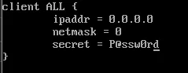
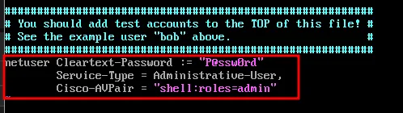
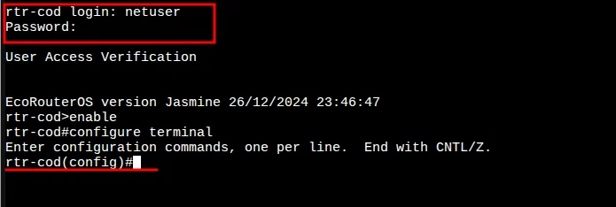
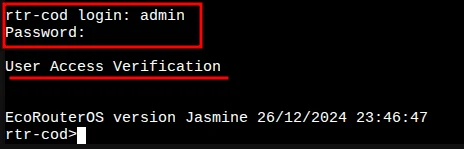
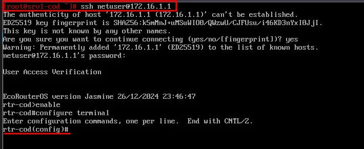
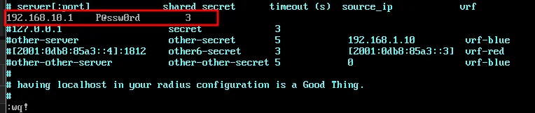
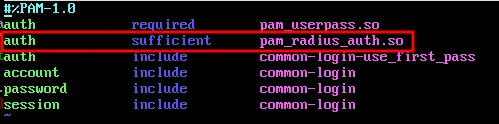
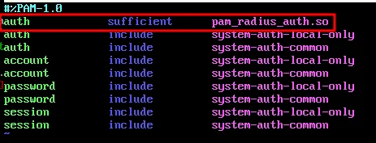
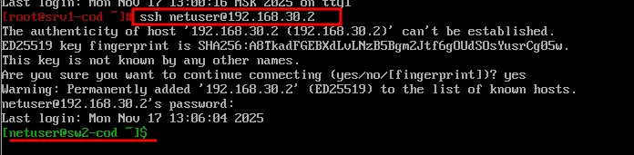

# Модуль 12. Настройка административного доступа (RADIUS)

## Описание

Данный модуль описывает настройку централизованной аутентификации с использованием протокола RADIUS для административного доступа к сетевым устройствам.

## Задачи

- Установка и настройка FreeRADIUS на srv1-cod
- Настройка клиентов RADIUS
- Создание пользователей для аутентификации
- Настройка RADIUS-аутентификации на rtr-cod (EcoRouter)
- Настройка PAM RADIUS на sw1-cod и sw2-cod (ALT Linux)

---

## 1. Настройка RADIUS-сервера (srv1-cod)

### 1.1 Временная настройка DNS

Для возможности установки необходимых пакетов зададим публичный DNS-сервер:

```bash
echo "nameserver 77.88.8.8" > /etc/resolv.conf
```

### 1.2 Установка FreeRADIUS

```bash
apt-get update && apt-get install -y freeradius freeradius-utils
```

### 1.3 Включение и запуск службы

```bash
systemctl enable --now radiusd
```

### 1.4 Настройка клиентов RADIUS

Редактируем файл `/etc/raddb/clients.conf`, добавляя следующее содержимое:

```bash
vim /etc/raddb/clients.conf
```

Пример конфигурации для любого клиента:

```
client ALL {
    ipaddr = 0.0.0.0
    netmask = 0
    secret = P@ssw0rd
}
```



### 1.5 Настройка пользователей

Редактируем файл `/etc/raddb/users`, добавляя в самый конец следующее содержимое:

```bash
vim /etc/raddb/users
```

```
netuser Cleartext-Password := "P@ssw0rd"
    Service-Type = Administrative-User,
    Cisco-AVPair = "shell:roles=admin"
```



### 1.6 Перезапуск службы

```bash
systemctl restart radiusd
```

---

## 2. Настройка RADIUS на rtr-cod (EcoRouter)

### 2.1 Подключение к RADIUS-серверу

```
rtr-cod(config)#security none 
rtr-cod(config)#aaa radius-server 192.168.10.1 port 1812 secret P@ssw0rd auth
rtr-cod(config)#
```

### 2.2 Настройка приоритета аутентификации

```
rtr-cod(config)#aaa precedence local radius
rtr-cod(config)#write memory
Building configuration...

rtr-cod(config)#
```

### 2.3 Проверка входа под пользователем netuser

Проверить возможность входа из-под пользователя `netuser` с паролем `P@ssw0rd`:



### 2.4 Проверка входа под локальной учётной записью

Проверить вход под локальной учетной записью `admin` даже при доступности RADIUS-сервера:



### 2.5 Проверка доступа по SSH

Проверить доступ по SSH из-под пользователя `netuser` с паролем `P@ssw0rd` (например с srv1-cod):

```bash
ssh netuser@172.16.1.1
```



---

## 3. Настройка PAM RADIUS на sw1-cod и sw2-cod (ALT Linux)

### 3.1 Временная настройка DNS

Для возможности установки необходимых пакетов зададим публичный DNS-сервер:

```bash
echo "nameserver 77.88.8.8" > /etc/resolv.conf
```

### 3.2 Установка pam_radius

```bash
apt-get update && apt-get install -y pam_radius
```

### 3.3 Настройка pam_radius_auth.conf

Редактируем конфигурационный файл `/etc/pam_radius_auth.conf`:

```bash
vim /etc/pam_radius_auth.conf
```



### 3.4 Настройка PAM для SSH

Редактируем конфигурационный файл `/etc/pam.d/sshd`:

```bash
vim /etc/pam.d/sshd
```

Добавляем строку в начало секции auth:

```
auth    sufficient    pam_radius_auth.so
```



### 3.5 Настройка PAM для локального входа

Редактируем конфигурационный файл `/etc/pam.d/system-auth-local`:

```bash
vim /etc/pam.d/system-auth-local
```

Добавляем строку в начало секции auth:

```
auth    sufficient    pam_radius_auth.so
```



### 3.6 Создание локального пользователя

В случае с Linux, пользователя необходимо создать локально:

```bash
useradd netuser
```

### 3.7 Проверка входа под пользователем netuser

Проверить возможность входа из-под пользователя `netuser` с паролем `P@ssw0rd`.

### 3.8 Проверка доступа по SSH

Проверить доступ по SSH из-под пользователя `netuser` с паролем `P@ssw0rd` (например с srv1-cod):

```bash
ssh netuser@192.168.30.2
```



---

## Итоги

После выполнения данного модуля настроено:

| Компонент | Устройство | Статус |
|-----------|------------|--------|
| FreeRADIUS сервер | srv1-cod | ✅ |
| RADIUS-клиенты | srv1-cod | ✅ |
| RADIUS-пользователи | srv1-cod | ✅ |
| RADIUS-аутентификация | rtr-cod | ✅ |
| PAM RADIUS | sw1-cod | ✅ |
| PAM RADIUS | sw2-cod | ✅ |

### Учётные данные

| Пользователь | Пароль | Права |
|--------------|--------|-------|
| netuser | P@ssw0rd | Administrative-User (admin) |

### Приоритет аутентификации на rtr-cod

1. Локальная аутентификация (local)
2. RADIUS-аутентификация (radius)

---

## Следующий модуль

➡️ [Модуль 13. ...](13-....md)
