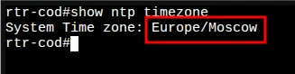
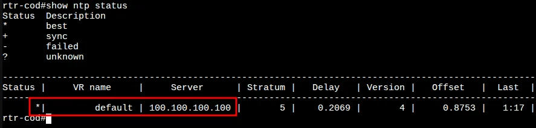
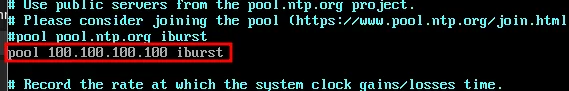
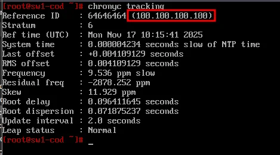
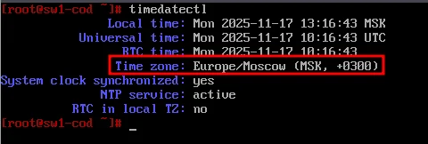
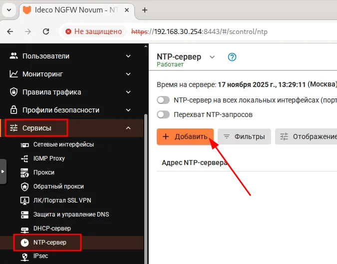
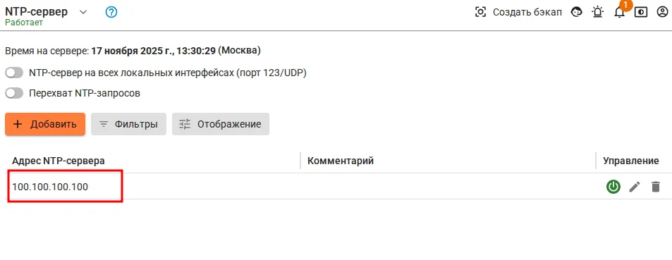
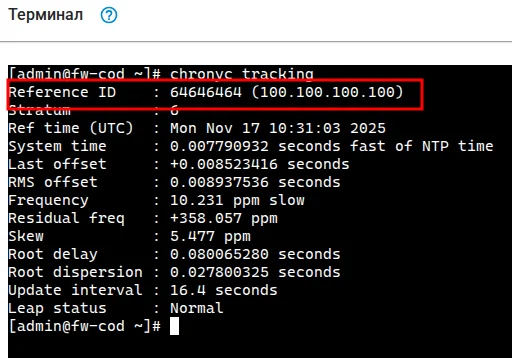
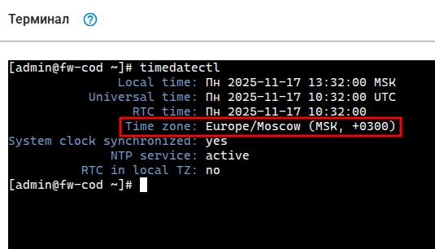

# Модуль 13. Настройка синхронизации времени между сетевыми устройствами

## Описание

Данный модуль описывает настройку синхронизации времени (NTP) на всех сетевых устройствах инфраструктуры с единым NTP-сервером 100.100.100.100 (ISP).

## Задачи

- Настройка NTP на маршрутизаторах rtr-cod и rtr-a (EcoRouter)
- Настройка Chrony на серверах и рабочих станциях ALT Linux
- Настройка NTP на межсетевом экране fw-cod (Ideco NGFW)

---

## 1. Настройка NTP на rtr-cod и rtr-a (EcoRouter)

### 1.1 Установка часового пояса

```
rtr-cod(config)#ntp timezone utc+7
rtr-cod(config)#
```

> ⚠️ **Важно:** Для Новосибирска используется часовой пояс UTC+7 (Asia/Novosibirsk)

### 1.2 Настройка NTP-сервера

```
rtr-cod(config)#ntp server 100.100.100.100
rtr-cod(config)#write memory
Building configuration...

rtr-cod(config)#
```

### 1.3 Проверка часового пояса

Проверить текущий часовой пояс можно командой `show ntp timezone` из режима администрирования (enable):

```
rtr-cod#show ntp timezone
```



### 1.4 Проверка NTP-статуса

Проверить адреса NTP-серверов для синхронизации можно командой `show ntp status` из режима администрирования (enable):

```
rtr-cod#show ntp status
```



---

## 2. Настройка NTP на ALT Linux

Данная настройка выполняется на следующих устройствах:

- sw1-cod, sw2-cod (ALT Server)
- cli-cod (ALT Workstation)
- srv1-cod, srv2-cod (ALT Server)
- admin-cod (ALT Workstation)
- sw1-a, sw2-a (ALT Server)
- dc-a (ALT Server)
- cli1-a, cli2-a (ALT Workstation)

### 2.1 Установка часового пояса

```bash
timedatectl set-timezone Asia/Novosibirsk
```

### 2.2 Настройка Chrony

Редактируем конфигурационный файл `/etc/chrony.conf`:

```bash
vim /etc/chrony.conf
```

Добавляем/изменяем строку с NTP-сервером:

```
pool 100.100.100.100 iburst
```



### 2.3 Перезапуск службы

```bash
systemctl restart chronyd
```

### 2.4 Проверка синхронизации

Проверяем, с каким сервером синхронизировалось время:

```bash
chronyc tracking
```



### 2.5 Проверка часового пояса

```bash
timedatectl
```



---

## 3. Настройка NTP на fw-cod (Ideco NGFW)

### 3.1 Вход в веб-интерфейс

Открываем браузер на admin-cod и переходим по адресу:

```
https://192.168.30.254:8443
```

Выполняем вход в веб-интерфейс управления fw-cod.

### 3.2 Переход в настройки NTP

Переходим: **Сервисы** → **NTP-сервер** и нажимаем **+ Добавить**:



### 3.3 Добавление NTP-сервера

Указываем адрес NTP-сервера `100.100.100.100` и нажимаем **Добавить**:


### 3.4 Результат

Результат успешного добавления NTP-сервера:



### 3.5 Проверка синхронизации через терминал

Открываем терминал в веб-интерфейсе fw-cod и проверяем синхронизацию:

```bash
chronyc tracking
```



### 3.6 Проверка часового пояса

```bash
timedatectl
```



---

## Итоги

После выполнения данного модуля настроено:

| Устройство | Тип | Часовой пояс | NTP-сервер | Статус |
|------------|-----|--------------|------------|--------|
| rtr-cod | EcoRouter | UTC+7 | 100.100.100.100 | ✅ |
| rtr-a | EcoRouter | UTC+7 | 100.100.100.100 | ✅ |
| fw-cod | Ideco NGFW | Asia/Novosibirsk | 100.100.100.100 | ✅ |
| sw1-cod | ALT Server | Asia/Novosibirsk | 100.100.100.100 | ✅ |
| sw2-cod | ALT Server | Asia/Novosibirsk | 100.100.100.100 | ✅ |
| srv1-cod | ALT Server | Asia/Novosibirsk | 100.100.100.100 | ✅ |
| srv2-cod | ALT Server | Asia/Novosibirsk | 100.100.100.100 | ✅ |
| cli-cod | ALT Workstation | Asia/Novosibirsk | 100.100.100.100 | ✅ |
| admin-cod | ALT Workstation | Asia/Novosibirsk | 100.100.100.100 | ✅ |
| sw1-a | ALT Server | Asia/Novosibirsk | 100.100.100.100 | ✅ |
| sw2-a | ALT Server | Asia/Novosibirsk | 100.100.100.100 | ✅ |
| dc-a | ALT Server | Asia/Novosibirsk | 100.100.100.100 | ✅ |
| cli1-a | ALT Workstation | Asia/Novosibirsk | 100.100.100.100 | ✅ |
| cli2-a | ALT Workstation | Asia/Novosibirsk | 100.100.100.100 | ✅ |

### Параметры NTP

| Параметр | Значение |
|----------|----------|
| NTP-сервер | 100.100.100.100 (ISP) |
| Часовой пояс | Asia/Novosibirsk (UTC+7) |
| Stratum ISP | 5 |
| Stratum клиентов | 6 |

---

## Следующий модуль

➡️ [Модуль 14. ...](14-....md)
