# Модуль 15. Развёртывание контроллера домена на базе Samba AD

## Описание

Данный модуль описывает развёртывание контроллера домена Active Directory на базе Samba на dc-a, ввод рабочих станций в домен, создание организационной структуры и настройку групповых политик.

## Задачи

- Установка и настройка Samba AD на dc-a
- Интеграция с BIND DNS (BIND9_DLZ)
- Ввод рабочих станций cli1-a и cli2-a в домен
- Создание организационных подразделений (OU)
- Создание групп и пользователей
- Настройка групповых политик (GPO)

---

## 1. Подготовка dc-a (ALT Server)

### 1.1 Временная настройка DNS

```bash
echo "nameserver 77.88.8.8" > /etc/resolv.conf
```

### 1.2 Установка пакетов

```bash
apt-get update && apt-get install -y task-samba-dc bind bind-utils
```

### 1.3 Предотвращение конфликта зон

Если при установке системы было указано полное имя домена, система может создать зону `office.ssa2026.region`, что приведёт к конфликту с Samba.

Закомментировать все строки в файле `/etc/bind/local.conf`:

```bash
vim /etc/bind/local.conf
```

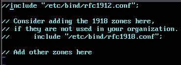

### 1.4 Отключение chroot

```bash
control bind-chroot disabled
```

### 1.5 Отключение KRB5RCACHETYPE

```bash
echo 'KRB5RCACHETYPE="none"' >> /etc/sysconfig/bind
```

### 1.6 Подключение плагина BIND_DLZ

```bash
echo 'include "/var/lib/samba/bind-dns/named.conf";' >> /etc/bind/named.conf
```

### 1.7 Настройка options.conf

Редактируем файл `/etc/bind/options.conf`:

```bash
vim /etc/bind/options.conf
```

Добавить в раздел `options`:

- **tkey-gssapi-keytab** — путь к ключевой таблице для GSS-API (интеграция с Kerberos)
- **minimal-responses yes** — уменьшает объём ответов
- **listen-on { any; }** — IP-адреса, на которых принимаются запросы
- **allow-query { any; }** — разрешённые подсети для DNS-запросов
- **allow-query-cache { any; }** — кэширование для всех
- **allow-recursion { any; }** — рекурсивные запросы для всех
- **forwarders { 100.100.100.100; }** — внешние DNS-серверы
- **forward first** — сначала пересылать, затем кешировать

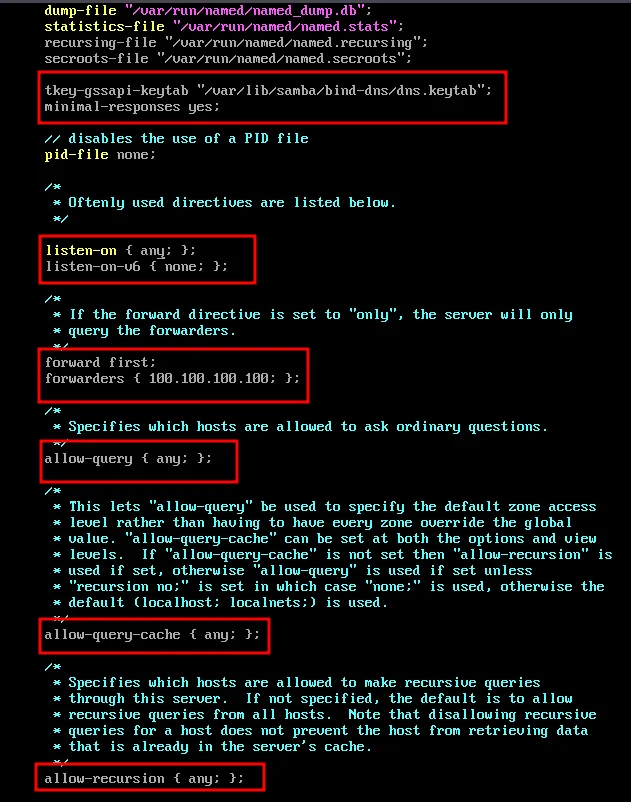

В раздел `logging` добавить:

```
category lame-servers { null; };
```

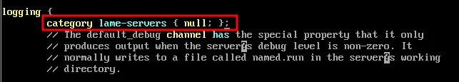

---

## 2. Создание домена Samba AD

### 2.1 Очистка предыдущих конфигураций

```bash
rm -f /etc/samba/smb.conf
rm -rf /var/lib/samba/*
rm -rf /var/cache/samba
mkdir -p /var/lib/samba/sysvol
```

### 2.2 Интерактивное создание домена

```bash
samba-tool domain provision
```

При выполнении команды указать:

- **Realm:** OFFICE.SSA2026.REGION
- **Domain:** OFFICE
- **Server Role:** dc
- **DNS backend:** BIND9_DLZ
- **Administrator password:** P@ssw0rd

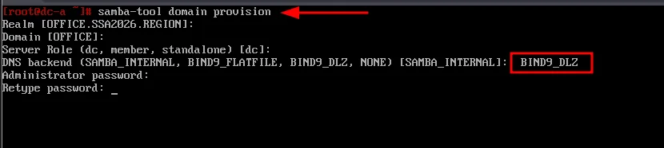

### 2.3 Результат создания домена

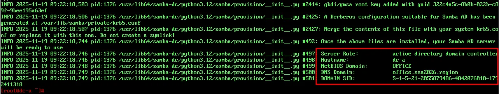

### 2.4 Запуск служб

```bash
systemctl enable --now samba
systemctl enable --now bind
```

### 2.5 Настройка Kerberos

При создании домена Samba автоматически генерирует файл `krb5.conf`:

```bash
cp /var/lib/samba/private/krb5.conf /etc/krb5.conf
```

### 2.6 Перезапуск Samba

```bash
systemctl restart samba
```

---

## 3. Проверка работы домена

### 3.1 Информация о домене

```bash
samba-tool domain info 127.0.0.1
```

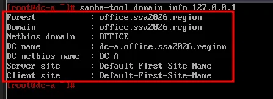

### 3.2 Проверка служб

```bash
smbclient -L localhost -U administrator
```

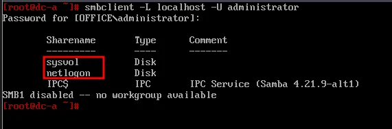

> **Примечание:** `netlogon` и `sysvol` создаются автоматически и необходимы для работы контроллера домена.

### 3.3 Проверка DNS

Проверка `/etc/resolv.conf`:

```bash
cat /etc/resolv.conf
```

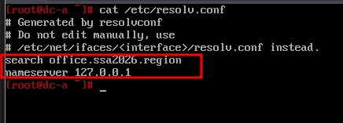

Проверка SRV-записи Kerberos:

```bash
host -t SRV _kerberos._udp.office.ssa2026.region.
```

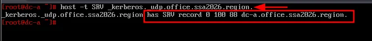

Проверка SRV-записи LDAP:

```bash
host -t SRV _ldap._tcp.office.ssa2026.region.
```

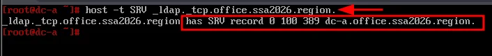

Проверка A-записи контроллера домена:

```bash
host -t A dc-a.office.ssa2026.region.
```

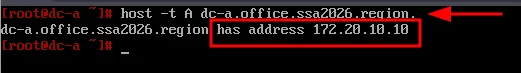

### 3.4 Проверка Kerberos-аутентификации

```bash
kinit administrator@OFFICE.SSA2026.REGION
```

> ⚠️ **Важно:** Имя домена должно быть в ВЕРХНЕМ регистре!

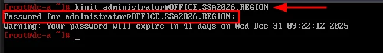

Просмотр билета:

```bash
klist
```

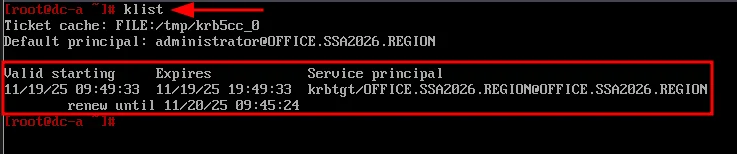

---

## 4. Ввод рабочих станций в домен

### 4.1 Установка пакетов (cli1-a и cli2-a)

```bash
apt-get update && apt-get install -y task-auth-ad-sssd
```

### 4.2 Ввод в домен через ЦУС

Открыть: **Пользователи** → **Аутентификация**

Выбрать:
- **Домен Active Directory**
- Домен: `office.ssa2026.region`
- Имя компьютера: `cli1-a` (или `cli2-a`)
- **SSSD (в единственном домене)**

Нажать **Применить**.

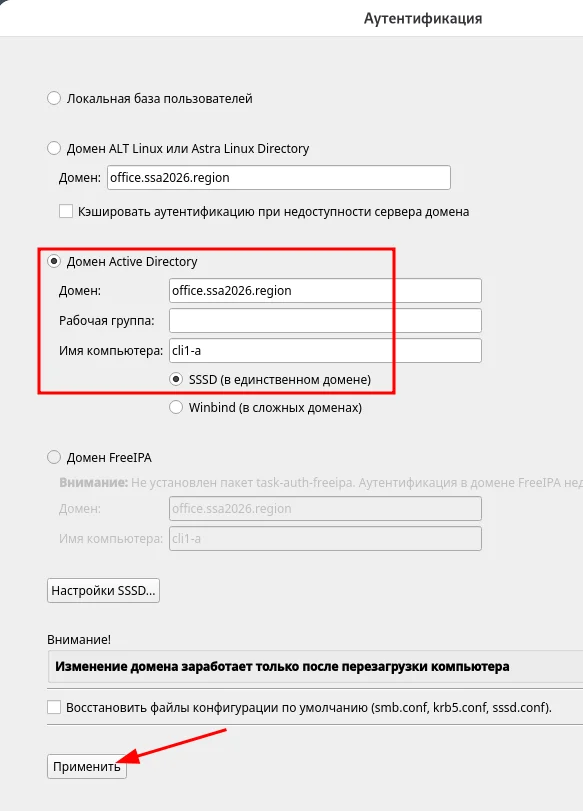

### 4.3 Ввод учётных данных

Ввести имя пользователя `Administrator` и пароль, нажать **ОК**:

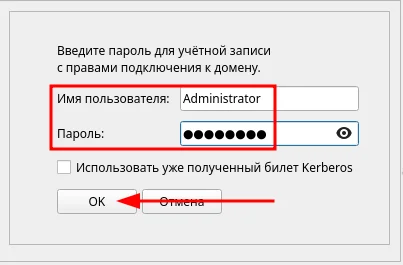

### 4.4 Результат

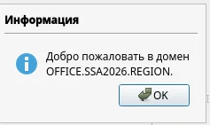

### 4.5 Перезагрузка

Перезагрузить рабочую станцию для применения всех настроек.

---

## 5. Управление Active Directory (ADMC)

### 5.1 Установка ADMC (cli1-a)

```bash
apt-get install -y admc
```

### 5.2 Получение билета Kerberos

```bash
kinit administrator@OFFICE.SSA2026.REGION
```

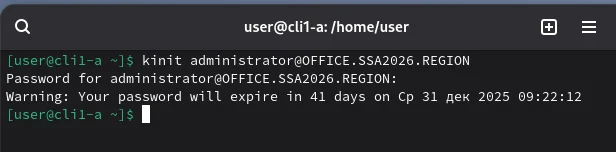

### 5.3 Запуск ADMC

Меню: **Системные** → **ADMC** или команда `admc`

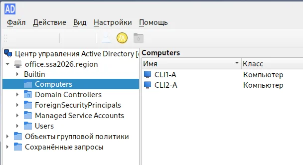

---

## 6. Создание организационной структуры

### 6.1 Создание OU ofadmins

ПКМ на `office.ssa2026.region` → **Создать подразделение**

Имя: `ofadmins`

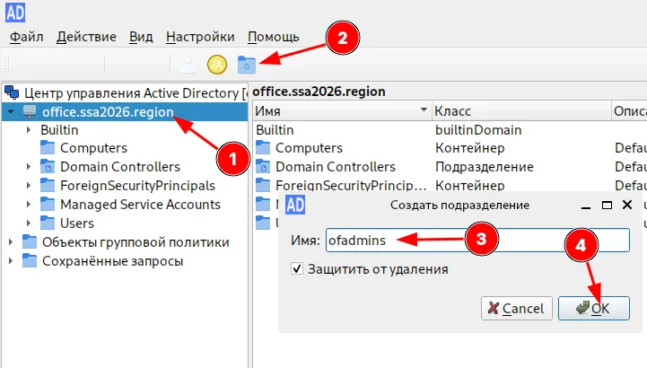

### 6.2 Создание OU ofusers

Аналогично создать подразделение `ofusers`:

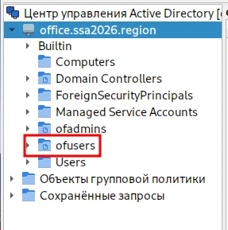

### 6.3 Создание группы ofadmins

ПКМ на OU `ofadmins` → **Создать группу**

- Имя: `ofadmins`
- Область группы: Глобальная
- Тип группы: Безопасность

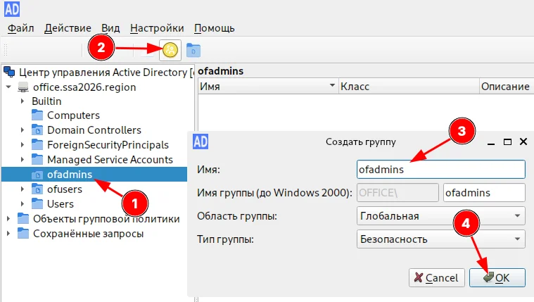

### 6.4 Создание группы ofusers

Аналогично создать группу `ofusers` в OU `ofusers`:

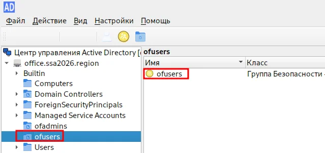

---

## 7. Создание пользователей

### 7.1 Создание пользователя ofadmin1

ПКМ на OU `ofadmins` → **Создать пользователя**

- Имя: `ofadmin1`
- Имя для входа: `ofadmin1`
- Пароль: `P@ssw0rd`
- ☑ Пользователь не может изменить пароль
- ☑ Пароль не истекает

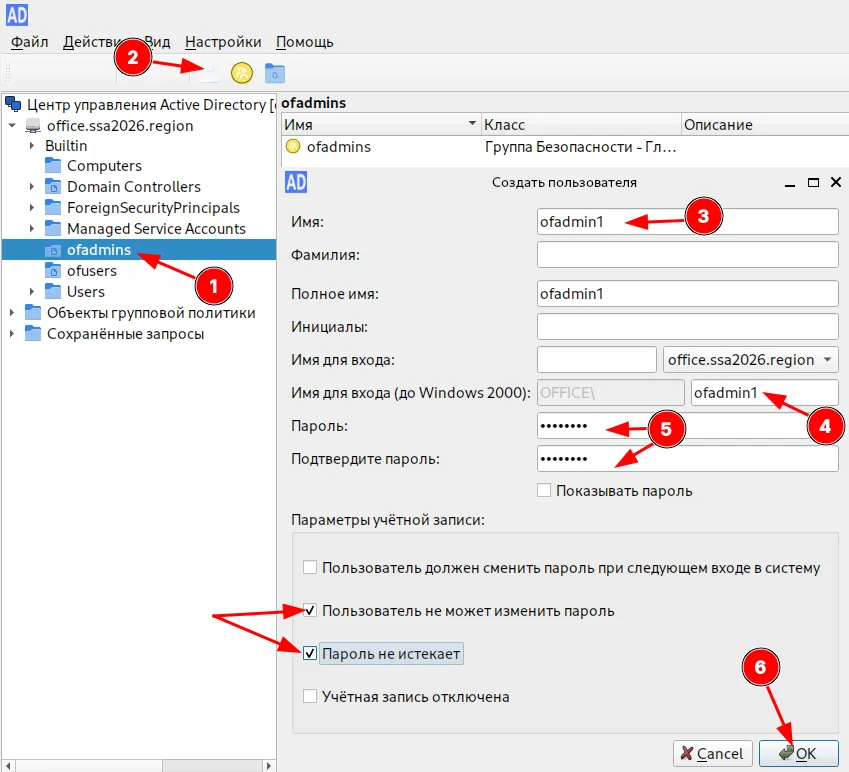

### 7.2 Добавление в группу ofadmins

Свойства группы `ofadmins` → **Участники** → **Добавить** → `ofadmin1`

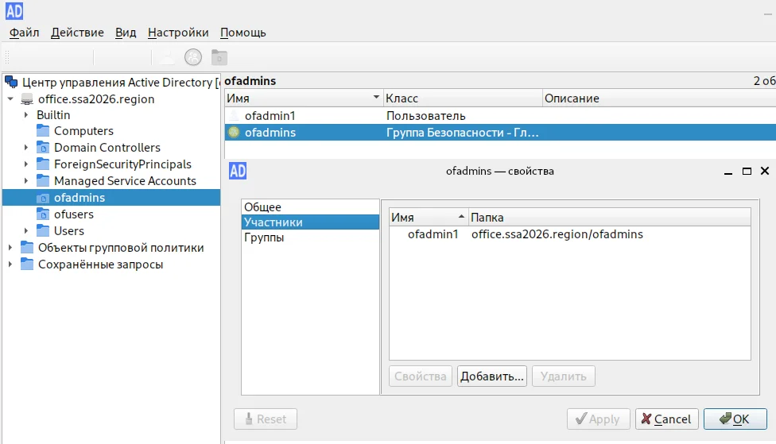

### 7.3 Создание пользователя ofuser1

Аналогично создать пользователя `ofuser1` в OU `ofusers` и добавить в группу `ofusers`:

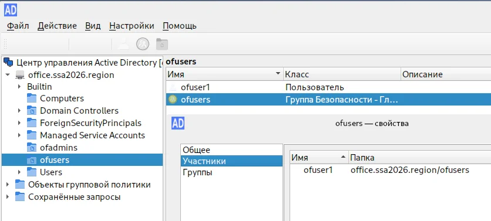

### 7.4 Создание пользователя user1

Создать пользователя `user1` в стандартном контейнере `Users`:

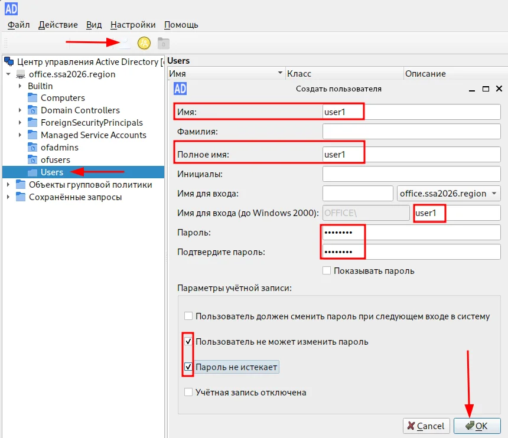

---

## 8. Проверка входа пользователей

### 8.1 Вход под ofadmin1 (cli2-a)

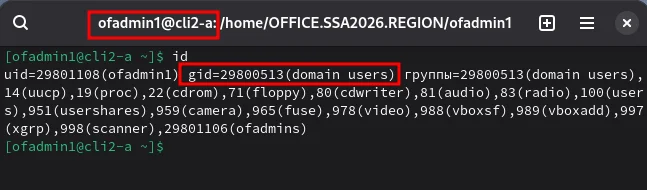

### 8.2 Вход под ofuser1 (cli2-a)

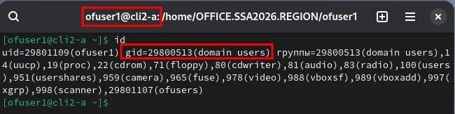

---

## 9. Настройка групповых политик (GPO)

### 9.1 Установка gpupdate (cli1-a и cli2-a)

```bash
apt-get install -y gpupdate
```

### 9.2 Включение модуля групповых политик

```bash
gpupdate-setup enable
```

### 9.3 Установка GPUI (cli1-a)

```bash
apt-get install -y gpui
```

### 9.4 Создание GPO

В ADMC: **Объекты групповой политики** → ПКМ на `office.ssa2026.region` → **Создать политику и связать с этим подразделением**

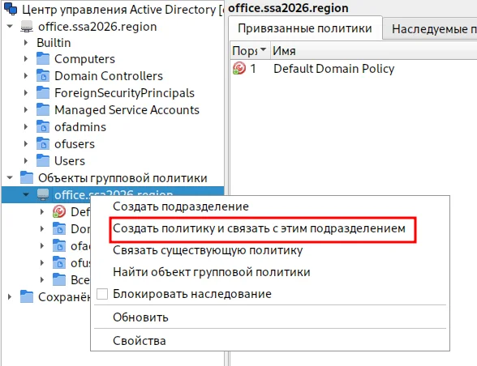

Задать имя: `my-gpo`

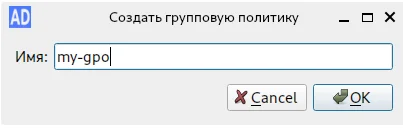

### 9.5 Редактирование GPO

ПКМ на созданной политике → **Изменить**

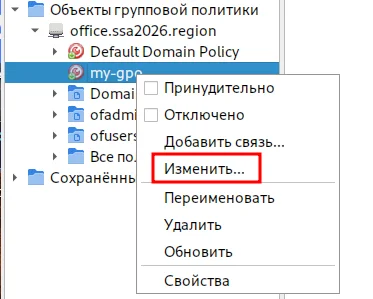

---

## 10. Настройка политик

### 10.1 Политика фона рабочего стола

Путь: **Компьютер** → **Административные шаблоны** → **Система ALT** → **Настройки GNOME** → **Внешний вид** → **Фон рабочего стола**

- Путь до изображения: `file:///home/user/Изображения/picture.png`
- ☑ Блокировать настройку изображения

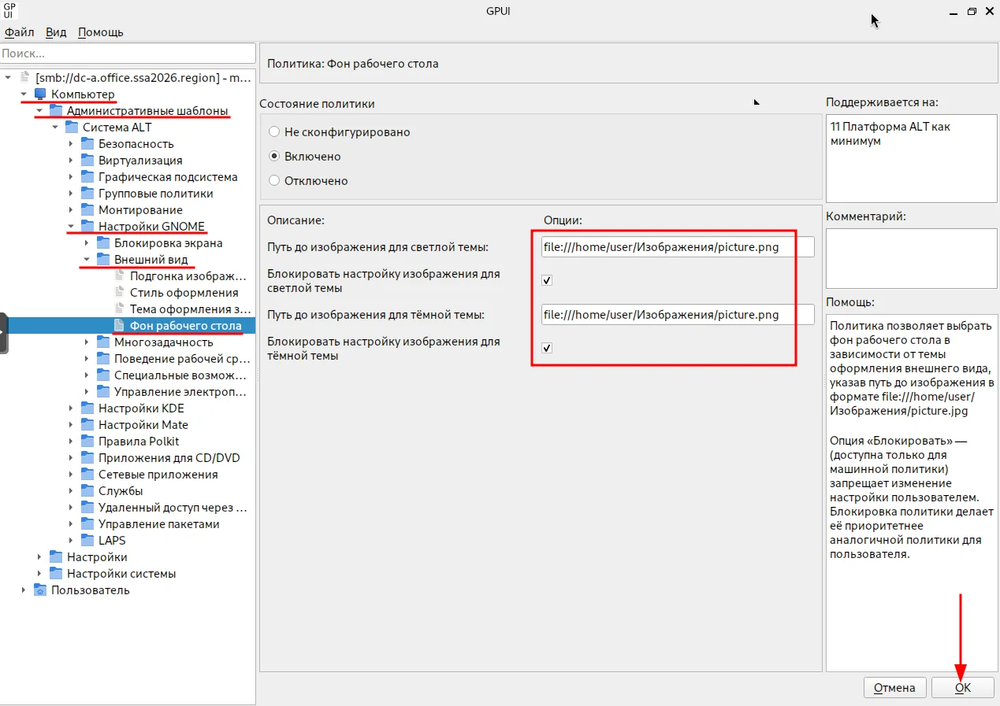

### 10.2 Политика подгонки изображения

Путь: **Внешний вид** → **Подгонка изображения**

- Состояние: Включено
- Способ подгонки: Wallpaper

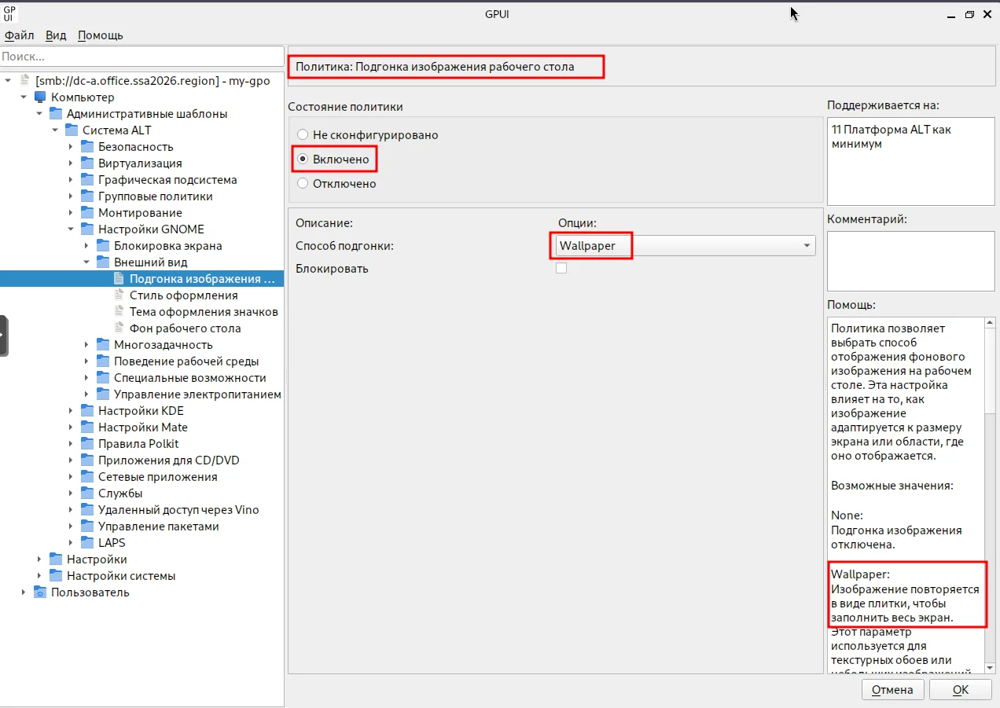

### 10.3 Политика сетевых настроек

Путь: **Компьютер** → **Административные шаблоны** → **Система ALT** → **Правила Polkit** → **Ограничения NetworkManager**

Для всех параметров выставить:
- Состояние: Включено
- Опция: No
- ☑ Блокировать

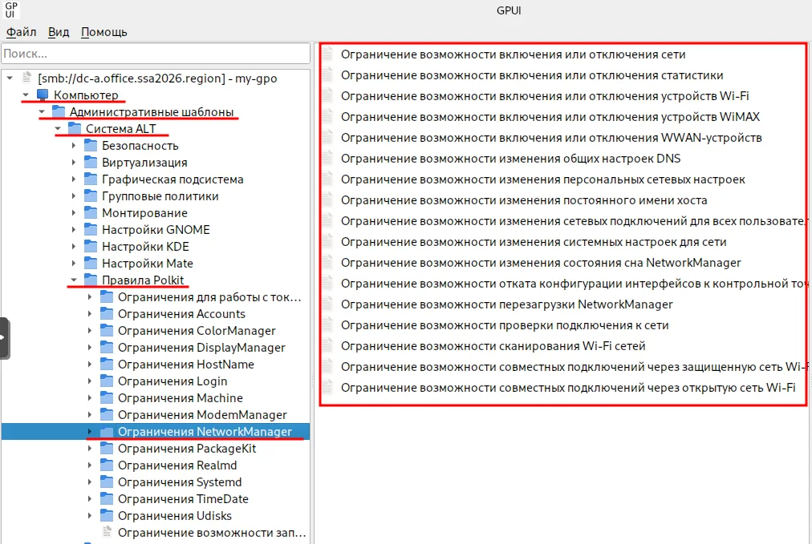

---

## 11. Проверка применения политик

### 11.1 Перезагрузка рабочих станций

Перезагрузить cli1-a и cli2-a для применения политик.

### 11.2 Проверка фона рабочего стола

Фон рабочего стола должен быть установлен согласно политике:

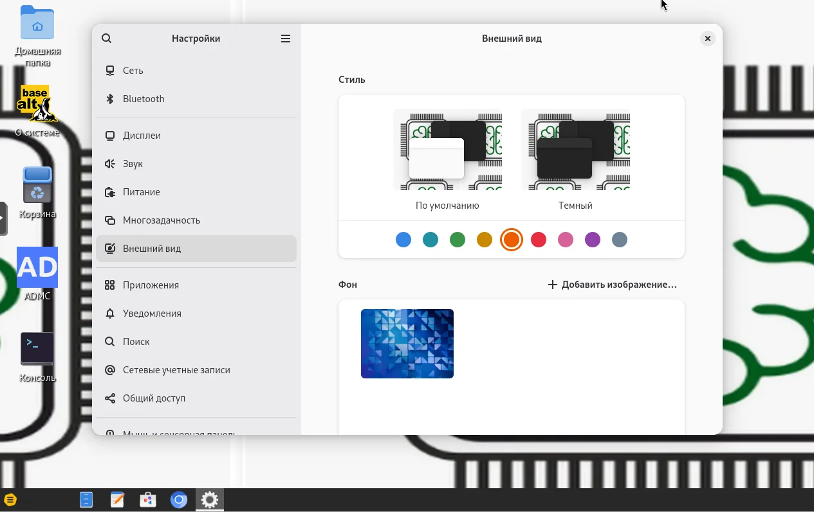

### 11.3 Проверка сетевых ограничений

При попытке отключить сетевой интерфейс, данная возможность отсутствует:


---

## Итоги

После выполнения данного модуля настроено:

| Компонент | Устройство | Статус |
|-----------|------------|--------|
| Samba AD DC | dc-a | ✅ |
| BIND DNS (BIND9_DLZ) | dc-a | ✅ |
| Kerberos | dc-a | ✅ |
| Ввод в домен | cli1-a | ✅ |
| Ввод в домен | cli2-a | ✅ |
| ADMC | cli1-a | ✅ |
| GPUI | cli1-a | ✅ |
| GPO | office.ssa2026.region | ✅ |

### Параметры домена

| Параметр | Значение |
|----------|----------|
| Realm | OFFICE.SSA2026.REGION |
| NetBIOS Domain | OFFICE |
| DNS Domain | office.ssa2026.region |
| DC Hostname | dc-a.office.ssa2026.region |
| DC IP | 172.20.10.10 |

### Организационная структура

```
office.ssa2026.region
├── Builtin
├── Computers
│   ├── CLI1-A
│   └── CLI2-A
├── Domain Controllers
├── ofadmins
│   ├── ofadmins (группа)
│   └── ofadmin1 (пользователь)
├── ofusers
│   ├── ofusers (группа)
│   └── ofuser1 (пользователь)
└── Users
    └── user1 (пользователь)
```

### Учётные записи

| Пользователь | Пароль | Группа | OU |
|--------------|--------|--------|-----|
| Administrator | P@ssw0rd | Domain Admins | Users |
| ofadmin1 | P@ssw0rd | ofadmins | ofadmins |
| ofuser1 | P@ssw0rd | ofusers | ofusers |
| user1 | P@ssw0rd | Domain Users | Users |

---

## Следующий модуль

➡️ [Модуль 16. ...](16-....md)
