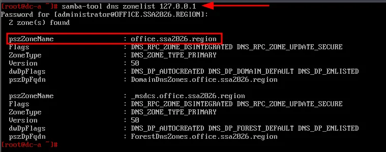
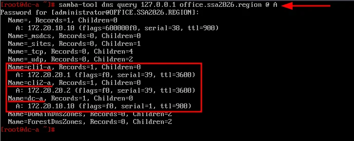
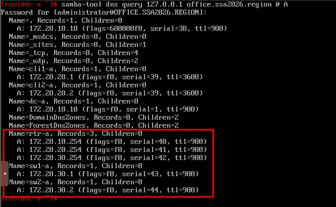
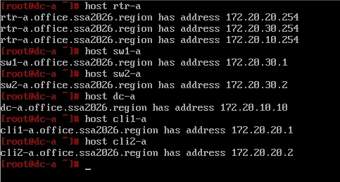
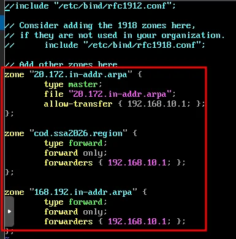
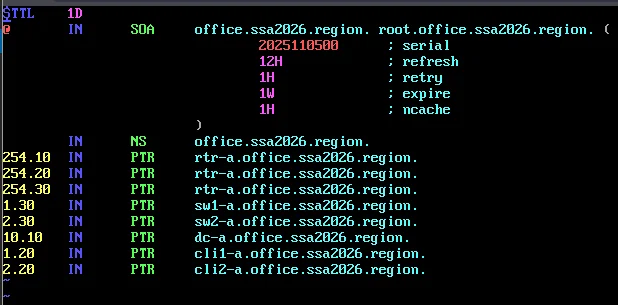
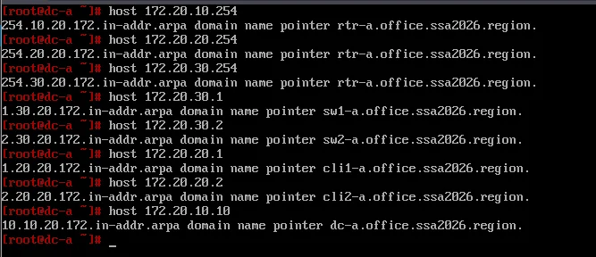
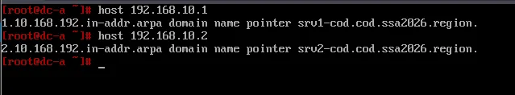
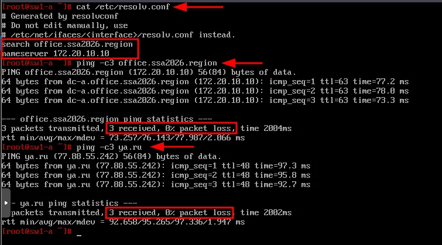

# Модуль 16. Настройка службы доменных имен в OFFICE

## Описание

Данный модуль описывает настройку DNS на контроллере домена dc-a для зоны `office.ssa2026.region`, добавление недостающих A-записей, создание зоны обратного просмотра и настройку пересылки запросов к зоне `cod.ssa2026.region`.

## Задачи

- Добавление A-записей для сетевых устройств офиса A
- Создание зоны обратного просмотра `20.172.in-addr.arpa`
- Настройка пересылки запросов к зоне COD
- Настройка DNS-клиентов на sw1-a и sw2-a

---

## 1. Управление DNS через samba-tool (dc-a)

### 1.1 Просмотр списка зон

```bash
samba-tool dns zonelist 127.0.0.1
```



### 1.2 Просмотр DNS-записей в зоне

```bash
samba-tool dns query 127.0.0.1 office.ssa2026.region @ A
```





---

## 2. Добавление A-записей

### 2.1 Создание недостающих записей

```bash
samba-tool dns add 127.0.0.1 office.ssa2026.region rtr-a A 172.20.10.254 -U administrator
samba-tool dns add 127.0.0.1 office.ssa2026.region rtr-a A 172.20.20.254 -U administrator
samba-tool dns add 127.0.0.1 office.ssa2026.region rtr-a A 172.20.30.254 -U administrator
samba-tool dns add 127.0.0.1 office.ssa2026.region sw1-a A 172.20.30.1 -U administrator
samba-tool dns add 127.0.0.1 office.ssa2026.region sw2-a A 172.20.30.2 -U administrator
```

> ⚠️ **Примечание:** Маршрутизатор rtr-a имеет несколько IP-адресов на разных интерфейсах, поэтому создаётся несколько A-записей.

### 2.2 Проверка наличия записей

```bash
samba-tool dns query 127.0.0.1 office.ssa2026.region @ A
```

### 2.3 Функциональная проверка

```bash
host rtr-a
host sw1-a
host sw2-a
host dc-a
host cli1-a
host cli2-a
```



---

## 3. Настройка зоны обратного просмотра и пересылки

### 3.1 Настройка /etc/bind/local.conf

Добавить в конфигурационный файл `/etc/bind/local.conf` информацию о зоне обратного просмотра и forward-зонах для COD:

```bash
vim /etc/bind/local.conf
```

```
zone "20.172.in-addr.arpa" {
    type master;
    file "20.172.in-addr.arpa";
    allow-transfer { 192.168.10.1; };
};

zone "cod.ssa2026.region" {
    type forward;
    forward only;
    forwarders { 192.168.10.1; };
};

zone "168.192.in-addr.arpa" {
    type forward;
    forward only;
    forwarders { 192.168.10.1; };
};
```



> ⚠️ **Важно:** 
> - `allow-transfer { 192.168.10.1; }` — разрешает трансфер зоны на srv1-cod
> - Зоны `cod.ssa2026.region` и `168.192.in-addr.arpa` настроены как forward для пересылки запросов к DNS-серверу COD (srv1-cod)

### 3.2 Создание файла зоны обратного просмотра

Скопировать файл шаблона:

```bash
cp /etc/bind/zone/localhost /etc/bind/zone/20.172.in-addr.arpa
```

Выдать права:

```bash
chown root:named /etc/bind/zone/20.172.in-addr.arpa
```

### 3.3 Настройка зоны обратного просмотра

Редактируем файл `/etc/bind/zone/20.172.in-addr.arpa`:

```bash
vim /etc/bind/zone/20.172.in-addr.arpa
```

Содержимое:

```
$TTL    1D
@       IN      SOA     office.ssa2026.region. root.office.ssa2026.region. (
                        2025110500      ; serial
                        12H             ; refresh
                        1H              ; retry
                        1W              ; expire
                        1H              ; ncache
                        )

        IN      NS      office.ssa2026.region.

254.10  IN      PTR     rtr-a.office.ssa2026.region.
254.20  IN      PTR     rtr-a.office.ssa2026.region.
254.30  IN      PTR     rtr-a.office.ssa2026.region.
1.30    IN      PTR     sw1-a.office.ssa2026.region.
2.30    IN      PTR     sw2-a.office.ssa2026.region.
10.10   IN      PTR     dc-a.office.ssa2026.region.
1.20    IN      PTR     cli1-a.office.ssa2026.region.
2.20    IN      PTR     cli2-a.office.ssa2026.region.
```



### 3.4 Перезапуск BIND

```bash
systemctl restart bind
```

---

## 4. Проверка DNS

### 4.1 Проверка записей PTR

```bash
host 172.20.10.254
host 172.20.20.254
host 172.20.30.254
host 172.20.30.1
host 172.20.30.2
host 172.20.20.1
host 172.20.20.2
host 172.20.10.10
```



### 4.2 Проверка forward-зон (COD)

```bash
host 192.168.10.1
host 192.168.10.2
```



---

## 5. Настройка DNS-клиентов

### 5.1 sw1-a и sw2-a (ALT Server)

Задаём в качестве DNS-сервера dc-a:

```bash
cat <<EOF > /etc/net/ifaces/mgmt/resolv.conf
search office.ssa2026.region
nameserver 172.20.10.10
EOF
```

Перезагружаем службу network:

```bash
systemctl restart network
```

### 5.2 Проверка

```bash
cat /etc/resolv.conf
ping -c3 office.ssa2026.region
ping -c3 ya.ru
```



---

## Итоги

После выполнения данного модуля настроено:

| Компонент | Устройство | Статус |
|-----------|------------|--------|
| A-записи устройств | dc-a | ✅ |
| Зона обратного просмотра | 20.172.in-addr.arpa | ✅ |
| Пересылка на COD | cod.ssa2026.region | ✅ |
| Пересылка PTR COD | 168.192.in-addr.arpa | ✅ |
| DNS-клиент | sw1-a | ✅ |
| DNS-клиент | sw2-a | ✅ |

### DNS-записи зоны office.ssa2026.region

| Имя | Тип | Значение |
|-----|-----|----------|
| dc-a | A | 172.20.10.10 |
| cli1-a | A | 172.20.20.1 |
| cli2-a | A | 172.20.20.2 |
| rtr-a | A | 172.20.10.254, 172.20.20.254, 172.20.30.254 |
| sw1-a | A | 172.20.30.1 |
| sw2-a | A | 172.20.30.2 |

### PTR-записи зоны 20.172.in-addr.arpa

| IP-адрес | PTR |
|----------|-----|
| 172.20.10.10 | dc-a.office.ssa2026.region |
| 172.20.10.254 | rtr-a.office.ssa2026.region |
| 172.20.20.1 | cli1-a.office.ssa2026.region |
| 172.20.20.2 | cli2-a.office.ssa2026.region |
| 172.20.20.254 | rtr-a.office.ssa2026.region |
| 172.20.30.1 | sw1-a.office.ssa2026.region |
| 172.20.30.2 | sw2-a.office.ssa2026.region |
| 172.20.30.254 | rtr-a.office.ssa2026.region |

### Пересылка DNS-запросов

| Зона | Направление | Сервер |
|------|-------------|--------|
| Интернет (по умолчанию) | → | 100.100.100.100 (ISP) |
| cod.ssa2026.region | → | 192.168.10.1 (srv1-cod) |
| 168.192.in-addr.arpa | → | 192.168.10.1 (srv1-cod) |

---

## Следующий модуль

➡️ [Модуль 17. ...](17-....md)
