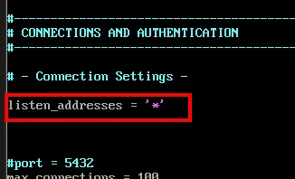
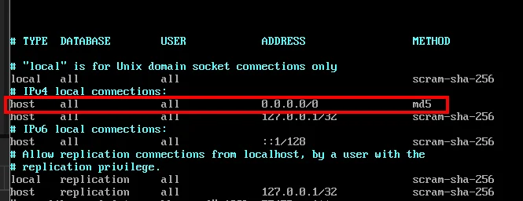
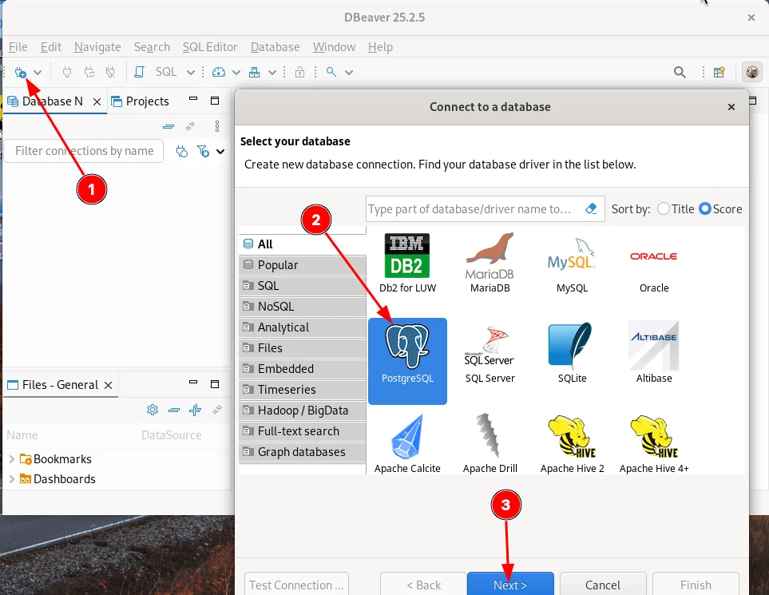
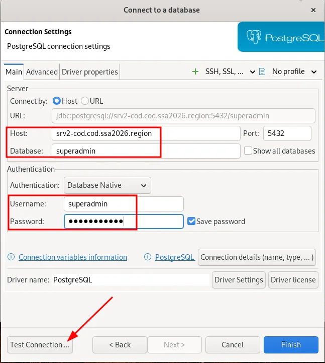
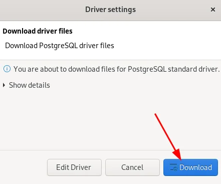
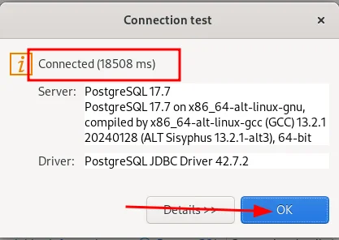
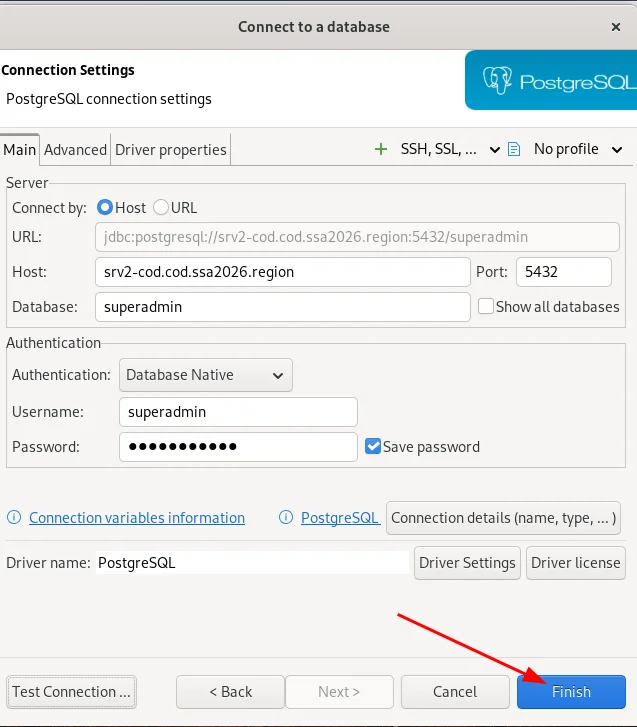
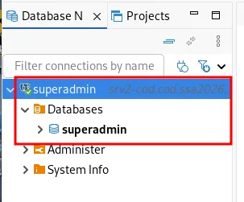

# Модуль 18. Настройка сервера баз данных (PostgreSQL)

[← Назад к оглавлению](../README.md)

---

## 📋 Содержание

* [Описание](#описание)
* [Часть 1: Установка и инициализация PostgreSQL](#часть-1-установка-и-инициализация-postgresql)
* [Часть 2: Настройка сетевого доступа](#часть-2-настройка-сетевого-доступа)
* [Часть 3: Создание пользователя и базы данных](#часть-3-создание-пользователя-и-базы-данных)
* [Часть 4: Подключение через DBeaver](#часть-4-подключение-через-dbeaver)
* [Проверка](#проверка)

---

## Описание

В данном модуле выполняется установка и настройка сервера баз данных PostgreSQL на **srv2-cod**, а также настройка удалённого подключения через DBeaver с **admin-cod**.

**Параметры:**
| Параметр | Значение |
| --- | --- |
| Сервер БД | srv2-cod |
| Версия PostgreSQL | 17 |
| Порт | 5432 |
| Суперпользователь | superadmin |
| Пароль | P@ssw0rdSQL |
| База данных | superadmin |

---

## Часть 1: Установка и инициализация PostgreSQL

### srv2-cod (alt-server)

#### Шаг 1.1: Установка PostgreSQL

```bash
apt-get update && apt-get install -y postgresql17-server
```

#### Шаг 1.2: Инициализация базы данных

Создаём системные базы данных:

```bash
/etc/init.d/postgresql initdb
```


**Результат:** При успешной инициализации отображается сообщение `Success.`

#### Шаг 1.3: Запуск и автозагрузка

Включаем PostgreSQL и добавляем в автозагрузку:

```bash
systemctl enable --now postgresql
```

---

## Часть 2: Настройка сетевого доступа

### srv2-cod (alt-server)

> ⚠️ **Важно:** По умолчанию PostgreSQL принимает подключения только с localhost!

#### Шаг 2.1: Настройка прослушивания сетевых интерфейсов

Редактируем конфигурационный файл `/var/lib/pgsql/data/postgresql.conf`:

```bash
nano /var/lib/pgsql/data/postgresql.conf
```

Находим строку `listen_addresses = 'localhost'` и изменяем на:

```
listen_addresses = '*'
```



#### Шаг 2.2: Настройка аутентификации

Редактируем конфигурационный файл `/var/lib/pgsql/data/pg_hba.conf`:

```bash
nano /var/lib/pgsql/data/pg_hba.conf
```

Добавляем запись для разрешения подключений из сети:

```
# IPv4 remote connections:
host    all    all    0.0.0.0/0    md5
```



**Описание полей:**
| Поле | Значение | Описание |
| --- | --- | --- |
| TYPE | host | TCP/IP подключение |
| DATABASE | all | Все базы данных |
| USER | all | Все пользователи |
| ADDRESS | 0.0.0.0/0 | Любой IP-адрес |
| METHOD | md5 | Парольная аутентификация (MD5) |

#### Шаг 2.3: Перезапуск PostgreSQL

```bash
systemctl restart postgresql
```

#### Шаг 2.4: Проверка сетевого доступа

```bash
ss -tlpn | grep "5432"
```


**Результат:** PostgreSQL должен слушать на `0.0.0.0:5432` и `[::]:5432`

---

## Часть 3: Создание пользователя и базы данных

### srv2-cod (alt-server)

#### Шаг 3.1: Создание суперпользователя

Создаём пользователя `superadmin` с паролем `P@ssw0rdSQL`:

```bash
createuser -U postgres --superuser --encrypted --pwprompt superadmin
```

При выполнении команды введите пароль дважды:
```
Enter password for new role: P@ssw0rdSQL
Enter it again: P@ssw0rdSQL
```

#### Шаг 3.2: Создание базы данных

Создаём базу данных `superadmin` с владельцем `superadmin`:

```bash
su - postgres -s /bin/sh -c 'createdb -O superadmin superadmin'
```

---

## Часть 4: Подключение через DBeaver

### admin-cod (alt-workstation)

#### Шаг 4.1: Установка DBeaver

```bash
apt-get update && apt-get install -y eepm
epm play -y dbeaver
```

#### Шаг 4.2: Создание подключения

1. Откройте DBeaver
2. Нажмите кнопку **New Database Connection** (1)
3. Выберите **PostgreSQL** (2)
4. Нажмите **Next** (3)



#### Шаг 4.3: Настройка параметров подключения

Заполните параметры подключения:

| Параметр | Значение |
| --- | --- |
| Host | srv2-cod.cod.ssa2026.region |
| Port | 5432 |
| Database | superadmin |
| Username | superadmin |
| Password | P@ssw0rdSQL |



#### Шаг 4.4: Загрузка драйвера

При первом подключении DBeaver предложит скачать драйвер PostgreSQL:



Нажмите **Download** для загрузки драйвера.

> ⚠️ **Примечание:** Если нет доступа к интернету, драйвер можно установить вручную:
> ```bash
> apt-get install -y postgresql-jdbc
> ```
> Затем добавить `/usr/share/java/postgresql.jar` в настройках драйвера.

#### Шаг 4.5: Тест подключения

Нажмите **Test Connection...** для проверки подключения:



**Результат:** Сообщение `Connected` подтверждает успешное подключение.

#### Шаг 4.6: Завершение настройки

Нажмите **Finish** для сохранения подключения:



---

## Проверка

### Результат в DBeaver

После успешного подключения в панели слева появится подключение к базе данных:



**Структура:**
```
superadmin (srv2-cod.cod.ssa2026.region)
├── Databases
│   └── superadmin
├── Administer
└── System Info
```

### Проверка через командную строку

На **admin-cod** можно также проверить подключение через `psql`:

```bash
psql -h srv2-cod.cod.ssa2026.region -U superadmin -d superadmin
```

---

## ⚠️ Частые ошибки

| Ошибка | Причина | Решение |
| --- | --- | --- |
| `connection refused` | PostgreSQL не слушает на сетевом интерфейсе | Проверьте `listen_addresses = '*'` в postgresql.conf |
| `no pg_hba.conf entry` | Нет правила для клиента | Добавьте запись в pg_hba.conf |
| `password authentication failed` | Неверный пароль | Проверьте пароль пользователя |
| `could not connect to server` | Фаервол блокирует порт | Откройте порт 5432 |
| `FATAL: database does not exist` | БД не создана | Создайте базу данных командой `createdb` |

---

## 📁 Конфигурационные файлы

| Файл | Назначение |
| --- | --- |
| `/var/lib/pgsql/data/postgresql.conf` | Основная конфигурация PostgreSQL |
| `/var/lib/pgsql/data/pg_hba.conf` | Настройки аутентификации |
| `/var/lib/pgsql/data/pg_ident.conf` | Маппинг пользователей |

---

[← Назад к оглавлению](../README.md)
