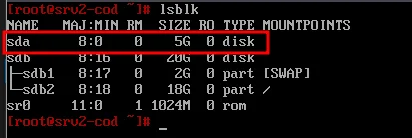
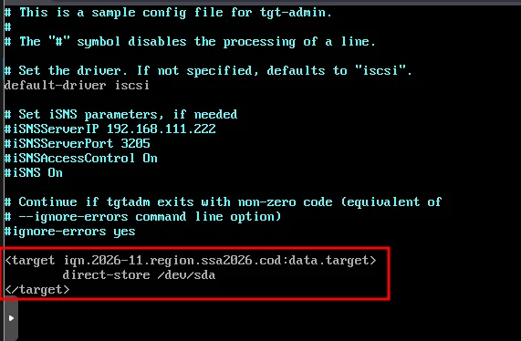
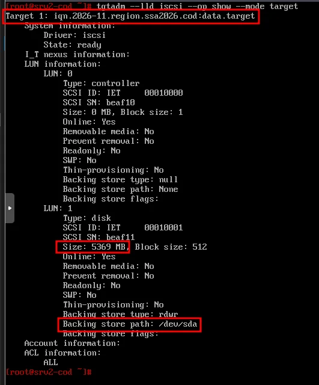
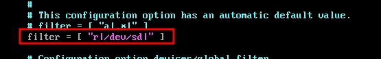
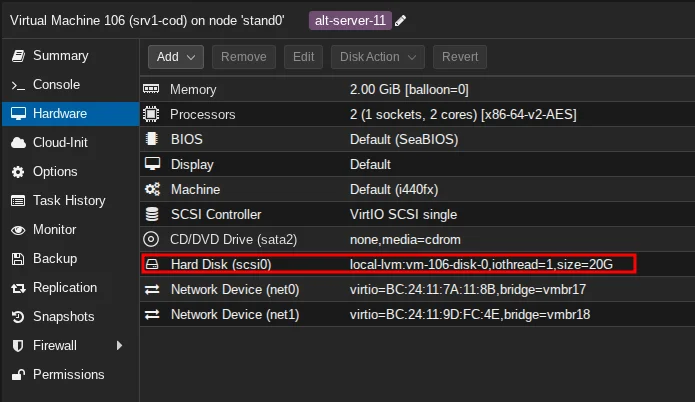
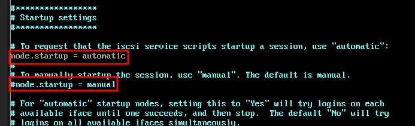
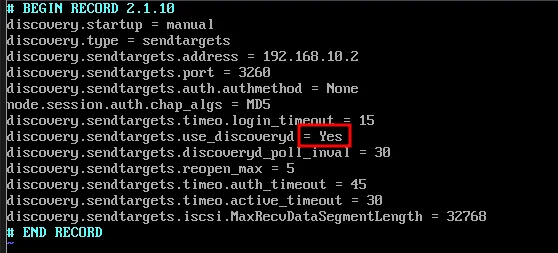
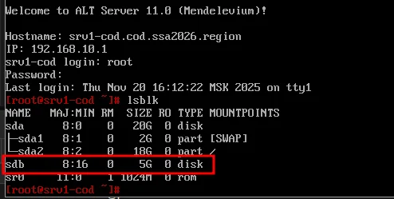

# Модуль 19. Настройка устройства хранения данных (iSCSI)

[← Назад к оглавлению](../README.md)

---

## 📋 Содержание

* [Описание](#описание)
* [Часть 1: Настройка iSCSI Target (srv2-cod)](#часть-1-настройка-iscsi-target-srv2-cod)
* [Часть 2: Настройка iSCSI Initiator (srv1-cod)](#часть-2-настройка-iscsi-initiator-srv1-cod)
* [Проверка](#проверка)

---

## Описание

В данном модуле настраивается iSCSI-хранилище: сервер **srv2-cod** выступает в роли Target (предоставляет диск), а **srv1-cod** — в роли Initiator (подключает диск по сети).

**Параметры:**
| Параметр | Значение |
| --- | --- |
| iSCSI Target | srv2-cod (192.168.20.2) |
| iSCSI Initiator | srv1-cod |
| IQN | iqn.2026-11.region.ssa2026.cod:data.target |
| Диск для экспорта | /dev/sda (5 ГБ) |
| Порт iSCSI | 3260 |

**Схема работы:**
```
srv1-cod (Initiator)  ──────iSCSI──────►  srv2-cod (Target)
     │                                         │
     │                                    /dev/sda (5GB)
     ▼                                         
   /dev/sdb (5GB)
```

---

## Часть 1: Настройка iSCSI Target (srv2-cod)

### srv2-cod (alt-server)

#### Шаг 1.1: Установка пакетов

```bash
apt-get update && apt-get install -y scsitarget-utils
```

#### Шаг 1.2: Запуск службы tgt

```bash
systemctl enable --now tgt
```

#### Шаг 1.3: Определение диска для экспорта

Просмотрите список блочных устройств:

```bash
lsblk
```



> ⚠️ **Важно:** В данном примере используется диск `/dev/sda` размером 5 ГБ. Убедитесь, что выбранный диск не содержит важных данных!

#### Шаг 1.4: Настройка экспорта диска

Отредактируйте конфигурационный файл `/etc/tgt/targets.conf`:

```bash
nano /etc/tgt/targets.conf
```

Добавьте в конец файла:

```xml
<target iqn.2026-11.region.ssa2026.cod:data.target>
    direct-store /dev/sda
</target>
```



**Формат IQN:**
```
iqn.<год>-<месяц>.<домен в обратном порядке>:<имя ресурса>
```

#### Шаг 1.5: Перезапуск службы tgt

```bash
systemctl restart tgt
```

#### Шаг 1.6: Проверка настройки Target

```bash
tgtadm --lld iscsi --op show --mode target
```



**Проверьте:**
* Target 1: `iqn.2026-11.region.ssa2026.cod:data.target`
* State: `ready`
* LUN 1: Size: `5369 MB`, Backing store path: `/dev/sda`

#### Шаг 1.7: Настройка фильтра LVM

Для корректной работы необходимо исключить iSCSI-диски из сканирования LVM.

Отредактируйте файл `/etc/lvm/lvm.conf`:

```bash
nano /etc/lvm/lvm.conf
```

В блоке `devices` найдите параметр `filter` и измените его:

```
filter = [ "r|/dev/sd|" ]
```



> ℹ️ **Пояснение:** Фильтр `r|/dev/sd|` запрещает LVM сканировать все устройства `/dev/sd*`, что предотвращает конфликты с iSCSI-дисками.

---

## Часть 2: Настройка iSCSI Initiator (srv1-cod)

### srv1-cod (alt-server)

> ℹ️ **Примечание:** Для работы iSCSI Initiator необходимо добавить дополнительный диск к виртуальной машине srv1-cod в гипервизоре.



#### Шаг 2.1: Установка пакетов

```bash
apt-get update && apt-get install -y open-iscsi
```

#### Шаг 2.2: Запуск службы iscsid

```bash
systemctl enable --now iscsid
```

#### Шаг 2.3: Обнаружение Target

Выполните discovery для поиска доступных Target:

```bash
iscsiadm -m discovery -t sendtargets -p 192.168.20.2
```

**Результат:**
```
192.168.20.2:3260,1 iqn.2026-11.region.ssa2026.cod:data.target
```

#### Шаг 2.4: Подключение к Target

```bash
iscsiadm -m node --login
```

**Результат:**
```
Logging in to [iface: default, target: iqn.2026-11.region.ssa2026.cod:data.target, portal: 192.168.20.2,3260]
Login to [iface: default, target: iqn.2026-11.region.ssa2026.cod:data.target, portal: 192.168.20.2,3260] successful.
```

#### Шаг 2.5: Настройка автоматического подключения

Отредактируйте файл `/etc/iscsi/iscsid.conf`:

```bash
nano /etc/iscsi/iscsid.conf
```

Внесите изменения:
* Закомментируйте: `#node.startup = manual`
* Раскомментируйте: `node.startup = automatic`



#### Шаг 2.6: Включение автообнаружения

Отредактируйте файл конфигурации обнаружения:

```bash
nano /var/lib/iscsi/send_targets/192.168.20.2,3260/st_config
```

Измените параметр:

```
discovery.sendtargets.use_discoveryd = Yes
```



#### Шаг 2.7: Перезагрузка

Выполните перезагрузку для применения настроек:

```bash
reboot
```

---

## Проверка

### srv1-cod (alt-server)

После перезагрузки проверьте наличие подключённого iSCSI-диска:

```bash
lsblk
```



**Результат:**
* `sda` — локальный диск 20 ГБ (системный)
* `sdb` — iSCSI-диск 5 ГБ (подключённый с srv2-cod)

### Дополнительные команды проверки

**Просмотр активных сессий:**
```bash
iscsiadm -m session
```

**Просмотр информации о подключении:**
```bash
iscsiadm -m session -P 3
```

**Проверка статуса службы:**
```bash
systemctl status iscsid
```

---

## 📁 Конфигурационные файлы

| Хост | Файл | Назначение |
| --- | --- | --- |
| srv2-cod | `/etc/tgt/targets.conf` | Конфигурация iSCSI Target |
| srv2-cod | `/etc/lvm/lvm.conf` | Фильтр LVM |
| srv1-cod | `/etc/iscsi/iscsid.conf` | Конфигурация iSCSI Initiator |
| srv1-cod | `/var/lib/iscsi/send_targets/*/st_config` | Настройки discovery |

---

## ⚠️ Частые ошибки

| Ошибка | Причина | Решение |
| --- | --- | --- |
| `connection refused` | Служба tgt не запущена | `systemctl start tgt` |
| `no portals found` | Неверный IP Target | Проверьте IP-адрес srv2-cod |
| `login failed` | Target не настроен | Проверьте `/etc/tgt/targets.conf` |
| Диск не появляется после reboot | Автозапуск не настроен | Проверьте `node.startup = automatic` |
| LVM конфликты | Фильтр не настроен | Добавьте фильтр в `/etc/lvm/lvm.conf` |

---

## 🔧 Полезные команды

**iSCSI Target (srv2-cod):**
```bash
# Показать все Target
tgtadm --lld iscsi --op show --mode target

# Перезапуск службы
systemctl restart tgt
```

**iSCSI Initiator (srv1-cod):**
```bash
# Обнаружение Target
iscsiadm -m discovery -t sendtargets -p <IP>

# Подключение
iscsiadm -m node --login

# Отключение
iscsiadm -m node --logout

# Список сессий
iscsiadm -m session
```

---

[← Назад к оглавлению](../README.md)
