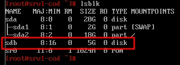
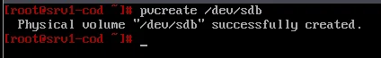
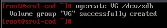
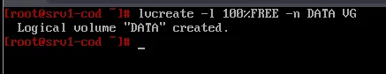
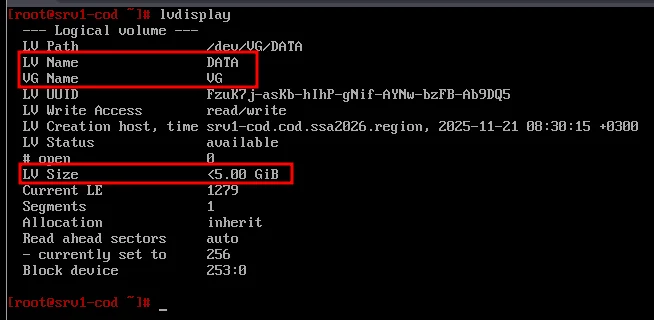
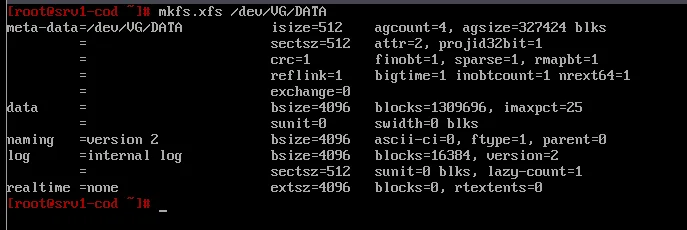
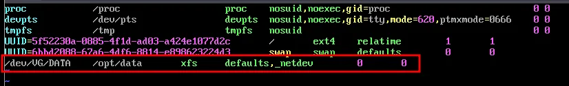
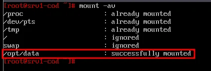
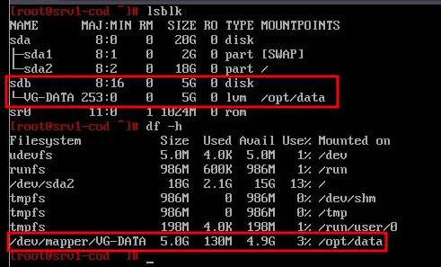

# Модуль 20. Настройка устройства хранения данных (LVM)

[← Назад к оглавлению](../README.md)

---

## 📋 Содержание

* [Описание](#описание)
* [Часть 1: Создание LVM](#часть-1-создание-lvm)
* [Часть 2: Форматирование и монтирование](#часть-2-форматирование-и-монтирование)
* [Проверка](#проверка)

---

## Описание

В данном модуле создаётся LVM-том на диске, подключённом по iSCSI (из модуля 19), и настраивается его автоматическое монтирование.

**Параметры:**
| Параметр | Значение |
| --- | --- |
| Сервер | srv1-cod |
| Диск | /dev/sdb (iSCSI, 5 ГБ) |
| Volume Group | VG |
| Logical Volume | DATA |
| Файловая система | XFS |
| Точка монтирования | /opt/data |

**Структура LVM:**
```
/dev/sdb (5 ГБ, iSCSI)
    └── PV (Physical Volume)
        └── VG (Volume Group)
            └── DATA (Logical Volume, 100%)
                └── /opt/data (XFS)
```

---

## Часть 1: Создание LVM

### srv1-cod (alt-server)

#### Шаг 1.1: Определение диска

Просмотрите список блочных устройств:

```bash
lsblk
```



> ℹ️ **Примечание:** Диск `sdb` (5 ГБ) — это iSCSI-диск, подключённый с srv2-cod в модуле 19.

#### Шаг 1.2: Создание Physical Volume (PV)

Пометьте диск для использования в LVM:

```bash
pvcreate /dev/sdb
```



**Результат:** `Physical volume "/dev/sdb" successfully created.`

#### Шаг 1.3: Создание Volume Group (VG)

Создайте группу логических томов с именем `VG`:

```bash
vgcreate VG /dev/sdb
```



**Результат:** `Volume group "VG" successfully created`

#### Шаг 1.4: Создание Logical Volume (LV)

Создайте логический том `DATA`, используя 100% свободного пространства:

```bash
lvcreate -l 100%FREE -n DATA VG
```



**Результат:** `Logical volume "DATA" created.`

#### Шаг 1.5: Проверка LVM

Проверьте созданный логический том:

```bash
lvdisplay
```



**Проверьте:**
| Параметр | Значение |
| --- | --- |
| LV Path | /dev/VG/DATA |
| LV Name | DATA |
| VG Name | VG |
| LV Size | <5.00 GiB |

---

## Часть 2: Форматирование и монтирование

### srv1-cod (alt-server)

#### Шаг 2.1: Форматирование в XFS

Создайте файловую систему XFS на логическом томе:

```bash
mkfs.xfs /dev/VG/DATA
```



#### Шаг 2.2: Создание точки монтирования

```bash
mkdir /opt/data
```

#### Шаг 2.3: Настройка автомонтирования

Отредактируйте файл `/etc/fstab`:

```bash
nano /etc/fstab
```

Добавьте строку:

```
/dev/VG/DATA    /opt/data    xfs    defaults,_netdev    0 0
```



**Описание параметров:**
| Параметр | Значение | Описание |
| --- | --- | --- |
| Устройство | /dev/VG/DATA | Путь к LV |
| Точка монтирования | /opt/data | Куда монтировать |
| Тип ФС | xfs | Файловая система |
| Опции | defaults,_netdev | Стандартные + сетевое устройство |
| dump | 0 | Не делать backup |
| pass | 0 | Не проверять fsck |

> ⚠️ **Важно:** Опция `_netdev` обязательна для iSCSI-дисков! Она указывает системе дождаться инициализации сети перед монтированием.

**Альтернативный вариант (по UUID):**
```bash
# Получить UUID
blkid /dev/VG/DATA

# Запись в fstab
UUID=<ваш-uuid>    /opt/data    xfs    defaults,_netdev    0 0
```

#### Шаг 2.4: Монтирование

Выполните монтирование всех разделов из fstab:

```bash
mount -av
```



**Результат:** `/opt/data : successfully mounted`

---

## Проверка

### Проверка монтирования

```bash
lsblk
df -h
```



**Результат lsblk:**
```
sdb           8:16   0    5G  0 disk  
└─VG-DATA   253:0    0    5G  0 lvm   /opt/data
```

**Результат df:**
```
/dev/mapper/VG-DATA   5.0G   130M   4.9G   3%  /opt/data
```

### Дополнительные команды проверки

**Информация о Physical Volumes:**
```bash
pvdisplay
pvs
```

**Информация о Volume Groups:**
```bash
vgdisplay
vgs
```

**Информация о Logical Volumes:**
```bash
lvdisplay
lvs
```

---

## 📁 Сводка команд LVM

| Операция | Команда |
| --- | --- |
| Создать PV | `pvcreate /dev/sdX` |
| Создать VG | `vgcreate <имя_VG> /dev/sdX` |
| Создать LV | `lvcreate -l 100%FREE -n <имя_LV> <имя_VG>` |
| Расширить VG | `vgextend <имя_VG> /dev/sdY` |
| Расширить LV | `lvextend -l +100%FREE /dev/<VG>/<LV>` |
| Расширить ФС | `xfs_growfs /opt/data` |
| Удалить LV | `lvremove /dev/<VG>/<LV>` |
| Удалить VG | `vgremove <имя_VG>` |
| Удалить PV | `pvremove /dev/sdX` |

---

## ⚠️ Частые ошибки

| Ошибка | Причина | Решение |
| --- | --- | --- |
| `Device not found` | iSCSI не подключён | Проверьте `iscsiadm -m session` |
| `mount: wrong fs type` | ФС не создана | Выполните `mkfs.xfs` |
| `mount: special device does not exist` | Неверный путь | Проверьте `lvdisplay` |
| Том не монтируется при загрузке | Нет `_netdev` | Добавьте опцию в fstab |
| `Can't open /dev/sdb exclusively` | Диск занят | Проверьте `lsof /dev/sdb` |

---

[← Назад к оглавлению](../README.md)
