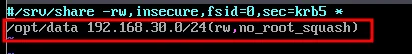
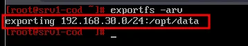
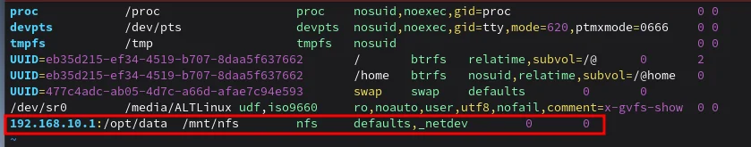
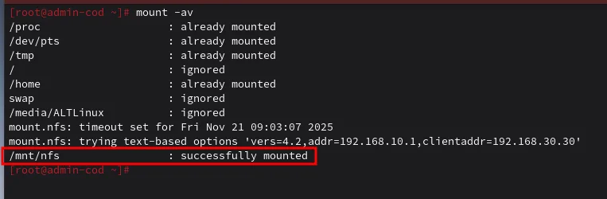
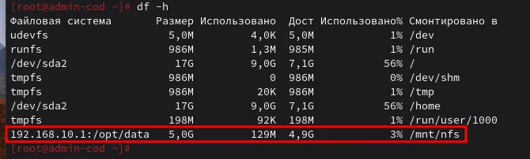
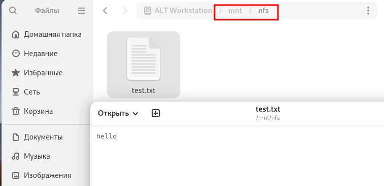
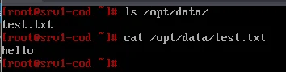

# Модуль 21. Настройка устройства хранения данных (NFS)

[← Назад к оглавлению](../README.md)

---

## 📋 Содержание

* [Описание](#описание)
* [Часть 1: Настройка NFS-сервера (srv1-cod)](#часть-1-настройка-nfs-сервера-srv1-cod)
* [Часть 2: Настройка NFS-клиента (admin-cod)](#часть-2-настройка-nfs-клиента-admin-cod)
* [Проверка](#проверка)

---

## Описание

В данном модуле настраивается сетевая файловая система NFS для предоставления общего доступа к директории `/opt/data` (созданной в модуле 20 на LVM-томе).

**Параметры:**
| Параметр | Значение |
| --- | --- |
| NFS-сервер | srv1-cod (192.168.10.1) |
| NFS-клиент | admin-cod (192.168.30.30) |
| Экспортируемая директория | /opt/data |
| Разрешённая сеть | 192.168.30.0/24 |
| Точка монтирования на клиенте | /mnt/nfs |

**Схема работы:**
```
admin-cod (Клиент)                    srv1-cod (Сервер)
192.168.30.30                         192.168.10.1
      │                                     │
  /mnt/nfs  ◄─────────NFS─────────►  /opt/data (LVM)
```

---

## Часть 1: Настройка NFS-сервера (srv1-cod)

### srv1-cod (alt-server)

#### Шаг 1.1: Установка пакетов

```bash
apt-get install -y nfs-server nfs-utils
```

#### Шаг 1.2: Настройка прав на директорию

Назначьте полные права на директорию для общего доступа:

```bash
chmod 777 /opt/data
```

#### Шаг 1.3: Настройка экспорта

Отредактируйте файл `/etc/exports`:

```bash
nano /etc/exports
```

Добавьте строку:

```
/opt/data 192.168.30.0/24(rw,no_root_squash)
```



**Описание параметров:**
| Параметр | Описание |
| --- | --- |
| `/opt/data` | Экспортируемая директория |
| `192.168.30.0/24` | Разрешённая сеть (MGMT-COD) |
| `rw` | Чтение и запись |
| `no_root_squash` | root на клиенте = root на сервере |

#### Шаг 1.4: Применение экспорта

Экспортируйте файловую систему:

```bash
exportfs -arv
```



**Результат:** `exporting 192.168.30.0/24:/opt/data`

**Параметры exportfs:**
| Флаг | Описание |
| --- | --- |
| `-a` | Экспортировать все директории |
| `-r` | Переэкспортировать (обновить) |
| `-v` | Подробный вывод |

#### Шаг 1.5: Запуск службы NFS

```bash
systemctl enable --now nfs-server
```

---

## Часть 2: Настройка NFS-клиента (admin-cod)

### admin-cod (alt-workstation)

#### Шаг 2.1: Установка пакетов

```bash
apt-get update && apt-get install -y nfs-utils nfs-clients
```

#### Шаг 2.2: Создание точки монтирования

```bash
mkdir /mnt/nfs
chmod 777 /mnt/nfs
```

#### Шаг 2.3: Настройка автомонтирования

Отредактируйте файл `/etc/fstab`:

```bash
nano /etc/fstab
```

Добавьте строку:

```
192.168.10.1:/opt/data    /mnt/nfs    nfs    defaults,_netdev    0 0
```



**Описание параметров:**
| Параметр | Значение | Описание |
| --- | --- | --- |
| Устройство | 192.168.10.1:/opt/data | NFS-ресурс (сервер:путь) |
| Точка монтирования | /mnt/nfs | Локальная директория |
| Тип ФС | nfs | Сетевая файловая система |
| Опции | defaults,_netdev | Стандартные + ждать сеть |
| dump | 0 | Не делать backup |
| pass | 0 | Не проверять fsck |

#### Шаг 2.4: Монтирование

```bash
mount -av
```



**Результат:** `/mnt/nfs : successfully mounted`

---

## Проверка

### Проверка на клиенте (admin-cod)

#### Проверка командой df

```bash
df -h
```



**Результат:**
```
192.168.10.1:/opt/data    5.0G   129M   4.9G   3%  /mnt/nfs
```

#### Проверка через файловый менеджер

Откройте файловый менеджер и перейдите в `/mnt/nfs`:



Создайте тестовый файл `test.txt` с содержимым `hello`.

### Проверка на сервере (srv1-cod)

```bash
ls /opt/data/
cat /opt/data/test.txt
```



**Результат:** Файл `test.txt` с содержимым `hello` виден на сервере.

---

## 📁 Конфигурационные файлы

| Хост | Файл | Назначение |
| --- | --- | --- |
| srv1-cod | `/etc/exports` | Список экспортируемых директорий |
| admin-cod | `/etc/fstab` | Автомонтирование NFS |

---

## 🔧 Полезные команды

**NFS-сервер:**
```bash
# Показать текущие экспорты
exportfs -v

# Показать активные подключения
showmount -a

# Показать экспортируемые директории
showmount -e localhost

# Переэкспортировать
exportfs -arv
```

**NFS-клиент:**
```bash
# Показать доступные ресурсы на сервере
showmount -e 192.168.10.1

# Ручное монтирование
mount -t nfs 192.168.10.1:/opt/data /mnt/nfs

# Размонтирование
umount /mnt/nfs
```

---

## ⚠️ Частые ошибки

| Ошибка | Причина | Решение |
| --- | --- | --- |
| `access denied` | Клиент не в разрешённой сети | Проверьте сеть в `/etc/exports` |
| `connection refused` | NFS-сервер не запущен | `systemctl start nfs-server` |
| `Permission denied` | Нет прав на директорию | `chmod 777 /opt/data` |
| `stale file handle` | Сервер перезагружен | Перемонтируйте ресурс |
| Не монтируется при загрузке | Нет `_netdev` | Добавьте опцию в fstab |

---

## 📊 Опции экспорта NFS

| Опция | Описание |
| --- | --- |
| `rw` | Чтение и запись |
| `ro` | Только чтение |
| `sync` | Синхронная запись (безопаснее) |
| `async` | Асинхронная запись (быстрее) |
| `no_root_squash` | root клиента = root сервера |
| `root_squash` | root клиента = nobody (по умолчанию) |
| `all_squash` | Все пользователи = nobody |
| `no_subtree_check` | Отключить проверку поддерева |

---

[← Назад к оглавлению](../README.md)
