# Модуль 22. Настройка системы мониторинга (Zabbix)

[← Назад к оглавлению](../README.md)

---

## 📋 Содержание

* [Описание](#описание)
* [Часть 1: Настройка базы данных (srv2-cod)](#часть-1-настройка-базы-данных-srv2-cod)
* [Часть 2: Настройка Zabbix-сервера и веб-интерфейса (srv1-cod)](#часть-2-настройка-zabbix-сервера-и-веб-интерфейса-srv1-cod)
* [Часть 3: Установка через веб-интерфейс (admin-cod)](#часть-3-установка-через-веб-интерфейс-admin-cod)
* [Часть 4: Настройка Zabbix-агентов](#часть-4-настройка-zabbix-агентов)
* [Проверка](#проверка)

---

## Описание

В данном модуле разворачивается система мониторинга Zabbix 7.0 с использованием PostgreSQL в качестве СУБД, Apache2 в качестве веб-сервера и SSL-сертификатами из модуля 17.

**Параметры:**
| Параметр | Значение |
| --- | --- |
| Zabbix-сервер | srv1-cod (192.168.10.1) |
| База данных | srv2-cod (192.168.10.2) |
| Версия Zabbix | 7.0 |
| СУБД | PostgreSQL |
| Веб-сервер | Apache2 + PHP 8.2 |
| URL | https://srv1-cod.cod.ssa2026.region |
| Alias | monitoring.cod.ssa2026.region |

**Учётные данные:**
| Параметр | Значение |
| --- | --- |
| Пользователь БД | zabbix_user |
| Пароль БД | P@ssw0rdZabbix |
| База данных | zabbix |
| Админ Zabbix | Admin |
| Пароль админа (начальный) | zabbix |
| Пароль админа (новый) | P@ssw0rd |

---

## Часть 1: Настройка базы данных (srv2-cod)

### srv2-cod (alt-server)

#### Шаг 1.1: Установка Zabbix-сервера (для схемы БД)

```bash
apt-get update && apt-get install -y zabbix-server-pgsql
```

#### Шаг 1.2: Создание пользователя базы данных

```bash
su - postgres -s /bin/sh -c 'createuser --no-superuser --no-createdb --no-createrole --encrypted --pwprompt zabbix_user'
```

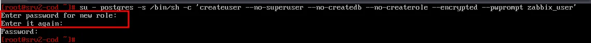

Введите пароль `P@ssw0rdZabbix` дважды.

#### Шаг 1.3: Создание базы данных

```bash
su - postgres -s /bin/sh -c 'createdb -O zabbix_user zabbix'
```

#### Шаг 1.4: Перезапуск PostgreSQL

```bash
systemctl restart postgresql
```

#### Шаг 1.5: Импорт схемы базы данных

```bash
su - postgres -s /bin/sh -c 'psql -U zabbix_user -f /usr/share/doc/zabbix-common-database-pgsql-*/schema.sql zabbix'
```

```bash
su - postgres -s /bin/sh -c 'psql -U zabbix_user -f /usr/share/doc/zabbix-common-database-pgsql-*/images.sql zabbix'
```

```bash
su - postgres -s /bin/sh -c 'psql -U zabbix_user -f /usr/share/doc/zabbix-common-database-pgsql-*/data.sql zabbix'
```

---

## Часть 2: Настройка Zabbix-сервера и веб-интерфейса (srv1-cod)

### srv1-cod (alt-server)

#### Шаг 2.1: Установка Apache2

```bash
apt-get install -y apache2 apache2-mod_{php8.2,ssl}
systemctl enable --now httpd2
```

#### Шаг 2.2: Установка PHP и модулей

```bash
apt-get install -y php8.2 php8.2-{mbstring,sockets,gd,xmlreader,pgsql,ldap,openssl}
```

#### Шаг 2.3: Настройка PHP

Отредактируйте файл `/etc/php/8.2/apache2-mod_php/php.ini`:

```bash
nano /etc/php/8.2/apache2-mod_php/php.ini
```

Измените следующие параметры:

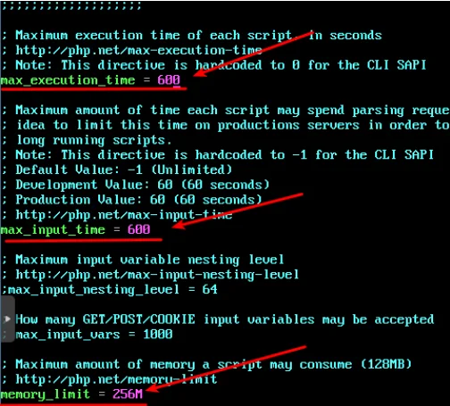

```ini
max_execution_time = 600
max_input_time = 600
memory_limit = 256M
```

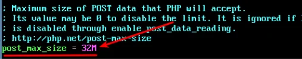

```ini
post_max_size = 32M
```

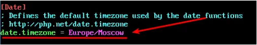

```ini
date.timezone = Europe/Moscow
```

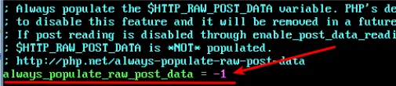

```ini
always_populate_raw_post_data = -1
```

#### Шаг 2.4: Перезапуск Apache

```bash
systemctl restart httpd2
```

#### Шаг 2.5: Установка Zabbix-сервера

```bash
apt-get install -y zabbix-server-pgsql
```

#### Шаг 2.6: Настройка Zabbix-сервера

Отредактируйте файл `/etc/zabbix/zabbix_server.conf`:

```bash
nano /etc/zabbix/zabbix_server.conf
```

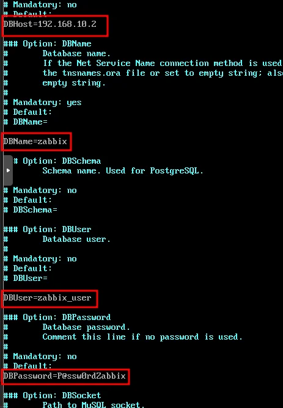

Добавьте/измените параметры:

```ini
DBHost=192.168.10.2
DBName=zabbix
DBUser=zabbix_user
DBPassword=P@ssw0rdZabbix
```

#### Шаг 2.7: Запуск Zabbix-сервера

```bash
systemctl enable --now zabbix_pgsql
```

#### Шаг 2.8: Установка веб-интерфейса

```bash
apt-get install zabbix-phpfrontend-{apache2,php8.2} -y
```

#### Шаг 2.9: Создание VirtualHost

Создайте файл `/etc/httpd2/conf/sites-available/zabbix.conf`:

```bash
nano /etc/httpd2/conf/sites-available/zabbix.conf
```

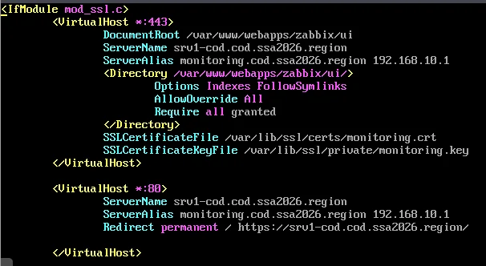

```apache
<IfModule mod_ssl.c>
    <VirtualHost *:443>
        DocumentRoot /var/www/webapps/zabbix/ui
        ServerName srv1-cod.cod.ssa2026.region
        ServerAlias monitoring.cod.ssa2026.region 192.168.10.1
        <Directory /var/www/webapps/zabbix/ui/>
            Options Indexes FollowSymlinks
            AllowOverride All
            Require all granted
        </Directory>
        SSLCertificateFile /var/lib/ssl/certs/monitoring.crt
        SSLCertificateKeyFile /var/lib/ssl/private/monitoring.key
    </VirtualHost>

    <VirtualHost *:80>
        ServerName srv1-cod.cod.ssa2026.region
        ServerAlias monitoring.cod.ssa2026.region 192.168.10.1
        Redirect permanent / https://srv1-cod.cod.ssa2026.region/
    </VirtualHost>
</IfModule>
```

#### Шаг 2.10: Копирование сертификатов

```bash
cp /var/ca/newcerts/monitoring.crt /var/lib/ssl/certs/
cp /var/ca/newcerts/monitoring.key /var/lib/ssl/private/
```

#### Шаг 2.11: Активация сайта и модулей

```bash
ln -s /etc/httpd2/conf/sites-available/zabbix.conf /etc/httpd2/conf/sites-enabled/
a2enmod ssl
a2enmod rewrite
a2enport https
```

#### Шаг 2.12: Проверка конфигурации

```bash
apachectl -t
```

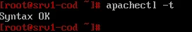

**Результат:** `Syntax OK`

#### Шаг 2.13: Назначение прав и перезапуск

```bash
chown -R apache2:apache2 /var/www/webapps/zabbix
systemctl restart httpd2
```

---

## Часть 3: Установка через веб-интерфейс (admin-cod)

### admin-cod (alt-workstation)

#### Шаг 3.1: Открытие мастера установки

Перейдите в браузере на `https://srv1-cod.cod.ssa2026.region`


Нажмите **Next step**.

#### Шаг 3.2: Проверка требований


Убедитесь, что все параметры имеют статус **OK**, и нажмите **Next step**.

#### Шаг 3.3: Настройка подключения к БД

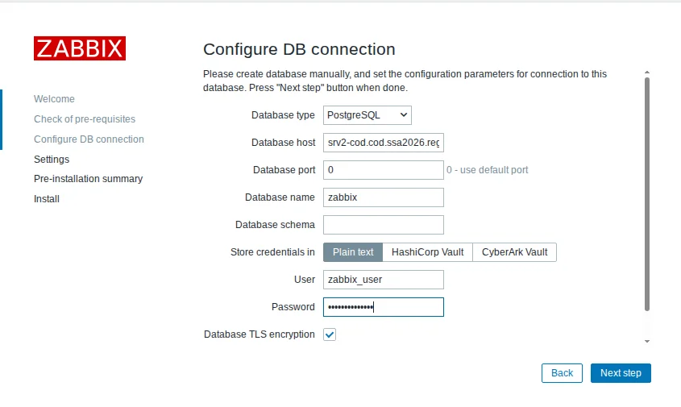

| Параметр | Значение |
| --- | --- |
| Database type | PostgreSQL |
| Database host | srv2-cod.cod.ssa2026.region |
| Database port | 0 (default) |
| Database name | zabbix |
| User | zabbix_user |
| Password | P@ssw0rdZabbix |
| Database TLS encryption | ✓ |

Нажмите **Next step**.

#### Шаг 3.4: Настройки сервера

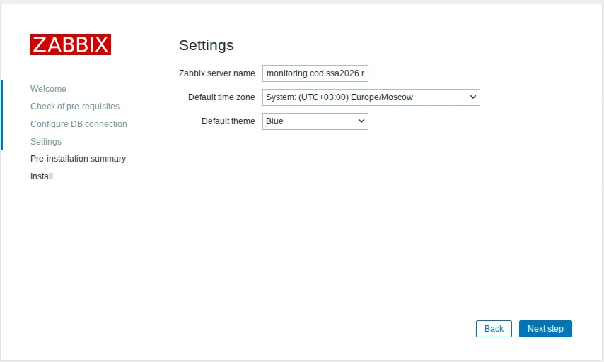

| Параметр | Значение |
| --- | --- |
| Zabbix server name | monitoring.cod.ssa2026.region |
| Default time zone | Europe/Moscow |
| Default theme | Blue |

Нажмите **Next step**.

#### Шаг 3.5: Проверка параметров

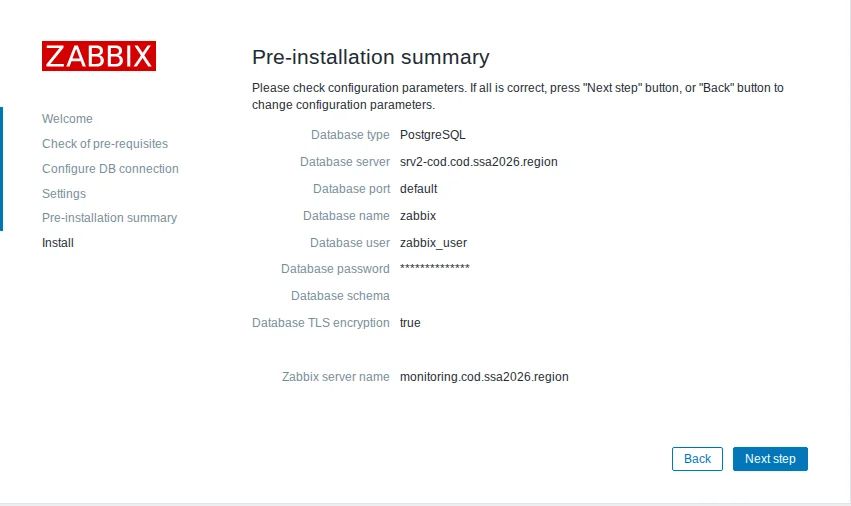

Проверьте все параметры и нажмите **Next step**.

#### Шаг 3.6: Завершение установки

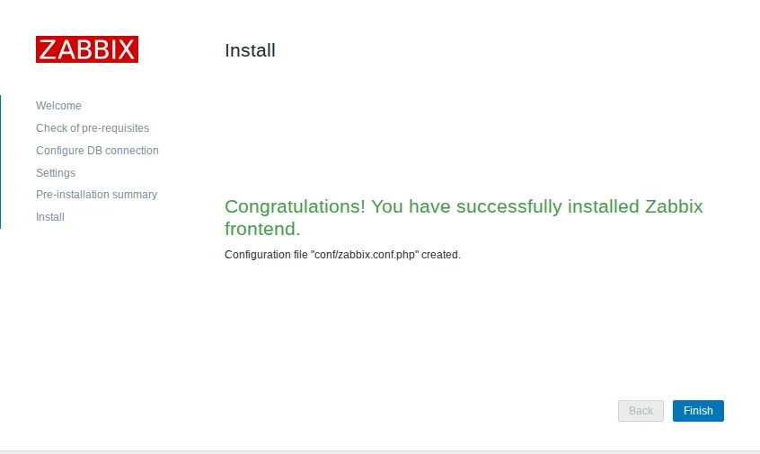

Нажмите **Finish**.

#### Шаг 3.7: Вход в систему

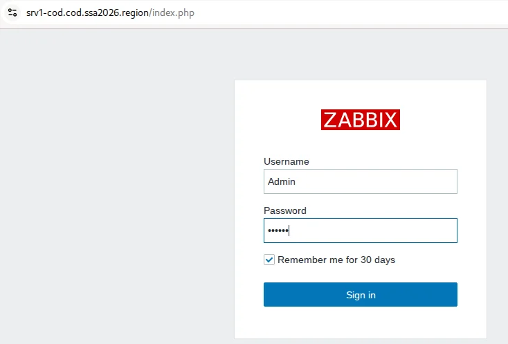

Войдите с учётными данными по умолчанию:
- **Username:** Admin
- **Password:** zabbix

#### Шаг 3.8: Главная панель

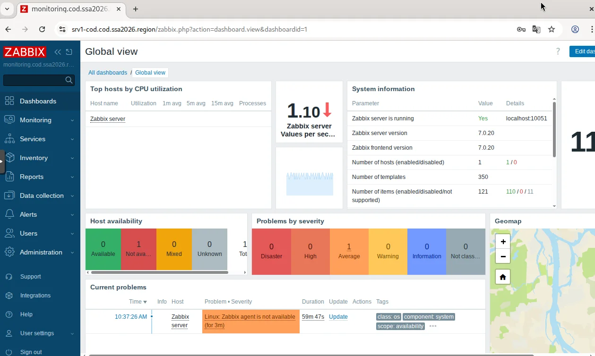

#### Шаг 3.9: Отключение проверки сложности пароля

Перейдите: **Users** → **Authentication**

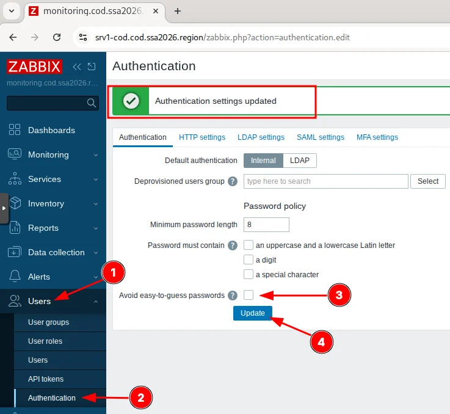

1. Перейдите в **Users** (1)
2. Выберите **Authentication** (2)
3. Снимите галочку **Avoid easy-to-guess passwords** (3)
4. Нажмите **Update** (4)

#### Шаг 3.10: Изменение пароля администратора

Перейдите: **Users** → **Users** → **Admin**

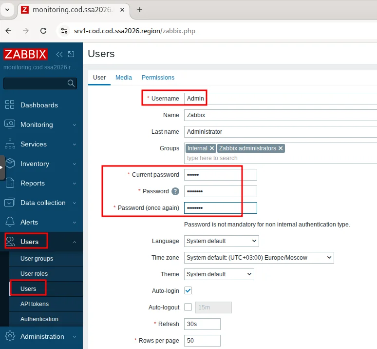

1. Current password: `zabbix`
2. Password: `P@ssw0rd`
3. Password (once again): `P@ssw0rd`
4. Нажмите **Update**

---

## Часть 4: Настройка Zabbix-агентов

### srv1-cod, srv2-cod, dc-a, sw1-cod, sw2-cod, sw1-a, sw2-a (alt-server)

#### Шаг 4.1: Установка агента

```bash
apt-get install zabbix-agent -y
```

#### Шаг 4.2: Настройка агента

Отредактируйте файл `/etc/zabbix/zabbix_agentd.conf`:

```bash
nano /etc/zabbix/zabbix_agentd.conf
```

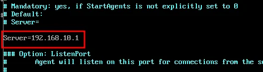

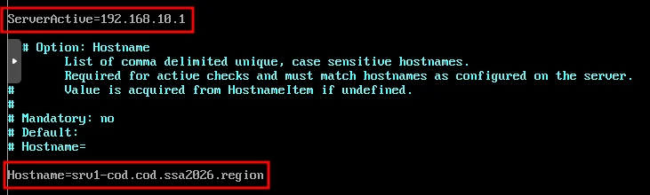

Измените параметры:

```ini
Server=192.168.10.1
ServerActive=192.168.10.1
Hostname=srv1-cod.cod.ssa2026.region
```

> ⚠️ **Важно:** В параметре `Hostname` указывайте полное доменное имя (FQDN) соответствующего хоста!

**Примеры Hostname для разных серверов:**
| Сервер | Hostname |
| --- | --- |
| srv1-cod | srv1-cod.cod.ssa2026.region |
| srv2-cod | srv2-cod.cod.ssa2026.region |
| dc-a | dc-a.office.ssa2026.region |
| sw1-cod | sw1-cod.cod.ssa2026.region |
| sw2-cod | sw2-cod.cod.ssa2026.region |
| sw1-a | sw1-a.office.ssa2026.region |
| sw2-a | sw2-a.office.ssa2026.region |

#### Шаг 4.3: Запуск агента

```bash
systemctl enable --now zabbix_agentd.service
```

---

## Часть 5: Настройка мониторинга fw-cod и маршрутизаторов

### fw-cod (Ideco NGFW)

#### Шаг 5.1: Настройка Zabbix-агента на fw-cod

Перейдите в веб-интерфейс fw-cod: `https://fw-cod.cod.ssa2026.region:8443`

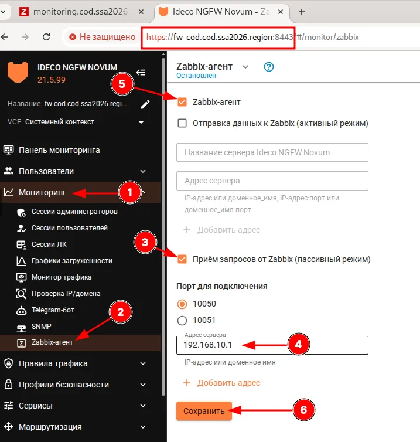

1. Перейдите в **Мониторинг** (1)
2. Выберите **Zabbix-агент** (2)
3. Включите **Zabbix-агент** (✓)
4. Включите **Приём запросов от Zabbix (пассивный режим)** (✓)
5. Укажите **Адрес сервера:** `192.168.10.1` (4)
6. Включите агент (5)
7. Нажмите **Сохранить** (6)

#### Шаг 5.2: Проверка статуса

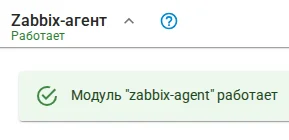

**Результат:** Модуль "zabbix-agent" работает.

### rtr-cod и rtr-a (EcoRouter)

#### Шаг 5.3: Настройка SNMP на маршрутизаторах

```
rtr-cod(config)#snmp-server enable snmp
rtr-cod(config)#snmp-server community public ro
rtr-cod(config)#write memory
Building configuration...
```

Аналогично для rtr-a:

```
rtr-a(config)#snmp-server enable snmp
rtr-a(config)#snmp-server community public ro
rtr-a(config)#write memory
```

---

## Часть 6: Регистрация хостов в Zabbix

### admin-cod (alt-workstation)

#### Шаг 6.1: Переход к списку хостов

Перейдите: **Monitoring** → **Hosts** → **Create host**

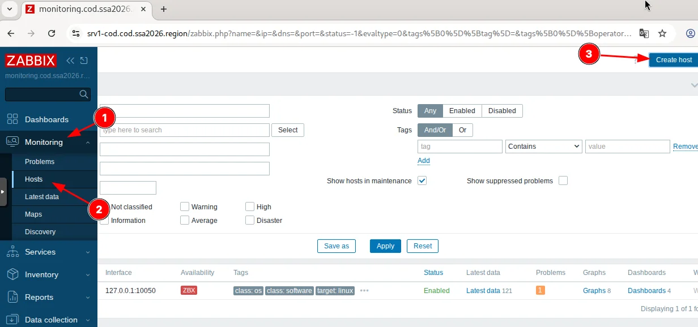

1. Перейдите в **Monitoring** (1)
2. Выберите **Hosts** (2)
3. Нажмите **Create host** (3)

#### Шаг 6.2: Заполнение формы хоста

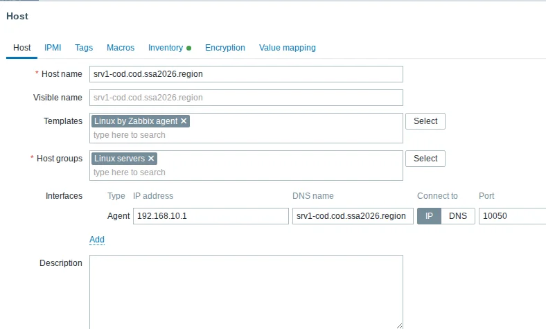

| Параметр | Значение |
| --- | --- |
| Host name | srv1-cod.cod.ssa2026.region |
| Visible name | srv1-cod.cod.ssa2026.region |
| Templates | Linux by Zabbix agent |
| Host groups | Linux servers |
| Interfaces | Agent: 192.168.10.1 / srv1-cod.cod.ssa2026.region / Port: 10050 |

Нажмите **Add** для сохранения.

#### Шаг 6.3: Добавление всех хостов

Добавьте все хосты аналогичным образом:

**Linux-серверы (Template: Linux by Zabbix agent):**
| Host name | IP Address | Port |
| --- | --- | --- |
| srv1-cod.cod.ssa2026.region | 192.168.10.1 | 10050 |
| srv2-cod.cod.ssa2026.region | 192.168.10.2 | 10050 |
| dc-a.office.ssa2026.region | 172.20.10.10 | 10050 |
| sw1-cod.cod.ssa2026.region | 192.168.30.1 | 10050 |
| sw2-cod.cod.ssa2026.region | 192.168.30.2 | 10050 |
| sw1-a.office.ssa2026.region | 172.20.30.1 | 10050 |
| sw2-a.office.ssa2026.region | 172.20.30.2 | 10050 |

**SNMP-устройства (Template: Network interfaces by SNMP):**
| Host name | IP Address | Interface | Community |
| --- | --- | --- | --- |
| rtr-cod.ssa2026.region | 172.16.1.1 | SNMP:161 | public |
| rtr-a.office.ssa2026.region | 10.10.10.2 | SNMP:161 | public |

#### Шаг 6.4: Проверка списка хостов

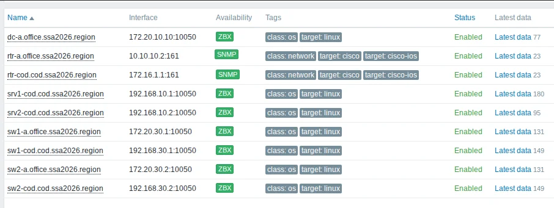

**Результат:** Все хосты отображаются со статусом **Enabled** и зелёным индикатором **ZBX** или **SNMP**.

---

## Проверка

### Проверка служб на srv1-cod

```bash
systemctl status zabbix_pgsql
systemctl status httpd2
```

### Проверка служб на srv2-cod

```bash
systemctl status postgresql
```

### Проверка агентов

```bash
systemctl status zabbix_agentd
```

### Проверка в веб-интерфейсе

1. Откройте https://monitoring.cod.ssa2026.region
2. Войдите под Admin / P@ssw0rd
3. Перейдите в **Monitoring** → **Hosts**
4. Убедитесь, что хосты имеют статус **Available** (зелёный)

---

## 📁 Конфигурационные файлы

| Хост | Файл | Назначение |
| --- | --- | --- |
| srv1-cod | `/etc/zabbix/zabbix_server.conf` | Конфигурация Zabbix-сервера |
| srv1-cod | `/etc/php/8.2/apache2-mod_php/php.ini` | Настройки PHP |
| srv1-cod | `/etc/httpd2/conf/sites-available/zabbix.conf` | VirtualHost Apache |
| Агенты | `/etc/zabbix/zabbix_agentd.conf` | Конфигурация агента |

---

## ⚠️ Частые ошибки

| Ошибка | Причина | Решение |
| --- | --- | --- |
| `Cannot connect to database` | Неверные параметры БД | Проверьте DBHost, DBUser, DBPassword |
| `PHP option ... Fail` | Не настроен php.ini | Измените параметры в php.ini |
| `Zabbix server is not running` | Служба не запущена | `systemctl start zabbix_pgsql` |
| `Cannot connect to agent` | Агент не запущен/firewall | Проверьте агента и порт 10050 |
| `SSL certificate error` | Нет сертификата | Скопируйте сертификаты из /var/ca |

---

## 🔧 Полезные команды

```bash
# Проверка статуса Zabbix-сервера
systemctl status zabbix_pgsql

# Логи Zabbix-сервера
tail -f /var/log/zabbix/zabbix_server.log

# Логи агента
tail -f /var/log/zabbix/zabbix_agentd.log

# Проверка подключения агента
zabbix_get -s 127.0.0.1 -k agent.ping
```

---

[← Назад к оглавлению](../README.md)
