# Модуль 23. Настройка IP-телефонии (FreePBX)

[← Назад к оглавлению](../README.md)

---

## 📋 Содержание

* [Описание](#описание)
* [Часть 1: Установка SangomaOS/FreePBX](#часть-1-установка-sangomaosfreepbx)
* [Часть 2: Настройка сети](#часть-2-настройка-сети)
* [Часть 3: Первоначальная настройка FreePBX](#часть-3-первоначальная-настройка-freepbx)
* [Часть 4: Создание внутренних номеров](#часть-4-создание-внутренних-номеров)
* [Часть 5: Настройка SIP-клиентов](#часть-5-настройка-sip-клиентов)
* [Часть 6: Тестирование звонков](#часть-6-тестирование-звонков)
* [Проверка](#проверка)

---

## Описание

В данном модуле разворачивается IP-АТС на базе FreePBX 16 (SangomaOS 7.8) для организации внутренней IP-телефонии между офисами COD и A.

**Параметры сервера:**
| Параметр | Значение |
| --- | --- |
| Сервер | sip-cod |
| ОС | SangomaOS 7.8 (SNG7-PBX16) |
| Версия FreePBX | 16 |
| Версия Asterisk | 18 |
| IP-адрес | 192.168.50.50 |
| Маска | 255.255.255.0 |
| Шлюз | 192.168.50.254 |
| DNS | 192.168.10.1 |
| SIP порт | 5060 (UDP) |
| VLAN | 500 (VOIP) |

**Учётные данные:**
| Параметр | Значение |
| --- | --- |
| root пароль | P@ssw0rd |
| Админ FreePBX | admin |
| Пароль админа | P@ssw0rd |

**Внутренние номера и соответствие клиентам:**
| Номер | Клиент | Офис | IP-адрес клиента | VLAN |
| --- | --- | --- | --- | --- |
| 1001 | admin-cod | COD | 192.168.30.30 | 300 (MGMT-COD) |
| 1002 | cli-cod | COD | 192.168.40.10 | 400 (CLI) |
| 2001 | cli1-a | OFFICE-A | 192.168.20.10 | 200 (CLI) |
| 2002 | cli2-a | OFFICE-A | 192.168.20.20 | 200 (CLI) |

---

## Часть 1: Установка SangomaOS/FreePBX

### sip-cod (SNG7-PBX16)

#### Шаг 1.1: Выбор типа установки

При загрузке с ISO-образа SangomaOS появится меню выбора версии установки:

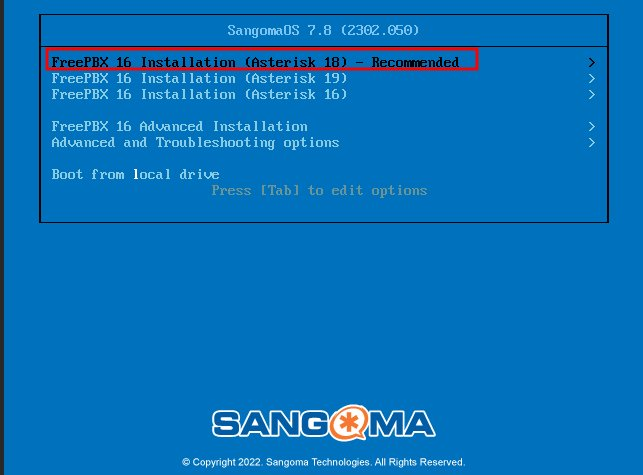

Выберите **FreePBX 16 Installation (Asterisk 18) - Recommended** (рекомендуемая версия).

> **💡 Примечание:** 
> - **Asterisk 18** - это LTS (Long Term Support) версия с долгосрочной поддержкой
> - **Asterisk 19** - более новая версия, но без расширенной поддержки
> - Для конкурса рекомендуется **Asterisk 18**

#### Шаг 1.2: Выбор режима установки

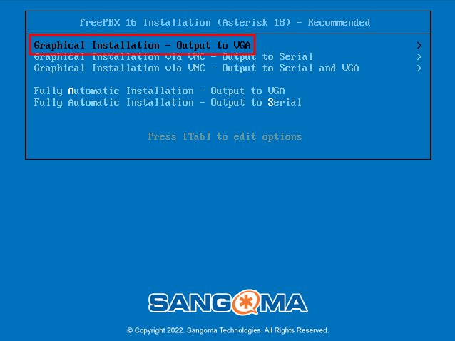

Выберите **Graphical Installation - Output to VGA** для установки с графическим интерфейсом.

Доступные варианты:
- **Graphical Installation - Output to VGA** ✅ (рекомендуется)
- **Graphical Installation via VNC - Output to Serial** (для удалённой установки)
- **Fully Automatic Installation** (автоматическая установка без настроек)

#### Шаг 1.3: Выбор типа установки

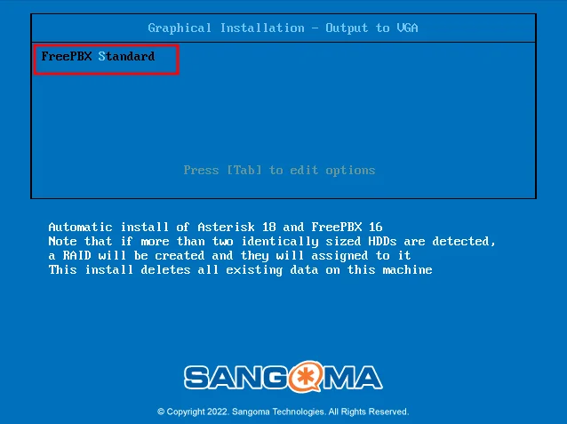

Выберите **FreePBX Standard**.

Это установит:
- Asterisk 18
- FreePBX 16
- Базовые модули
- MariaDB (MySQL)
- Apache веб-сервер

> **⚠️ Внимание:** Установщик предупреждает:
> - Если обнаружено более 2 идентичных HDD, будет создан RAID
> - Установка удалит все существующие данные на диске

#### Шаг 1.4: Настройка пароля root

Во время установки пакетов появится экран настройки:

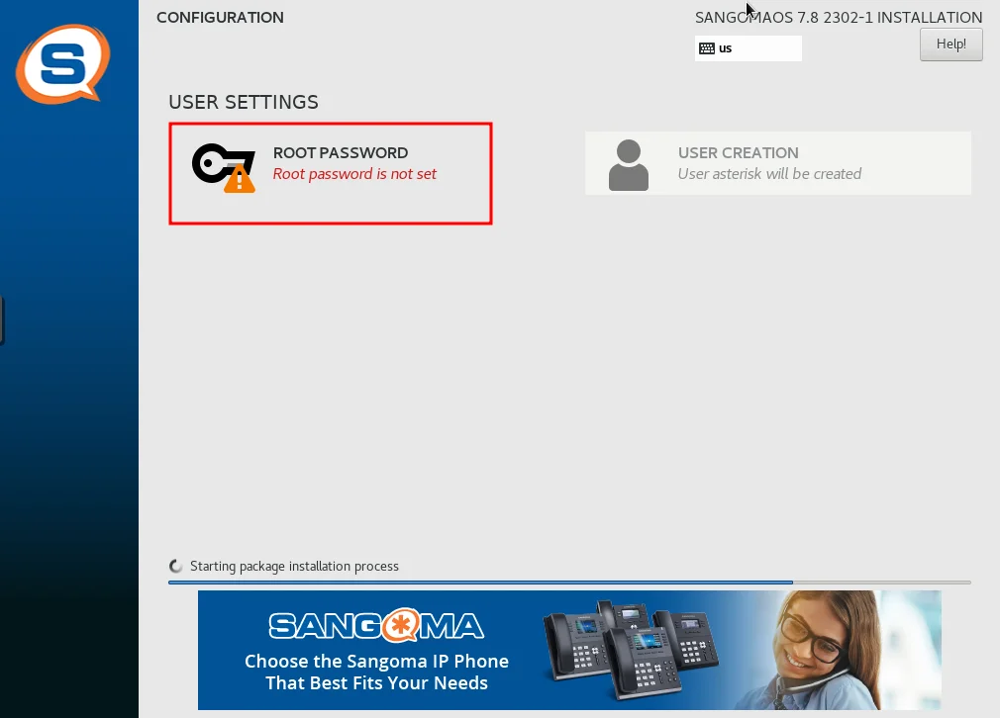

Нажмите на **ROOT PASSWORD** (отмечен красным предупреждением "Root password is not set").

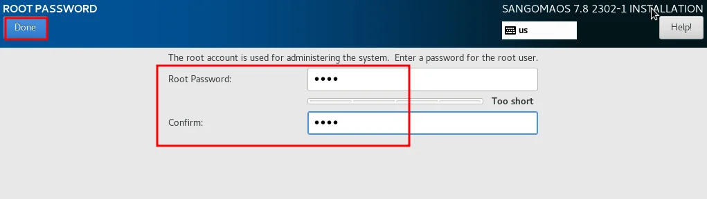

Введите пароль root:
- **Root Password:** `P@ssw0rd`
- **Confirm:** `P@ssw0rd`

Если пароль слишком простой, появится предупреждение **"Too short"**, но вы можете продолжить, нажав **Done** дважды.

> **💡 Совет:** В производственной среде используйте надёжный пароль!

Дождитесь завершения установки пакетов. Процесс отображается в статусе **"Starting package installation process"**.

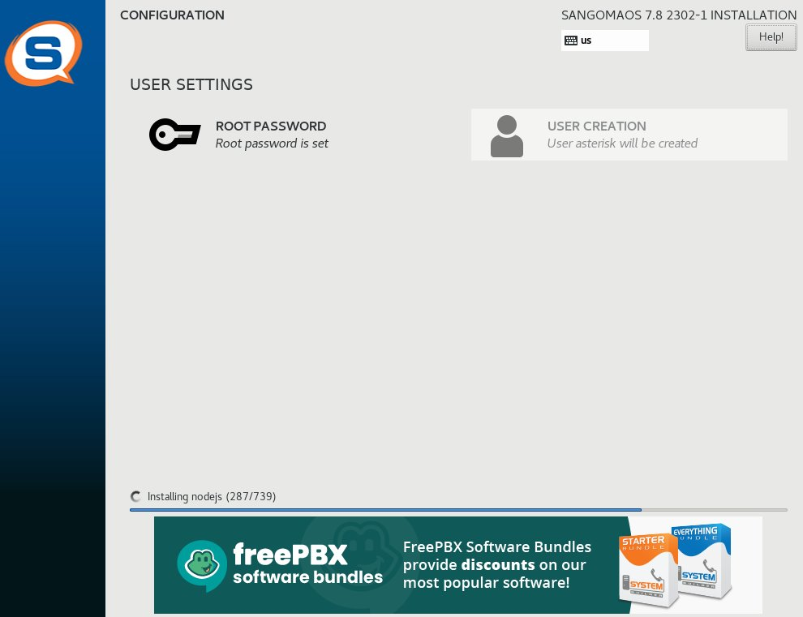

Когда установка завершится, появится статус:
- **ROOT PASSWORD**: Root password is set ✅
- **USER CREATION**: User asterisk will be created

Внизу экрана появится сообщение **"Installing nodejs (287/739)"** - это нормальный процесс установки зависимостей.

#### Шаг 1.5: Завершение установки

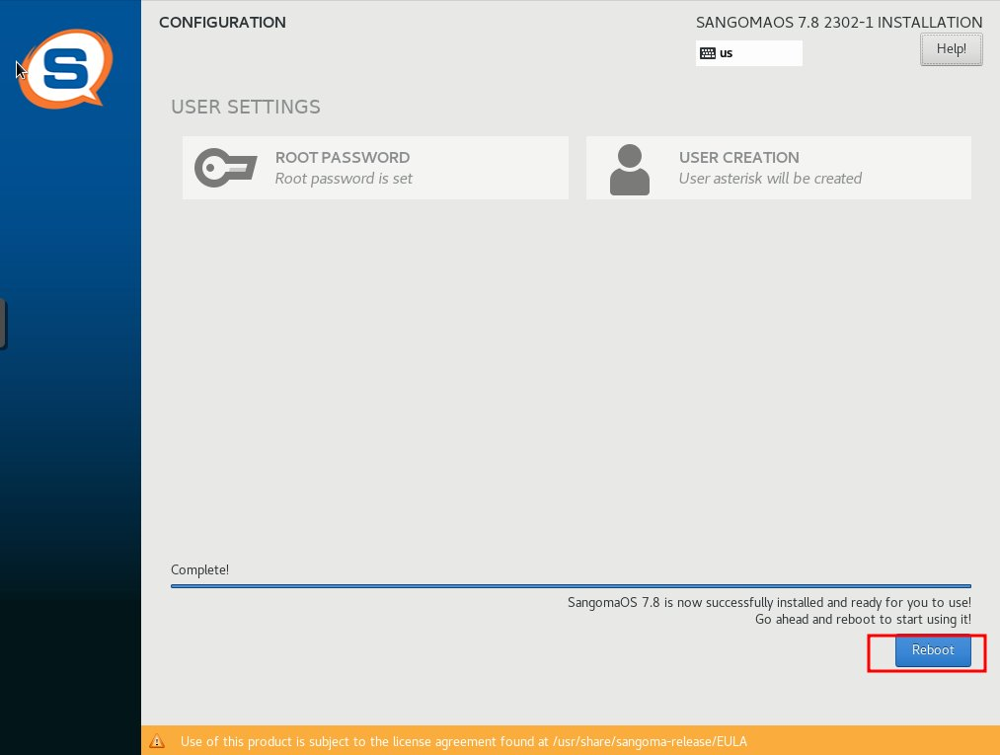

После завершения всех этапов установки появится сообщение:
- **"Complete!"**
- **"SangomaOS 7.8 is now successfully installed and ready for you to use!"**
- **"Go ahead and reboot to start using it!"**

Нажмите кнопку **Reboot** для перезагрузки системы.

> **⚠️ Важно:** После нажатия Reboot извлеките установочный ISO-образ из виртуального привода, чтобы система загрузилась с жёсткого диска.

---

## Часть 2: Настройка сети

### sip-cod (SNG7-PBX16)

#### Шаг 2.1: Вход в систему

После перезагрузки войдите в систему:
- **Login:** `root`
- **Password:** `P@ssw0rd`

#### Шаг 2.2: Настройка сетевого интерфейса

Отредактируйте файл `/etc/sysconfig/network-scripts/ifcfg-eth0`:

```bash
nano /etc/sysconfig/network-scripts/ifcfg-eth0
```

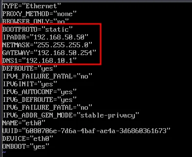

Настройте следующие параметры:

```ini
TYPE="Ethernet"
PROXY_METHOD="none"
BROWSER_ONLY="no"
BOOTPROTO="static"
IPADDR="192.168.50.50"
NETMASK="255.255.255.0"
GATEWAY="192.168.50.254"
DNS1="192.168.10.1"
DEFROUTE="yes"
IPV4_FAILURE_FATAL="no"
IPV6INIT="yes"
IPV6_AUTOCONF="yes"
IPV6_DEFROUTE="yes"
IPV6_FAILURE_FATAL="no"
IPV6_ADDR_GEN_MODE="stable-privacy"
NAME="eth0"
DEVICE="eth0"
ONBOOT="yes"
```

**Ключевые параметры:**
- `BOOTPROTO="static"` - статический IP
- `IPADDR="192.168.50.50"` - IP-адрес сервера
- `NETMASK="255.255.255.0"` - маска подсети (/24)
- `GATEWAY="192.168.50.254"` - шлюз (fw-cod)
- `DNS1="192.168.10.1"` - DNS сервер
- `ONBOOT="yes"` - автозапуск интерфейса при загрузке

Сохраните файл: `Ctrl+O`, `Enter`, `Ctrl+X`.

#### Шаг 2.3: Перезагрузка

```bash
reboot
```

#### Шаг 2.4: Проверка сети

После загрузки войдите снова и проверьте конфигурацию:

```bash
ip -c -br -4 a
ip -c r
cat /etc/resolv.conf
```

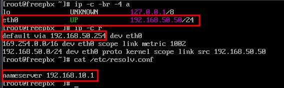

**Ожидаемый результат:**
```
eth0             UP             192.168.50.50/24
```

```
default via 192.168.50.254 dev eth0
192.168.50.0/24 dev eth0 proto kernel scope link src 192.168.50.50
```

```
nameserver 192.168.10.1
```

**Проверка связности:**
```bash
ping -c 3 192.168.50.254  # Проверка шлюза
ping -c 3 192.168.10.1    # Проверка DNS
ping -c 3 8.8.8.8         # Проверка интернета
```

---

## Часть 3: Первоначальная настройка FreePBX

### admin-cod (alt-workstation)

#### Шаг 3.1: Открытие веб-интерфейса

Откройте в браузере `http://192.168.50.50`

> **⚠️ Важно:** Если страница не загружается, проверьте:
> - Доступность сервера: `ping 192.168.50.50` с admin-cod
> - Правила firewall на fw-cod для порта 80/TCP из VLAN 300 в VLAN 500
> - Статус Apache: на sip-cod выполните `systemctl status httpd`

#### Шаг 3.2: Создание учётной записи администратора

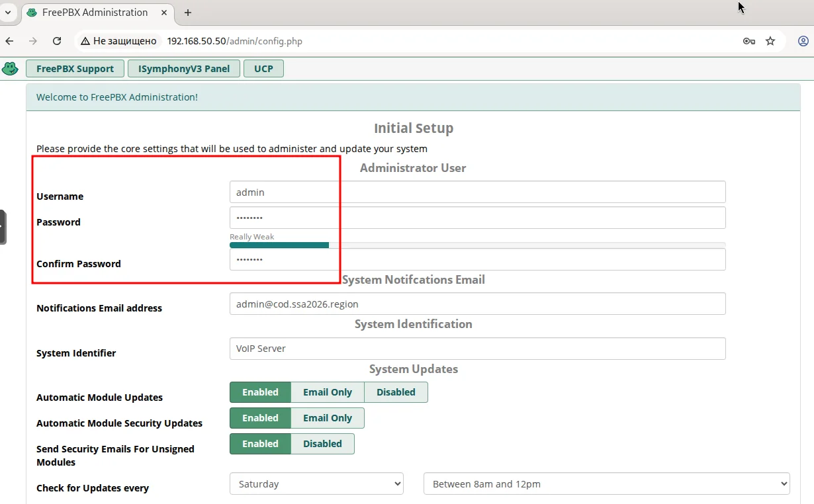

На странице **Initial Setup** заполните форму в разделе **Administrator User**:

| Параметр | Значение | Описание |
| --- | --- | --- |
| **Username** | `admin` | Логин администратора |
| **Password** | `P@ssw0rd` | Пароль администратора |
| **Confirm Password** | `P@ssw0rd` | Подтверждение пароля |

Индикатор силы пароля покажет **"Really Weak"** - это нормально для тестовой среды.

В разделе **System Notifications Email**:
| Параметр | Значение |
| --- | --- |
| **Notifications Email address** | `admin@cod.ssa2026.region` |

В разделе **System Identification**:
| Параметр | Значение |
| --- | --- |
| **System Identifier** | `VoIP Server` |

В разделе **System Updates** оставьте настройки по умолчанию:
- Automatic Module Updates: **Enabled**
- Automatic Module Security Updates: **Enabled**
- Send Security Emails For Unsigned Modules: **Enabled**
- Check for Updates every: **Saturday**
- Between 8am and 12pm

Прокрутите вниз и нажмите **Submit** (внизу страницы).

#### Шаг 3.3: Выбор панели администрирования

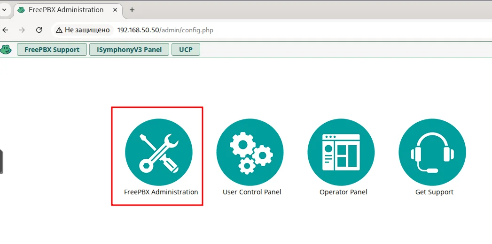

После первоначальной настройки появится выбор панелей:

- **FreePBX Administration** 🔧 ← выберите эту
- **User Control Panel** ⚙️
- **Operator Panel** 📋
- **Get Support** 🎧

Нажмите на **FreePBX Administration** для входа в административную панель.

#### Шаг 3.4: Вход в систему

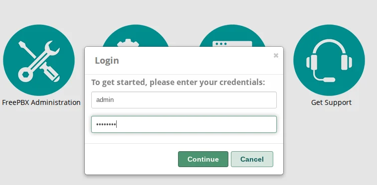

Появится диалоговое окно **Login**:
- **Username:** `admin`
- **Password:** `••••••••` (введите `P@ssw0rd`)

Нажмите **Continue**.

#### Шаг 3.5: Отключение файрвола

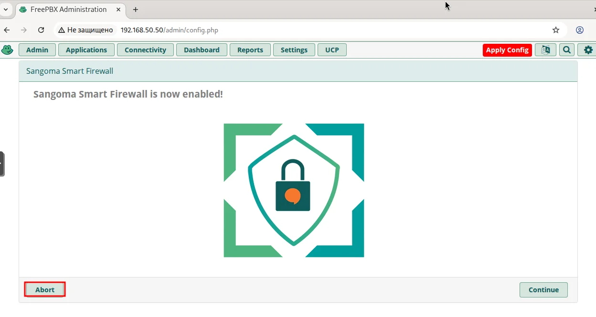

При первом входе появится окно **Sangoma Smart Firewall**:
- Заголовок: **"Sangoma Smart Firewall is now enabled!"**
- Предлагается включить встроенный фаервол

Нажмите **Abort** для отключения встроенного firewall.

> **💡 Примечание:** Мы отключаем встроенный firewall FreePBX, так как защита сети обеспечивается на уровне fw-cod (Ideco NGFW). Включение двух firewall может привести к конфликтам правил.

После нажатия **Abort** вы попадёте на главную панель FreePBX.

---

## Часть 4: Создание внутренних номеров

### admin-cod (alt-workstation)

#### Шаг 4.1: Настройка SIP Channel Driver (CHAN_SIP)

По умолчанию FreePBX 16 использует **PJSIP**. Для совместимости с большинством SIP-клиентов переключимся на **CHAN_SIP**.

**Шаг 4.1.1:** Перейдите в **Settings** → **Advanced Settings**

**Шаг 4.1.2:** Найдите параметр **SIP Channel Driver**

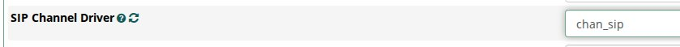

Выберите **chan_sip** в выпадающем списке.

Нажмите **Submit** внизу страницы.

#### Шаг 4.2: Настройка SIP Bind Port

**Шаг 4.2.1:** Перейдите в **Settings** → **Asterisk SIP Settings**

**Шаг 4.2.2:** Найдите параметр **Bind Port**


Измените порт с **5160** на **5060** (стандартный SIP порт).

Нажмите **Submit** внизу страницы.

#### Шаг 4.3: Применение конфигурации

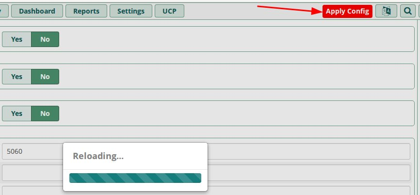

В правом верхнем углу появится красная кнопка **Apply Config** со стрелкой.

Нажмите на неё для применения изменений.

В появившемся диалоге будет несколько пунктов с кнопками **Yes/No**. Нажмите **Yes** на всех пунктах.

Появится индикатор **"Reloading..."** с прогресс-баром.

После применения конфигурации **перезагрузите sip-cod**:

```bash
reboot
```

> **💡 Примечание:** Перезагрузка гарантирует, что все настройки применены корректно и Asterisk работает с новой конфигурацией CHAN_SIP на порту 5060.

#### Шаг 4.4: Переход к внутренним номерам

После перезагрузки и повторного входа в веб-интерфейс перейдите:

**Applications** → **Extensions**

#### Шаг 4.5: Добавление нового номера

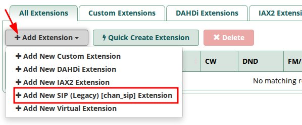

Нажмите **+ Add Extension** (выпадающее меню) и выберите:

**+ Add New SIP (Legacy) [chan_sip] Extension**

> **⚠️ Важно:** Выбирайте именно **SIP (Legacy) [chan_sip]**, а не PJSIP!

#### Шаг 4.6: Заполнение формы для номера 1001

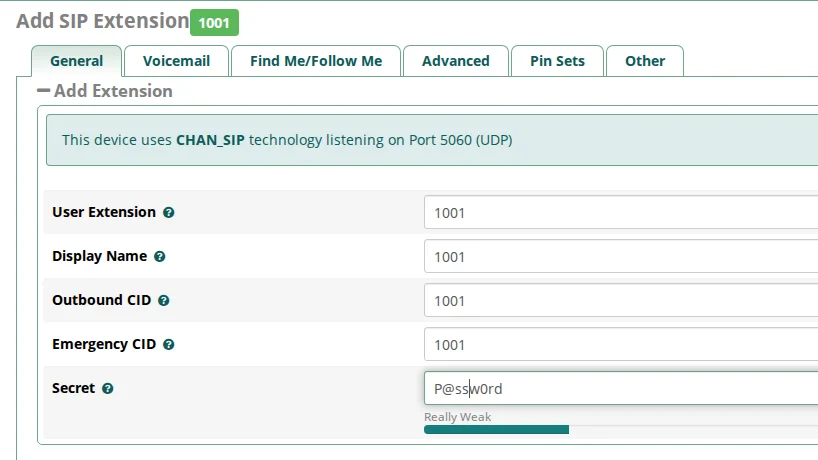

На вкладке **General** заполните форму:

**Раздел ▬ Add Extension:**

В синей информационной полосе указано:
- **"This device uses CHAN_SIP technology listening on Port 5060 (UDP)"**

| Параметр | Значение | Описание |
| --- | --- | --- |
| **User Extension** | `1001` | Внутренний номер |
| **Display Name** | `1001` | Отображаемое имя |
| **Outbound CID** | `1001` | Caller ID для исходящих |
| **Emergency CID** | `1001` | Caller ID для экстренных |
| **Secret** | `P@ssw0rd` | Пароль для SIP-аутентификации |

Индикатор силы пароля покажет **"Really Weak"** - это приемлемо для учебной среды.

Прокрутите вниз и нажмите **Submit**.

#### Шаг 4.7: Проверка создания

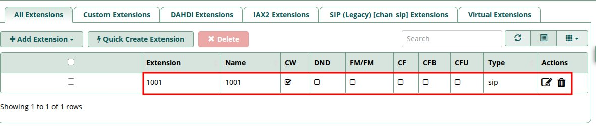

После нажатия **Submit** вы вернётесь к списку Extensions. В таблице должен появиться созданный номер:

| Extension | Name | CW | DND | FM/FM | CF | CFB | CFU | Type | Actions |
| --- | --- | --- | --- | --- | --- | --- | --- | --- | --- |
| **1001** | 1001 | ☑ | ☐ | ☐ | ☐ | ☐ | ☐ | sip | ✏️ 🗑️ |

Внизу будет надпись: **"Showing 1 to 1 of 1 rows"**

#### Шаг 4.8: Создание всех номеров

Аналогично создайте все необходимые номера, повторяя шаги 4.5-4.7 для каждого:

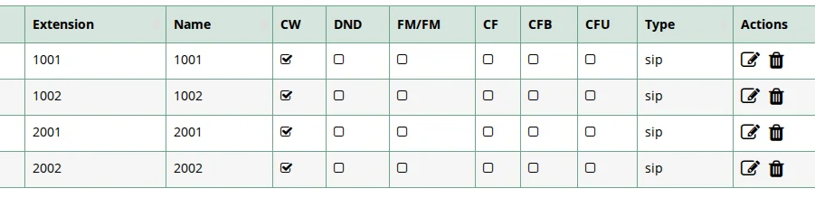

**Полный список внутренних номеров:**

| Extension | Name | Secret | Назначение | IP клиента | Офис |
| --- | --- | --- | --- | --- | --- |
| **1001** | 1001 | P@ssw0rd | Администратор COD | 192.168.30.30 | COD |
| **1002** | 1002 | P@ssw0rd | Клиент COD | 192.168.40.10 | COD |
| **2001** | 2001 | P@ssw0rd | Клиент 1 OFFICE-A | 192.168.20.10 | OFFICE-A |
| **2002** | 2002 | P@ssw0rd | Клиент 2 OFFICE-A | 192.168.20.20 | OFFICE-A |

В таблице Extensions должны отображаться все 4 номера:
- 1001, 1002, 2001, 2002
- Все с типом **sip**
- Все с включённым **Call Waiting** (CW) ☑

> **⚠️ Важно:** Для каждого номера параметры одинаковые:
> - User Extension = номер (1001, 1002, 2001, 2002)
> - Display Name = номер
> - Outbound CID = номер
> - Emergency CID = номер
> - Secret = P@ssw0rd

#### Шаг 4.9: Финальное применение конфигурации

После создания всех 4 номеров нажмите **Apply Config** в правом верхнем углу и подтвердите все изменения.

Затем перезагрузите sip-cod:

```bash
reboot
```

---

## Часть 5: Настройка SIP-клиентов

### admin-cod, cli-cod, cli1-a, cli2-a (alt-workstation)

> **📌 Выполните следующие шаги на каждом из 4 клиентских компьютеров**

#### Шаг 5.1: Установка софтфона

Откройте **Центр приложений** (Applications) и найдите приложение для VoIP-звонков.

Рекомендуемые варианты:
- **Вызовы** (GNOME Calls) - простой и встроенный
- **Linphone** - более продвинутый SIP-клиент
- **Ekiga** - старый, но надёжный
- **Zoiper** - коммерческий, но с бесплатной версией

Установите приложение **Вызовы** (GNOME Calls).

#### Шаг 5.2: Запуск приложения

Запустите приложение **Вызовы** из меню приложений.

#### Шаг 5.3: Настройка учётной записи VoIP

Откройте настройки приложения и перейдите в раздел **Учётные записи VoIP** или **VoIP Accounts**.

#### Шаг 5.4: Добавление SIP-аккаунта

Нажмите **Добавить новую учетную запись** или **Add Account**.

**Форма настройки SIP-аккаунта (пример для admin-cod):**

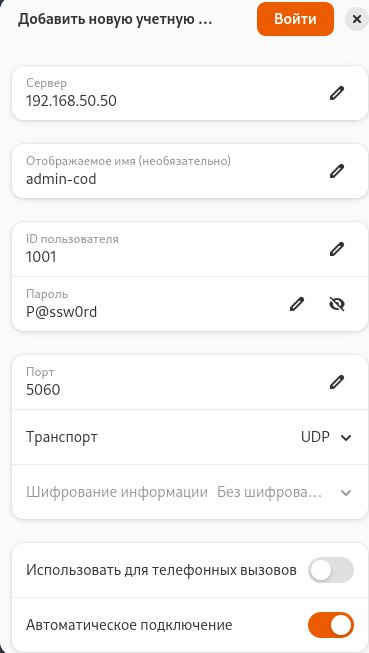

Заполните параметры подключения:

| Параметр | Значение | Описание |
| --- | --- | --- |
| **Сервер** | `192.168.50.50` | IP-адрес sip-cod |
| **Отображаемое имя (необязательно)** | `admin-cod` | Ваше отображаемое имя |
| **ID пользователя** | `1001` | Внутренний номер (зависит от клиента) |
| **Пароль** | `P@ssw0rd` | Пароль из Extension |
| **Порт** | `5060` | Стандартный SIP порт |
| **Транспорт** | `UDP` | Протокол транспорта |

Убедитесь, что:
- Переключатель **Использовать для телефонных вызовов** включён
- Переключатель **Автоматическое подключение** включён (оранжевый)

**Соответствие номеров клиентам:**
| Клиент | ID пользователя | Отображаемое имя | IP-адрес |
| --- | --- | --- | --- |
| admin-cod | 1001 | admin-cod | 192.168.30.30 |
| cli-cod | 1002 | cli-cod | 192.168.40.10 |
| cli1-a | 2001 | cli1-a | 192.168.20.10 |
| cli2-a | 2002 | cli2-a | 192.168.20.20 |

Нажмите **Добавить** или **Сохранить**.

#### Шаг 5.5: Проверка регистрации

После настройки в интерфейсе софтфона должен появиться статус регистрации:

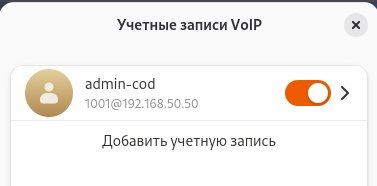

В разделе **Учётные записи VoIP** должна отображаться учётная запись:
- **Имя:** `admin-cod`
- **Номер:** `1001@192.168.50.50`
- **Переключатель:** включён (оранжевый)

Индикация успешной регистрации:
- ✅ Зелёная отметка или включённый переключатель
- ✅ Отображение номера: `1001@192.168.50.50`
- ✅ Статус **Online** / **Онлайн** / **Зарегистрирован**

> **⚠️ Устранение неполадок при регистрации:**
> 
> Если регистрация не проходит:
> 1. Проверьте связность: `ping 192.168.50.50` с клиента
> 2. Проверьте, что порт 5060/UDP открыт на fw-cod из соответствующего VLAN в VLAN 500
> 3. На sip-cod проверьте регистрацию: `asterisk -rx "sip show peers"`
> 4. Проверьте логи: `tail -f /var/log/asterisk/full` на sip-cod
> 5. Убедитесь, что ID пользователя и пароль совпадают с настройками Extension

---

## Часть 6: Тестирование звонков

### Сценарий 1: Звонок внутри офиса COD (1001 → 1002)

#### Шаг 6.1: Инициация звонка

На **admin-cod** (номер 1001) откройте софтфон и наберите номер **1002**.

#### Шаг 6.2: Входящий звонок

На **cli-cod** (номер 1002) появится входящий вызов:


Информация на экране:
- Номер звонящего: `sip:1001@192.168.50.50:5060`
- Статус: "Вызов..." или "Входящий вызов"
- Индикатор незашифрованного соединения: 🔓 "Этот вызов не зашифрован"

Нажмите кнопку **принять вызов** (зелёная трубка 📞).

#### Шаг 6.3: Активный разговор

После принятия вызова на обоих клиентах отобразится активный канал связи:

**На стороне 1002 (cli-cod):**

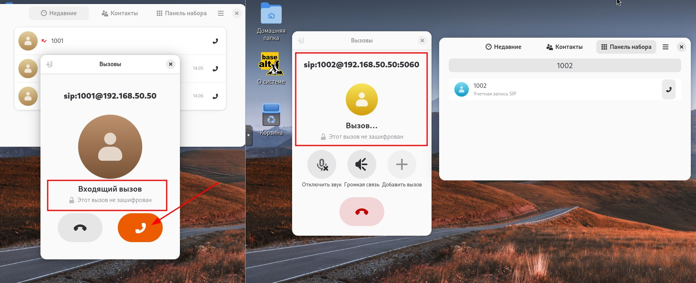

**На стороне 1001 (admin-cod) и 1002 (cli-cod):**

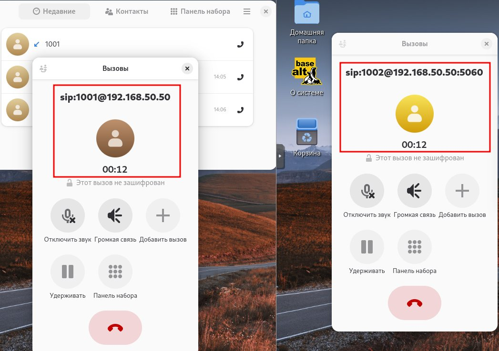


Отображается:
- **Таймер звонка** (например, "00:12" - 12 секунд разговора)
- **Номер собеседника** (`sip:1001@192.168.50.50`)
- **Статус "Этот вызов не зашифрован"** 🔓
- **Кнопки управления:**
  - 🔇 Отключить звук микрофона
  - 🔊 Громкая связь
  - ➕ Добавить вызов
  - ⏸️ Удерживать
  - 🔢 Панель набора
  - ❌ Завершить вызов (красная кнопка)

**Проверка:**
- ✅ Обе стороны слышат друг друга
- ✅ Таймер звонка работает
- ✅ Нет эха или задержек
- ✅ Качество звука хорошее

### Сценарий 2: Звонок между офисами (1001 → 2001)

#### Шаг 6.4: Междугородний звонок

На **admin-cod** (1001) наберите номер **2001** для звонка в OFFICE-A.

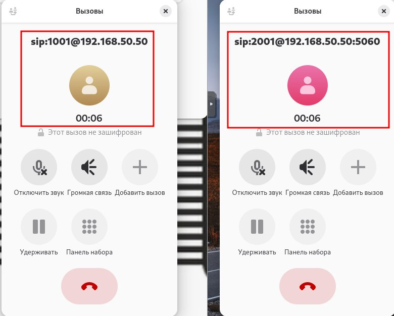

На **cli1-a** (2001) примите входящий вызов.

#### Шаг 6.5: Активный междугородний разговор


**Проверка:**
- ✅ Звонок проходит через GRE туннель между офисами
- ✅ Качество связи стабильное
- ✅ Задержка минимальная (< 100ms)
- ✅ Нет разрывов соединения

> **💡 Диагностика качества:**
> На sip-cod выполните:
> ```bash
> asterisk -rx "core show channels verbose"
> asterisk -rx "rtp show stats"
> ```

### Сценарий 3: Альтернативные направления звонков

#### Звонок 1001 → 2002


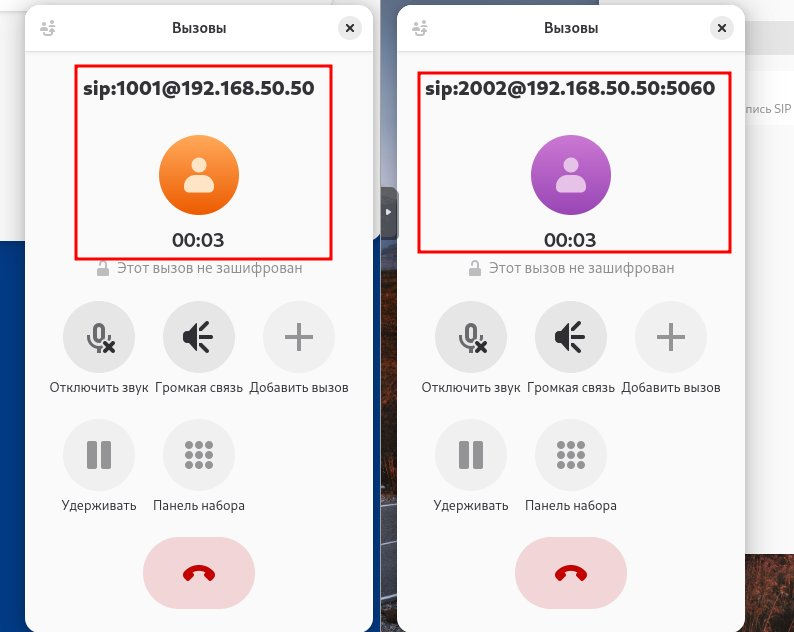

**Тестируемое направление:**
- admin-cod (1001) → cli2-a (2002)
- Офис COD → Офис OFFICE-A
- VLAN 300 → туннель GRE → VLAN 200

### Сценарий 4: История звонков

После завершения тестовых звонков проверьте историю вызовов:

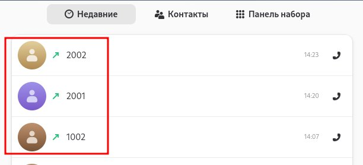

В списке **Недавние** должны отображаться:
- **2002** - последний звонок (время 14:23)
- **2001** - предыдущий звонок (время 14:20)
- **1002** - первый тестовый звонок (время 14:07)
- Иконки телефона 📞 для быстрого перезвона

**Проверка журнала:**
- ✅ Все вызовы зарегистрированы
- ✅ Отображается время каждого звонка
- ✅ Видны номера абонентов
- ✅ Возможность быстрого перезвона по клику

---

## Проверка

### 1. Проверка регистрации на sip-cod

```bash
asterisk -rx "sip show peers"
```

**Ожидаемый результат:**
```
Name/username    Host              Dyn  Forcerport  Comedia  ACL  Port   Status      
1001/1001        192.168.30.30     D    Auto (No)   No       A    5060   OK (8 ms)
1002/1002        192.168.40.10     D    Auto (No)   No       A    5060   OK (12 ms)
2001/2001        192.168.20.10     D    Auto (No)   No       A    5060   OK (15 ms)
2002/2002        192.168.20.20     D    Auto (No)   No       A    5060   OK (18 ms)
4 sip peers [Monitored: 4 online, 0 offline Unmonitored: 0 online, 0 offline]
```

**Расшифровка:**
- **Dyn (D)** - динамическая регистрация
- **Status OK** - пир зарегистрирован
- **XX ms** - задержка до клиента (ping time)

### 2. Проверка активных каналов

```bash
asterisk -rx "core show channels"
```

**Во время звонка ожидается:**
```
Channel              Location             State   Application(Data)
SIP/1001-00000001    2001@from-internal:1 Up      Dial(SIP/2001,tr)
SIP/2001-00000002    (None)               Up      AppDial((Outgoing Line))
2 active channels
1 active call
```

### 3. Тестовая матрица звонков

| От кого | Кому | Маршрут | Ожидаемый результат | Статус |
| --- | --- | --- | --- | --- |
| 1001 | 1002 | VLAN 300 → VLAN 500 → VLAN 400 | Звонок успешен | ✅ |
| 1001 | 2001 | VLAN 300 → VLAN 500 → GRE → VLAN 200 | Звонок через туннель | ✅ |
| 1002 | 2002 | VLAN 400 → VLAN 500 → GRE → VLAN 200 | Звонок через туннель | ✅ |
| 2001 | 1001 | VLAN 200 → GRE → VLAN 500 → VLAN 300 | Обратный звонок | ✅ |
| 2002 | 1002 | VLAN 200 → GRE → VLAN 500 → VLAN 400 | Обратный звонок | ✅ |
| 2001 | 2002 | VLAN 200 (внутри офиса A) | Локальный звонок | ✅ |

---

## 📁 Конфигурационные файлы

| Файл | Назначение | Редактируется вручную |
| --- | --- | --- |
| `/etc/sysconfig/network-scripts/ifcfg-eth0` | Сетевые настройки | ✅ Да |
| `/etc/asterisk/sip_additional.conf` | Настройки SIP | ❌ Генерируется FreePBX |
| `/etc/asterisk/extensions_additional.conf` | Dialplan | ❌ Генерируется FreePBX |
| `/var/log/asterisk/full` | Основной лог | - (только чтение) |

> **⚠️ Внимание:** Файлы с суффиксом `_additional` автоматически генерируются FreePBX. Не редактируйте их вручную!

---

## ⚠️ Частые ошибки и решения

| Проблема | Причина | Решение |
| --- | --- | --- |
| **Нет регистрации** | Неверный IP/порт | Проверьте настройки: `192.168.50.50:5060` |
| **Registration failed** | Неверный логин/пароль | Проверьте Secret в Extensions: `P@ssw0rd` |
| **No audio** | Firewall блокирует RTP | Откройте порты 10000-20000/UDP на fw-cod |
| **Односторонний звук** | RTP порты закрыты | Добавьте правило на fw-cod для RTP |
| **Эхо** | Проблемы с кодеками | Settings → Asterisk SIP → отключите эхо |
| **Can't register** | Дублирование | `asterisk -rx "sip prune realtime peer 1001"` |

---

## 🔧 Полезные команды Asterisk

```bash
# Статус SIP-пиров
asterisk -rx "sip show peers"

# Активные каналы
asterisk -rx "core show channels"

# Перезагрузка SIP
asterisk -rx "sip reload"

# Интерактивная консоль
asterisk -rvvv
```

---

[← Назад к оглавлению](../README.md)
